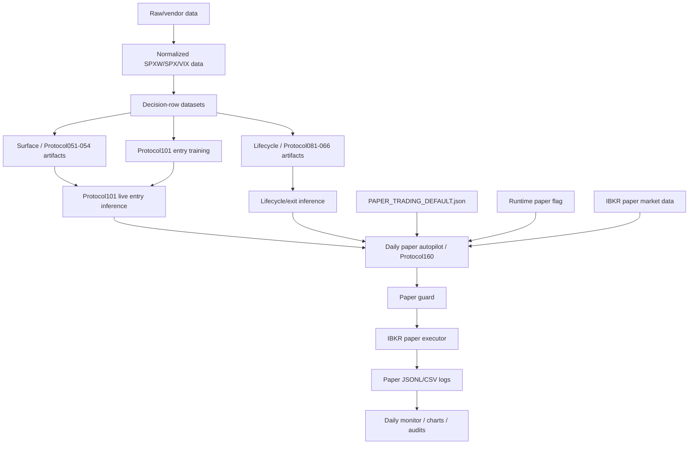

# Project Section And Feature Map

Generated: 2026-05-26  
Repository: `/Users/gduby/Documents/autoresearch-trading`  
Primary artifact type: cartography report  
Mutation scope for this pass: documentation only  

This report is a read-only cartography pass plus one authorized documentation write. It does not run broker scripts, call IBKR, run trading scripts, download paid data, train models, tune thresholds, promote challengers, change runtime flags, change launchd, or move files.

## Status Labels

| Label | Meaning in this report |
|---|---|
| Active Core | Part of the current Protocol101 paper-trading spine or owner workflow. Active does not mean alpha-proven, promotion-clean, or real-money approved. |
| Active Dependency With Warning | Used by the current spine, but carrying old lineage, stale readiness language, or proof gaps. Protect it, but do not treat it as clean. |
| Protected Data | Data/raw/cache/artifact material that should not be moved until a dedicated inventory proves what depends on it. |
| Research Toolkit | Useful manual/evidence tooling or frozen research packets, not the normal daily paper path. |
| Research History | Historical experiments, challengers, diagnostics, or failed lines. Keep as history unless promoted by explicit current evidence. |
| Protected History | Old systems or archives that are not current v4 but may be needed for context or reproducibility. |
| Dangerous Ops | Broker, launchd, runtime flag, paid-data, or paper-order surfaces. Do not run or edit casually. |
| Quarantine Candidate | Likely stale/duplicate/hygiene item, but only after review and a manifest. |
| UNKNOWN | Evidence is missing or name-only classification would be unsafe. |

## Evidence Snapshot

- `git status --short --branch` showed the repo already dirty on branch `v4/phase-0...origin/v4/phase-0` before this report was written. Many tracked files were modified and many untracked docs/scripts/artifacts were already present.
- `git ls-files | wc -l` returned `1060` tracked files.
- `find v4/audit/autoresearch -mindepth 1 -maxdepth 1 -type d | wc -l` returned `408` top-level audit folders.
- `launchctl list | rg 'autoresearch|ibgateway|protocol101|premiumblend|tuesday'` showed installed-looking user launchd labels for Protocol101 paper session, preflight, monitor, IB Gateway paper start/shutdown, Tuesday evidence, Tuesday fill observation, premium-blend no-order check, plus unrelated `com.trinity.autoresearch.*` labels.
- `v4/promotion/PAPER_TRADING_DEFAULT.json` identifies `current_model_id: protocol101`, `paper_trading_status: approved_paper_default`, and entrypoint `v4.scripts.run_protocol160_protocol101_persistent_paper_trader`.
- `v4/runtime/protocol101_paper_order_enablement.json` says `paper_orders_enabled: true`, `real_money_trading: false`, and scope `ibkr_paper_account_only_protocol101_one_contract`.

# 1. Executive Summary

This project currently appears to be a v4 SPXW 0DTE research and guarded paper-trading system. Its practical current spine is `PAPER_DEFAULT_PROTOCOL101`: local historical data and feature artifacts feed a frozen Protocol101 entry model, which depends on a Protocol051/054 surface scorer and a Protocol081/066 lifecycle/exit artifact, and the daily paper autopilot can route that stack into a guarded IBKR paper-trading loop.

The main workflow is:

1. Acquire and store raw market data from paid/local sources.
2. Normalize SPXW option and SPX/VIX context data.
3. Build decision-row datasets with executable ask-entry/bid-exit style labels.
4. Train/replay Protocol101 and challenger models manually.
5. Freeze/promote artifacts only through explicit packets and registry changes.
6. Run the current paper default through daily autopilot in guarded `paper-submit` mode.
7. Log paper decisions/orders/fills and inspect them through monitors and HTML charts.

Research/backtesting components live mostly in `v4/scripts`, `v4/model`, `v4/dataset`, `v4/sim`, `data/processed`, and `v4/audit/autoresearch`. They build datasets, train models, replay historical trades, create diagnostics, and generate artifacts. They are not automatically live or paper-trading code.

Live/paper-trading components live mostly in `v4/live`, `v4/ops/ibkr`, `v4/ops/launchd`, `v4/runtime`, `v4/logs/paper_trading`, and the current registry under `v4/promotion/PAPER_TRADING_DEFAULT.json`. They touch live market data, IBKR paper connectivity, runtime flags, launch scheduling, order guards, paper executor code, and operational logs.

The biggest confusion sources are:

- Root `README.md` and `CLAUDE.md` still describe v2/deferred-live-era truth, while newer docs and ops point to v4 Protocol101 paper-submit.
- Old promotion/readiness packets say Protocol101, Protocol066, and Protocol081 were not broker-connected paper approved, while newer registry/runtime/log evidence shows Protocol101 paper-submit capability exists.
- Protocol051/054 surface and Protocol081/066 lifecycle artifacts are used by the current stack but come from older research lineage with stale warnings.
- There are many challenger families, one-off Tuesday evidence jobs, premium-blend harnesses, router/unified experiments, and old pilots mixed near active code.
- Generated artifacts are huge and important, but not all artifacts are active. The safe rule is: protect all data/artifacts until a dedicated inventory proves what can move.
- Launchd and runtime files are both current and dangerous: reading is fine; installing, editing, or running can mutate machine/broker behavior.

# 2. Project Section Map

| Section number/name | Purpose | Main directories/files | Main features | Current status | Evidence for status | Notes or risks |
|---|---|---|---|---|---|---|
| 1. Governance / project docs | Define current truth, safety rules, stages, naming, and decision process. | `research_ops/`, `docs/CURRENT_TRADING_BOT_SINGLE_SOURCE_OF_TRUTH.md`, `v4/docs/NAMING_GUIDE.md`, `v4/docs/PROJECT_SECTIONS_AND_HILL_CLIMB_GATES.md`, `v4/docs/PROTOCOL101_DAILY_PAPER_TRADING.md` | Current truth doc, decision queue, naming guide, stage gates, daily paper runbook. | Active Core, with unresolved governance formality | `research_ops/DECISION_QUEUE.md` has D001 unresolved; current SSoT and v4 docs identify Protocol101 paper default. | Use `research_ops` plus SSoT as practical front door, but do not call `research_ops` formally binding until D001 is decided. |
| 2. Raw data download and storage | Acquire/preserve raw SPXW/SPX/VIX data. | `data/raw/`, `data/vendor/`, `v4/raw/`, `v4/ingest/`, `v4/scripts/download_databento_*`, `v4/scripts/download_thetadata_index_bars.py` | Databento OPRA definitions/CBBO, context data, paid-data guardrails. | Protected Data / Dangerous Ops | `v4/docs/SPXW_0DTE_DATA_DOWNLOADS.md`; download scripts exist; paid-data guard exists. | Do not run download scripts without explicit paid-data approval. |
| 3. Dataset building | Convert normalized data into model/replay decision rows. | `v4/dataset/spxw_0dte_neural.py`, `v4/scripts/build_databento_neural_dataset.py`, `data/processed/` | SPXW 0DTE neural decision rows, official/proxy context variants, labels. | Active Core data layer, protected | Current training/replay scripts read these processed datasets; user confirmed data store is protected. | Official/live-equivalent context is current truth; derived/proxy/smoke datasets are fallback/history unless proven current. |
| 4. Feature engineering | Build causal features for historical and live-style rows. | `v4/model/hypothesis_protocol.py`, `v4/model/serial_opportunity.py`, `v4/live/protocol101_live_entry.py`, `v4/feature_eng/`, `v4/greeks/` | Surface decisions, entry features, history features, Greeks, live row construction. | Active Dependency With Warning | Protocol101 live/training code imports these components. | Some early utility names remain from pilot-era code. |
| 5. Backtesting / simulation / replay | Evaluate historical decisions and diagnostics. | `v4/scripts/run_protocol101_*`, `v4/scripts/run_protocol161_*`, `v4/scripts/run_protocol162_*`, `v4/sim/paper_replay.py`, `v4/sim/shadow_paper.py`, `v4/sim/simulator.py` | Strict serial replay, historical replay, paper replay accounting, shadow paper, diagnostics. | Mixed: Active Core diagnostics / Research History / UNKNOWN | Protocol101 reports and charts are current review artifacts; `v4/sim/simulator.py` is a `NullSimulator` skeleton. | Do not assume simulator quality from file existence. Fill realism remains a proof gap. |
| 6. Model training | Train Protocol101 and research challengers. | `v4/scripts/run_protocol101_event_history_policy.py`, `v4/scripts/run_protocol097_sequential_event_policy.py`, `v4/scripts/run_protocol061_sequence_lifecycle_model.py`, challenger scripts. | Protocol101 event-history policy, sequential event base, lifecycle model, challengers. | Active manual step / Dangerous if run casually | User confirmed Protocol101 training pipeline is active manual work; training scripts produce model artifacts. | Training is frozen unless explicitly authorized; no training in cleanup. |
| 7. Model evaluation | Explain model behavior and failure modes. | `v4/docs/trading_bot_engineer_strategy_audit_2026_05_24/`, Protocol101 diagnostics, challenger diagnostics, `v4/audit/autoresearch/*` | Forensics, attribution, charts, skeptical falsification, strategy selection. | Active for Protocol101; Research History for challengers | `v4/audit/autoresearch/v4_aplus_hypothesis_113_protocol101_trade_charts/` contains `equity.html` and `trades.html`; user said these matter. | Charts are review artifacts, not runtime behavior. |
| 8. Model artifacts and promotion | Freeze, approve, or reject model/artifact status. | `v4/promotion/`, `v4/audit/autoresearch/*/model_artifacts`, `v4/promotion/PAPER_TRADING_DEFAULT.json` | Paper default registry, freeze packets, promotion/readiness packets. | Active Core registry; stale/conflict packets exist | `PAPER_TRADING_DEFAULT.json` points to Protocol101 and current manifests. Older readiness packets conflict. | Old packets are conflict evidence, not current operating truth when newer registry/log evidence disagrees. |
| 9. Protocol definitions | Name historical protocol families and roles. | `v4/docs/NAMING_GUIDE.md`, protocol-numbered scripts and audits. | Paper default, challengers, diagnostics, runtime harnesses, decisions. | Active Core documentation | Naming guide explicitly labels `PAPER_DEFAULT_PROTOCOL101` and many challengers as research-only. | Protocol numbers are history IDs, not the best mental model. |
| 10. Live market-data observation | Observe IBKR market data without/with order path. | `v4/scripts/run_protocol158_*`, `v4/scripts/run_protocol160_*`, `v4/scripts/run_protocol245_*`, `v4/runtime/protocol101_live_index_context.jsonl` | Live SPX/VIX/SPXW quote capture, live context logs, no-order parity. | Active Core / Research Toolkit / Dangerous Ops | Protocol160 is daily paper runtime; Protocol245 is premium-blend no-order toolkit. | Even no-order/live observation can contact broker/data endpoints. Do not run during cleanup. |
| 11. IBKR integration | Connect to IB Gateway paper and inspect entitlement/account/order surfaces. | `v4/ops/ibkr/`, `v4/live/ibkr_paper_guard.py`, `v4/live/ibkr_paper_executor.py` | Gateway start/wait/probe, paper guard, executor, account snapshot. | Dangerous Ops | May 26 handoff and capability summary show IBKR paper connectivity and paper order endpoint. | Read only unless explicitly authorized. |
| 12. Paper-trading bridge | Dispatch current paper default into persistent paper runtime. | `v4/ops/ibkr/run_daily_paper_autopilot.sh`, `v4/scripts/run_daily_paper_autopilot.py`, `v4/scripts/run_protocol160_protocol101_persistent_paper_trader.py`, `v4/live/paper_model_registry.py` | Daily registry dispatch, persistent paper loop, model selection. | Active Core / Dangerous Ops | Registry, shell, launchd, and tests all point at daily autopilot and Protocol160. | Default mode is guarded `paper-submit`, not safe to run casually. |
| 13. Guard / risk controls | Prevent unsafe paper orders. | `v4/live/ibkr_paper_guard.py`, runtime flag, paper order env flags, tests. | Paper account prefix, quantity 1, max one position, quote/context freshness, affordability. | Active Core | Runtime flag says paper only; guard code enforces paper permission and quote/context checks. | `ibkr_access_reserve` appears informational in current affordability formula; D004 remains unresolved. |
| 14. Order execution | Submit or dry-run IBKR paper orders. | `v4/live/ibkr_paper_executor.py`, `v4/scripts/run_protocol158_*`, `v4/scripts/run_protocol160_*` | Guarded paper order execution and logging. | Active Core / Dangerous Ops | May 26 summary shows broker endpoint called and one filled round trip. | Paper only; real-money not approved. |
| 15. Lifecycle / exits / forced-flat | Decide hold/exit and flatten positions. | `v4/live/protocol066_inference.py`, `v4/scripts/run_protocol081_live_shadow_router.py`, `v4/scripts/run_protocol160_*` | Lifecycle model/rules, hard stops, forced flat, exit orders. | Active Dependency With Warning | Protocol160 loads `DEFAULT_PROTOCOL081_MANIFEST` through `load_protocol066_artifact`. | Old Protocol066/081 readiness docs say not paper/live approved; runtime use is newer. |
| 16. Monitoring / audits / reports | Review daily paper state and model/trade behavior. | `v4/scripts/run_protocol157_protocol101_daily_ops_monitor.py`, `v4/scripts/run_protocol149_protocol101_live_log_visual.py`, `v4/scripts/export_protocol101_trade_charts.py`, `v4/audit/autoresearch/` | Daily monitor, live session visual, trade/equity charts, audit reports. | Active review core / Research History | Daily monitor launchd installed; Protocol101 trade charts exist and user confirmed useful. | Monitor may read account snapshot unless skipped; no order endpoint, but not purely inert. |
| 17. Launchd / scheduled operations | Schedule Gateway, preflight, paper session, monitor, shutdown, one-off evidence jobs. | `v4/ops/launchd/*.plist`, `v4/ops/launchd/install_*.sh`, `v4/ops/launchd/uninstall_*.sh` | Daily launch schedule and date-guarded Tuesday/premium evidence jobs. | Dangerous Ops | `launchctl list` shows labels present; plists show 06:30 paper session and 06:31 monitor. | Do not install/uninstall/edit during cleanup. |
| 18. Tests | Unit/regression coverage around data, models, runtime, guards, docs. | `v4/tests/` | 126 test files, including daily autopilot, Protocol101 entry, guard/executor, monitoring, challengers. | Mixed: follows feature status | `find v4/tests -name 'test_*.py' | wc -l` returned 126. | Do not run broad tests blindly; some tests may inspect ops surfaces or write cache/tmp. |
| 19. Logs / generated artifacts | Append-only paper logs, audit artifacts, reports, charts. | `v4/logs/paper_trading/`, `v4/audit/`, `v4/audit/autoresearch/`, `data/models/`, `data/processed/` | JSONL/CSV logs, summaries, reports, HTML dashboards, model artifacts. | Protected Data / mixed artifact history | Current logs include May 26 capability run; audit folder count is 408. | Protect until separate artifact inventory. |
| 20. Deprecated or stale materials | Historical systems and stale docs. | `v2/`, `v3/`, `archive/`, `archive_quarantine/`, top-level `scripts/`, old root docs, copy-suffixed files. | Old systems, historical research, duplicated files. | Protected History / Quarantine Candidate | Root README/CLAUDE still point to v2; duplicate ` 2` files exist outside `.git/.venv`. | Do not delete yet. Quarantine only after manifest and review. |

# 3. Feature Inventory By Section

## Governance / Project Docs

| Feature name | Plain-English description | Why it exists | Main implementation files | Entry points | Inputs | Outputs | Dependencies | Used/unused evidence | Status | Confidence |
|---|---|---|---|---|---|---|---|---|---|---|
| Current trading bot source of truth | Human/agent overview of the current bot and contradictions. | Stops old docs from steering agents into stale paths. | `docs/CURRENT_TRADING_BOT_SINGLE_SOURCE_OF_TRUTH.md` | Read directly. | Repo files, logs, reports. | Current truth doc. | Code/log evidence. | Newer than root README/CLAUDE and matches current registry/ops. | Active Core | HIGH |
| Research ops governance | Artifact types, safety defaults, assumptions, decision queue. | Controls AI-agent work before model/runtime changes. | `research_ops/AI_AGENT_OPERATING_CONTRACT.md`, `research_ops/DECISION_QUEUE.md`, `research_ops/README.md` | Read directly. | Owner decisions, repo evidence. | Decision queue, templates. | v4 docs. | D001 says binding status unresolved. | Research Toolkit | HIGH |
| v4 section gates | Defines Section 1-5 gates and forbidden actions. | Prevents jumping from docs to training/promotion/runtime. | `v4/docs/PROJECT_SECTIONS_AND_HILL_CLIMB_GATES.md` | Read directly; command listed there is not run here. | Docs, audit scripts. | Gate definitions. | `research_ops`, model improvement docs. | Current governance doc. | Active Core | HIGH |
| Naming guide | Maps protocol numbers to human role labels. | Keeps protocol IDs from becoming the main language. | `v4/docs/NAMING_GUIDE.md` | Read directly. | Protocol history. | Role labels. | Promotion docs, reports. | Explicitly says Protocol101 is paper default. | Active Core | HIGH |

## Raw Data Download And Storage

| Feature name | Plain-English description | Why it exists | Main implementation files | Entry points | Inputs | Outputs | Dependencies | Used/unused evidence | Status | Confidence |
|---|---|---|---|---|---|---|---|---|---|---|
| Databento OPRA ingest | Convert paid OPRA SPXW data into normalized local files. | Supplies quote-realistic historical option data. | `v4/ingest/databento_opra.py`, `v4/scripts/download_databento_*` | `python -m v4.scripts.download_databento_*` (do not run casually). | Databento credentials/API, date windows, symbols. | Raw and normalized parquet/audit logs. | Paid data guard, data contract. | Docs and scripts exist; downloads are forbidden in this cleanup. | Dangerous Ops / Protected Data | MEDIUM |
| Index context acquisition | Get SPX/VIX or proxy context. | Model features need underlying and volatility context. | `v4/scripts/download_thetadata_index_bars.py`, `v4/scripts/download_databento_context_proxies.py`, `data/raw/index/` | Download scripts (do not run casually). | Vendor/API data or local files. | SPX/VIX/context files. | Dataset builder. | Official context is preferred; proxy/derived is fallback/history. | Protected Data | MEDIUM |
| Paid data guard | Require exact approval before paid endpoint use. | Prevent accidental paid data downloads. | `v4/checks/paid_data_guard.py`, `v4/tests/test_paid_data_guard.py` | Imported by download flows/tests. | Approval manifest/env. | Pass/fail. | Download scripts. | Tests/docs reference paid-data safety. | Active Core | HIGH |

## Dataset Building / Feature Construction

| Feature name | Plain-English description | Why it exists | Main implementation files | Entry points | Inputs | Outputs | Dependencies | Used/unused evidence | Status | Confidence |
|---|---|---|---|---|---|---|---|---|---|---|
| SPXW 0DTE decision rows | Build historical rows with option ladder, labels, and filters. | Training/replay needs point-in-time trade candidates. | `v4/dataset/spxw_0dte_neural.py` | Builder scripts only with explicit authorization. | Normalized option quotes, SPX/VIX context. | Decision-row datasets in `data/processed/`. | Ingest, context data, feature code. | Current Protocol101 training/replay lineage uses processed datasets. | Active Core / Protected Data | HIGH |
| Databento neural dataset builder | Build normalized and processed rows from local Databento data. | Bridges raw paid/local files into model inputs. | `v4/scripts/build_databento_neural_dataset.py` | `python -m v4.scripts.build_databento_neural_dataset` (do not run in cleanup). | Local raw/normalized data; official/proxy context. | Normalized parquet, processed rows, build summary. | Ingest adapter. | Docs list it as builder; data folders exist. | Active Core / Dangerous if run | MEDIUM |
| Surface decision features | Create surface/token rows used by Protocol051/054 and downstream Protocol101. | Protocol101 entry depends on upstream surface scores. | `v4/model/hypothesis_protocol.py`, `v4/live/protocol051_surface_edge.py` | Training/replay/live imports. | Decision rows, surface artifact. | Surface scores and token/flat predictions. | `FeatureScaler`, surface manifest. | Runtime loads surface manifest from registry/defaults. | Active Dependency With Warning | HIGH |
| Protocol101 entry features | Convert scored candidates into entry features with causal history. | Current entry model selects no-entry/entry candidates. | `v4/model/serial_opportunity.py`, `v4/scripts/run_protocol101_event_history_policy.py`, `v4/live/protocol101_entry.py` | Training script; live inference import. | Protocol092/101 datasets, surface scores, history state. | Model artifacts, candidate frame, prediction. | Surface scorer, scaler, event policy. | Registry points to Protocol101 artifact; tests cover entry. | Active Core | HIGH |
| Early pilot utility helpers | Shared scaler/metrics/trade dataclasses from pilot-era file. | Older name still hosts reusable utilities. | `v4/model/supervised_pilot.py`, `v4/model/action_pilot.py` | Imported by many scripts/tests. | Feature arrays/trades. | Scalers, metrics, pilot decisions. | Model scripts. | `FeatureScaler` is imported by current Protocol101/surface/lifecycle code; old pilot `.pt` artifacts are not current registry. | Active Dependency With Warning / Research History | HIGH |

## Model Training / Evaluation

| Feature name | Plain-English description | Why it exists | Main implementation files | Entry points | Inputs | Outputs | Dependencies | Used/unused evidence | Status | Confidence |
|---|---|---|---|---|---|---|---|---|---|---|
| Protocol101 event-history training | Train the current paper-default entry model family. | Produce/reproduce Protocol101 entry artifacts. | `v4/scripts/run_protocol101_event_history_policy.py`, `v4/scripts/run_protocol097_sequential_event_policy.py` | `python -m v4.scripts.run_protocol101_event_history_policy` (do not run without explicit training authorization). | Processed datasets, fold definitions, labels. | Model/scaler/manifest/report in audit folder. | Dataset builder, `FeatureScaler`, event policy. | Current registry points to Protocol101 seed/fold artifact. | Active manual step | HIGH |
| Lifecycle/exit training | Train sequence/residual lifecycle artifacts. | Exit/hold decisions after entry. | `v4/scripts/build_lifecycle_sequence_dataset.py`, `v4/scripts/run_protocol061_sequence_lifecycle_model.py`, `v4/live/protocol066_inference.py` | Dataset/training scripts (do not run in cleanup). | Selected trades, path data, lifecycle labels. | Lifecycle model/scaler/manifest. | Protocol054/066/081 lineage. | Protocol160 loads Protocol081 through Protocol066 inference. | Active Dependency With Warning | HIGH |
| Protocol101 charts | Generate review artifacts for current model validation. | Let owner inspect trade/equity behavior. | `v4/scripts/export_protocol101_trade_charts.py` | Chart export script (writes artifacts; not run here). | Protocol101 trade outputs. | `equity.html`, `trades.html`. | Protocol101 replay outputs. | User confirmed `equity.html`/`trades.html` are needed. | Active review core | HIGH |
| Protocol101 diagnostics | Forensics, selection, slot-cost, loss reversal, replay diagnostics. | Explain current control behavior before changing it. | `v4/scripts/run_protocol101_*`, `v4/docs/PROTOCOL101_*`, `v4/audit/autoresearch/protocol101_*` | Many diagnostic scripts; inspect before running. | Protocol101 artifacts/trades. | Reports, CSVs, summaries. | Current model artifacts. | Current docs and audits reference these packets. | Active Dependency With Warning | MEDIUM |
| Challenger families | Full-action, premium blend, routers, unified-action, learned-defer research. | Explore replacements or improvements without changing paper default. | `v4/scripts/run_protocol164_*` through `run_protocol276_*`, unified scripts, premium scripts. | Training/replay/runtime-harness scripts; do not run casually. | Processed datasets, saved artifacts, logs. | Research artifacts, charts, summaries. | Current baseline artifacts, data. | Naming guide says paper default unchanged for these families. | Research Toolkit / Research History | HIGH |

## Live / Paper Trading / Ops

| Feature name | Plain-English description | Why it exists | Main implementation files | Entry points | Inputs | Outputs | Dependencies | Used/unused evidence | Status | Confidence |
|---|---|---|---|---|---|---|---|---|---|---|
| Daily paper autopilot | Dispatch current paper-approved default from registry. | Avoid hard-coding future model changes into launchd. | `v4/scripts/run_daily_paper_autopilot.py`, `v4/live/paper_model_registry.py`, `v4/ops/ibkr/run_daily_paper_autopilot.sh` | `v4/ops/ibkr/run_daily_paper_autopilot.sh` (dangerous paper path). | Registry, runtime flag, IBKR host/ports, paper cash. | Child Protocol160 run and logs. | Protocol160, registry, launchd. | Tests assert registry and child args; launchd points to registry. | Active Core / Dangerous Ops | HIGH |
| Persistent Protocol101 paper trader | Main current paper runtime loop. | Observe/submit guarded paper trades across session. | `v4/scripts/run_protocol160_protocol101_persistent_paper_trader.py` | `python -m v4.scripts.run_protocol160_protocol101_persistent_paper_trader` (do not run casually). | IBKR market data, artifacts, runtime flag, account state. | Paper logs, runtime state, orders/fills/cancels. | Protocol051/101/081 artifacts, guard/executor. | Registry entrypoint points here. | Active Core / Dangerous Ops | HIGH |
| Live entry bridge | One-shot/manual bridge for live candidate/order path. | Capture and test entry path outside full persistent loop. | `v4/scripts/run_protocol158_protocol101_live_entry_paper_bridge.py` | `--mode intent-shadow`, `paper-dry-run`, `paper-submit` (dangerous). | IBKR data, artifacts, runtime flag. | JSONL/CSV logs, possible paper orders. | Guard/executor, live row builder. | Daily runbook lists manual commands; Protocol160 supersedes normal daily path. | Research Toolkit / Dangerous Ops | HIGH |
| Paper guard | Deterministic permission and order-intent validation. | Block unsafe or non-paper orders. | `v4/live/ibkr_paper_guard.py` | Imported by bridge/runtime/executor. | Intent, account id/cash, quote age, context age, env flags. | Pass/block reason. | Runtime flag/env, account data. | Guard code enforces paper account, qty 1, freshness, affordability. | Active Core | HIGH |
| Paper executor | Calls IBKR paper order endpoint after guards. | Submit/cancel paper BUY/SELL limits. | `v4/live/ibkr_paper_executor.py` | Imported by Protocol158/160. | IB object, validated intent. | Broker order status, logs. | Guard, IBKR connection. | May 26 capability summary shows broker endpoint called and fills. | Active Core / Dangerous Ops | HIGH |
| Paper trade logging | Append structured JSONL/CSV paper events. | Source of truth for paper decisions/fills. | `v4/live/paper_trade_log.py`, `v4/logs/paper_trading/` | Runtime appends; validator can read. | Runtime events. | JSONL/CSV logs. | Paper runtime/monitor. | May 26 and May 21 logs exist. | Active Core | HIGH |
| Daily ops monitor | HTML/JSON/MD view over paper session state. | Owner review of startup, decisions, orders, positions, blockers. | `v4/scripts/run_protocol157_protocol101_daily_ops_monitor.py`, `v4/ops/ibkr/run_protocol101_daily_monitor.sh` | Monitor shell/script (writes reports; may read account snapshot). | Paper logs, runtime state, launchd status, entitlement summaries. | `daily_monitor.html`, `latest_daily_monitor.html`, summary/report files. | Paper logs, launchd, optional account snapshot. | Launchd installed at 06:31; daily runbook names monitor page. | Active review core / Safe-ish report | HIGH |
| Launchd schedule | macOS scheduling for Gateway, preflight, session, monitor, shutdown, one-off evidence jobs. | Automate daily paper workflow. | `v4/ops/launchd/*.plist`, install/uninstall scripts. | `launchctl`/install scripts (do not mutate in cleanup). | Plists, shell scripts, OS launchd state. | Scheduled processes/logs. | IBKR shell scripts. | `launchctl list` shows labels; plists define times. | Dangerous Ops | HIGH |

## Logs, Artifacts, Tests, History

| Feature name | Plain-English description | Why it exists | Main implementation files | Entry points | Inputs | Outputs | Dependencies | Used/unused evidence | Status | Confidence |
|---|---|---|---|---|---|---|---|---|---|---|
| Audit artifact store | Append-only research/runtime evidence. | Preserve reproducibility and decisions. | `v4/audit/autoresearch/`, `v4/audit/` | Scripts write there; do not rewrite. | Script outputs. | Summaries, reports, models, charts, CSVs. | Almost every workflow. | 408 top-level autoresearch folders. | Protected Data / mixed status | HIGH |
| Old pilot model files | Standalone `.pt` artifacts from early pilot era. | Historical/pilot model outputs. | `data/models/v4_spxw_*pilot*.pt` | No current entrypoint found in registry. | Old training outputs. | Five `.pt` files. | Old pilot scripts. | User requested per-file audit before quarantine. | UNKNOWN / Research History | MEDIUM |
| v4 tests | Regression coverage for active and historical features. | Prove local behavior without live side effects where designed. | `v4/tests/` | `pytest` selected tests only; avoid broad unsafe assumptions. | Code/fixtures/tmp paths. | Pass/fail, caches. | Feature modules. | 126 test files found. | Follows feature status | MEDIUM |
| Legacy systems | Older v2/v3/archive material. | Historical project phases and evidence. | `v2/`, `v3/`, `archive/`, `archive_quarantine/`, top-level `scripts/` | Do not run without explicit legacy task. | Old data/models/scripts. | Old artifacts/reports. | Some old docs; possible rare imports. | Current front door is v4, but root docs still mention v2. | Protected History | HIGH |
| Copy-suffixed duplicates | Files with ` 2`/copy-like names outside local env internals. | Likely sync/backup duplicates. | Many under old areas; exclude `.git`, `.venv`, caches. | None. | Existing files. | None. | Unknown. | `find` found copy-suffixed project files. | Quarantine Candidate | MEDIUM |

# 4. End-to-End Workflow Map

| Step | Exists in repo? | Implementing files | Proven / partial / unknown | What would prove it works |
|---|---|---|---|---|
| 1. Raw data acquisition | Yes | `v4/ingest/databento_opra.py`, `v4/scripts/download_databento_*`, `v4/scripts/download_thetadata_index_bars.py`, `data/raw/` | Partial / protected | A stamped inventory of raw files, vendor provenance, cost approvals, and deterministic ingest reports. |
| 2. Data validation/cache | Yes | `v4/checks/`, `v4/scripts/audit_context_provenance.py`, `v4/scripts/audit_data_sufficiency.py`, `data/cache/`, `v4/audit/*` | Partial | Current green data-contract audits with no paid endpoint calls and source/context labels. |
| 3. Dataset build | Yes | `v4/dataset/spxw_0dte_neural.py`, `v4/scripts/build_databento_neural_dataset.py`, `data/processed/` | Partial / active data layer | Rebuild proof from raw/normalized inputs to identical processed rows. |
| 4. Feature construction | Yes | `v4/model/hypothesis_protocol.py`, `v4/model/serial_opportunity.py`, `v4/live/protocol101_live_entry.py`, `v4/live/protocol051_surface_edge.py` | Partial | Live/historical feature parity audit for exact candidate rows, quote freshness, Greeks, context, and history state. |
| 5. Training | Yes | `v4/scripts/run_protocol101_event_history_policy.py`, `v4/scripts/run_protocol097_sequential_event_policy.py`, `v4/scripts/run_protocol061_sequence_lifecycle_model.py` | Active manual / not run here | Explicit owner authorization, preregistered hypothesis, training logs, artifact manifests, and post-run validation. |
| 6. Evaluation/backtest/replay | Yes | Protocol101 diagnostics, `v4/scripts/run_protocol161_*`, `v4/scripts/run_protocol162_*`, `v4/sim/paper_replay.py` | Partial | Reproducible strict serial replay with known data split, ask/bid costs, slippage stress, and no protected-holdout leakage. |
| 7. Candidate/model selection | Yes | `v4/promotion/`, `v4/docs/MODEL_IMPROVEMENT_GUIDELINES.md`, `v4/docs/HYPOTHESIS_TO_PROMOTION_PROCESS.md` | Partial | Current decision memo and promotion packet that explicitly changes or preserves `PAPER_DEFAULT_PROTOCOL101`. |
| 8. Artifact promotion | Yes | `v4/promotion/PAPER_TRADING_DEFAULT.json`, freeze/readiness packets | Proven for current registry, conflicted historically | Registry diff plus decision packet and logs showing why current default changed or remained. |
| 9. Live observation | Yes | Protocol158/160/245 scripts, `v4/runtime/protocol101_live_index_context.jsonl`, paper logs | Partial | Live no-order parity over full candidate breadth and current quote-age semantics. |
| 10. Paper-dry-run or paper-submit path | Yes | `v4/scripts/run_daily_paper_autopilot.py`, `v4/scripts/run_protocol158_*`, `v4/scripts/run_protocol160_*`, runtime flag | Capability proven for paper-submit | May 26 proves one forced capability round trip; normal-threshold repeated fills would prove operational routine behavior. |
| 11. Broker/order handling | Yes | `v4/live/ibkr_paper_guard.py`, `v4/live/ibkr_paper_executor.py`, `v4/ops/ibkr/` | Capability proven for paper only | Repeated guarded paper order/fill/cancel logs with no real-money path and full account redaction. |
| 12. Position lifecycle/exit | Yes | `v4/live/protocol066_inference.py`, Protocol160 position handling, Protocol081 manifest | Active dependency with warning | Live/replay parity for lifecycle state and actual paper exits under normal sessions. |
| 13. Logging/audit/reconstruction | Yes | `v4/live/paper_trade_log.py`, Protocol157 monitor, `v4/logs/paper_trading/`, audit reports | Partial | Complete reconstruction from paper JSONL to daily monitor, PnL, fills, cancellations, and forced-flat evidence. |

# 5. Current Default / Current Truth

## Current Default Protocol / Model

Current default is `PAPER_DEFAULT_PROTOCOL101`, implemented by `v4/promotion/PAPER_TRADING_DEFAULT.json`.

Evidence:

- `current_model_id` is `protocol101`.
- `paper_trading_status` is `approved_paper_default`.
- Entrypoint is `v4.scripts.run_protocol160_protocol101_persistent_paper_trader`.
- Arguments point to:
  - Surface manifest: `v4/audit/autoresearch/v4_aplus_hypothesis_075_protocol054_frozen_stack_artifacts/.../seed_11/manifest.json`
  - Protocol101 manifest: `v4/audit/autoresearch/v4_aplus_hypothesis_101_event_history_policy/.../seed_1/manifest.json`
  - Lifecycle manifest: `v4/audit/autoresearch/v4_aplus_hypothesis_081_q4start_residual_sequence_deterministic_artifacts/.../seed_1/manifest.json`
  - Runtime flag: `v4/runtime/protocol101_paper_order_enablement.json`
  - Runtime state: `v4/runtime/protocol101_live_paper_state.json`
  - Live context log: `v4/runtime/protocol101_live_index_context.jsonl`

## Current Default Runtime Mode

The current scheduled/default paper posture is guarded `paper-submit`, not real money.

Evidence:

- `v4/ops/launchd/com.autoresearch.protocol101.paper-session.plist` sets `DAILY_PAPER_AUTOPILOT_MODE=paper-submit`, `PROTOCOL101_ENABLE_PAPER_ORDERS=YES`, `PROTOCOL101_ACKNOWLEDGE_PAPER_LOSS=YES`, and `V4_ALLOW_IBKR_PAPER_ORDERS=YES`.
- `v4/ops/ibkr/run_daily_paper_autopilot.sh` defaults `DAILY_PAPER_AUTOPILOT_MODE` to `paper-submit` and appends `--enable-paper-orders` and `--acknowledge-paper-loss` when env flags are `YES`.
- `v4/scripts/run_daily_paper_autopilot.py` default `--mode` is `paper-submit`.
- `v4/runtime/protocol101_paper_order_enablement.json` says `real_money_trading: false`.

## Current Launch / Scheduled Behavior

Read-only launch evidence:

- `launchctl list` showed these relevant labels present: `com.autoresearch.ibgateway.paper`, `com.autoresearch.protocol101.paper-preflight`, `com.autoresearch.protocol101.paper-session`, `com.autoresearch.protocol101.daily-monitor`, `com.autoresearch.ibgateway.paper-shutdown`, Tuesday evidence labels, and `com.autoresearch.premiumblend.no-order-surface-check`.
- Protocol101 paper session plist starts at 06:30 PT and points at `/Users/gduby/.autoresearch-trading/launchd/run_protocol101_paper_session.sh`.
- Daily monitor plist starts at 06:31 PT with `--watch`.
- Premium-blend no-order surface check plist is date-guarded to Month 5 Day 26 at 06:33 and `PREMIUM_BLEND_AUTOTEST_TARGET_DATE=2026-05-26`.

Interpretation:

- Daily Protocol101/Gateway/preflight/monitor/shutdown looks active/scheduled.
- Tuesday and premium date-guarded jobs are historical evidence tools unless deliberately renewed.
- `launchctl list` does not prove the last run worked; logs prove behavior.

## Current Paper-Trading Posture

The repo contains a guarded IBKR paper-submit path. It is not a live-money path.

Evidence:

- May 26, 2026 handoff states `live_trade_capability_20260526T194814Z` connected to IBKR paper, acquired SPX/VIX/SPXW quotes, selected a contract, passed guards, called the IBKR paper broker endpoint, submitted a one-contract paper entry, received entry fill, submitted exit, received exit fill, and flattened.
- The capability summary shows `broker_order_endpoint_called: true`, `paper_orders_submitted: 1`, `filled_round_trips: 1`, `real_money_trading: false`.
- The same handoff says the run used relaxed `--min-edge -100`, so it is capability proof only, not alpha proof and not normal-threshold proof.

## Current Conflicts

| Conflict | Newer/current evidence | Older/conflicting evidence | Treatment |
|---|---|---|---|
| v2 vs v4 current system | `docs/CURRENT_TRADING_BOT_SINGLE_SOURCE_OF_TRUTH.md`, `research_ops/`, registry/launchd all point to v4 Protocol101. | Root `README.md` and `CLAUDE.md` say v2 is current or live is deferred. | New docs/ops override old docs; record conflict. |
| Paper readiness | Registry, runtime flag, launchd, May 26 fill summary prove guarded paper capability. | `v4/promotion/PROTOCOL_101_PROMOTION_READINESS_PACKET.md` says not broker-connected paper approved. | Old packet is conflict evidence, not current operating truth. |
| Surface/lifecycle approval | Current runtime imports surface/lifecycle artifacts. | Protocol054/066/081 packets contain old not-approved language. | Active dependency with warning. |
| Daily vs one-off jobs | Protocol101 daily schedule appears installed; premium/Tues jobs are date-guarded. | Install scripts may include premium/Tues labels. | Daily active; date-guarded jobs are historical/manual toolkit unless renewed. |
| `research_ops` authority | Practical front door now. | D001 asks whether it should become binding. | Use for cleanup process, but leave formal binding unresolved. |

# 6. Dependency Graph

Readable dependency map:

- Dataset build depends on: raw/local Databento data, SPX/VIX context, normalized quote files, data contract, paid-data guard.
- Protocol101 training depends on: processed decision rows, surface scores, history features, labels, fold definitions, `FeatureScaler`.
- Protocol051/054 surface scoring depends on: frozen surface artifact manifest and `SurfaceDecision` rows.
- Protocol081/066 lifecycle depends on: lifecycle sequence dataset, selected trade paths, lifecycle artifact manifest, fallback/hard-exit rules.
- Live decisioning depends on: IBKR SPX/VIX/SPXW quotes, live context, Protocol051 surface scores, Protocol101 entry artifact, history state.
- Paper execution depends on: live decision, runtime paper flag, paper permission env/flags, paper account evidence, quote/context freshness, guard pass, executor.
- Monitoring depends on: paper logs, runtime state, launchd state, entitlement summaries, optional account snapshot, report writers.
- Promotion/default changes depend on: decision memo, promotion packet, registry update, runtime/log evidence, and explicit owner approval.

# 7. Stale / Duplicated / Conflicting Areas

| Area | Why it may be stale, duplicated, or conflicting | Risk |
|---|---|---|
| `README.md` | Says live execution is deferred and points reviewers toward old v2 framing. | Misleads agents away from v4 paper reality. |
| `CLAUDE.md` | Says v2 is canonical and directs agents to v2 files. | High risk for future AI sessions. |
| `v4/README.md` | Clean-slate/Phase 0 framing is stale relative to current paper runtime and later docs. | Understates operational surface. |
| Old promotion/readiness packets | Some claim no paper/broker approval while newer registry/runtime/logs show paper capability. | Agents may block current truth or trust wrong readiness state. |
| Protocol051/054 and Protocol081/066 lineage | Runtime uses old artifacts with legacy approval language. | Active but confusing; do not quarantine. |
| `v4/sim/simulator.py` | Contains `NullSimulator` skeleton, not a full execution/fill simulator. | Easy to overclaim simulator realism. |
| Premium blend Protocol240-247 | Useful research toolkit and no-order surface evidence, but paper default unchanged. | Could be mistaken for current trading stack. |
| Full-action/router/unified challenger families | Many scripts/artifacts beat or investigate baselines but remain research-only. | Could trigger unauthorized training/promotions. |
| Date-guarded Tuesday jobs | Target May 26, 2026 and were evidence tools. | Could be stale if installed but no longer intended. |
| Top-level `scripts/` | Looks like older v2/v3 research scripts, not current v4 spine. | Accidental old-pipeline execution. |
| `v2/`, `v3/`, `archive/`, `archive_quarantine/` | Protected history, not current v4. | Cleanup temptation; possible context loss. |
| Copy-suffixed project files | Many ` 2` duplicates exist outside local env internals. | Hygiene clutter; quarantine only after manifest. |
| `.git`, `.venv`, caches | Local machine/internals include copy-looking files too. | Excluded from project cleanup; do not repair casually. |
| `data/models/*pilot*.pt` | Old pilot artifacts not current registry. | Require per-file audit before quarantine. |

# 8. What I Should Understand As The Owner

You have two things living together.

First, you have a real v4 research lab for SPXW 0DTE options. It has data contracts, dataset builders, feature code, training scripts, replay/diagnostic tooling, model artifacts, and a large audit trail. This is where model ideas are tested and usually rejected. Most protocol numbers are history, not things to run today.

Second, you have operational paper-trading infrastructure around Protocol101. The current daily path is not "any latest model." It is registry-driven: `PAPER_TRADING_DEFAULT.json` selects Protocol101, the daily autopilot dispatches it, Protocol160 runs the persistent paper loop, the guard blocks unsafe paper orders, the executor can submit IBKR paper orders, and logs/monitors reconstruct what happened.

The research side can write a lot of artifacts but should not directly change the paper default. The paper side is dangerous because it can contact IBKR, use live market data, write runtime state, and submit paper orders. Real-money trading is not approved.

The experiments are not all junk. Some are valuable history or reusable diagnostic tools. But they should not be mentally active unless a current registry, current doc, launchd schedule, test, or owner confirmation says they are active.

The most dangerous things to touch casually are:

- `v4/ops/launchd/`
- `v4/ops/ibkr/`
- `v4/runtime/`
- `v4/live/ibkr_paper_executor.py`
- `v4/live/ibkr_paper_guard.py`
- Protocol158/160 runtime scripts
- paid-data download scripts
- training scripts
- promotion/default registry files
- model artifacts named by `PAPER_TRADING_DEFAULT.json`

Before making any next decision, understand the current spine, the active artifact manifests, the daily launch path, the runtime flag, paper logs, and the stale-doc conflicts.

# 9. Recommended Next Documentation Step

Create a single source-of-truth cleanup registry that lives next to this map and is reviewed by the owner before any file movement. It should have one row per cleanup candidate with:

- path
- current label
- why it is stale or protected
- what imports/references it has
- whether it is safe to move
- proposed quarantine batch
- rollback note

Do not implement cleanup yet. The next documentation step is an active-vs-stale index plus a do-not-run safety list.

# 10. Deliverables

## Top 10 Files / Directories To Understand First

1. `docs/CURRENT_TRADING_BOT_SINGLE_SOURCE_OF_TRUTH.md`
2. `research_ops/AI_AGENT_OPERATING_CONTRACT.md`
3. `research_ops/DECISION_QUEUE.md`
4. `v4/docs/NAMING_GUIDE.md`
5. `v4/docs/PROTOCOL101_DAILY_PAPER_TRADING.md`
6. `v4/promotion/PAPER_TRADING_DEFAULT.json`
7. `v4/scripts/run_daily_paper_autopilot.py`
8. `v4/scripts/run_protocol160_protocol101_persistent_paper_trader.py`
9. `v4/live/ibkr_paper_guard.py`
10. `v4/logs/paper_trading/`

## Top 10 Confusing Or Risky Areas

1. Root `README.md` and `CLAUDE.md` stale v2/deferred-live claims.
2. Old promotion packets conflicting with current paper registry/log evidence.
3. Protocol051/054 and Protocol081/066 active runtime use despite legacy warning language.
4. Launchd daily jobs mixed with date-guarded Tuesday/premium one-offs.
5. Premium blend tools appearing runtime-like while paper default remains Protocol101.
6. Full-action/router/unified challengers with many impressive artifacts but no default change.
7. Old pilot helpers still active as utilities while old pilot `.pt` files are not proven current.
8. `v4/sim/simulator.py` skeleton versus more realistic replay/log tooling elsewhere.
9. Huge audit artifact tree with active, historical, and unknown folders mixed.
10. Duplicate/copy-suffixed files in legacy areas and local machine internals.

## Top 10 Questions Before Changing Anything

1. Should D001 formally make `research_ops/` binding governance?
2. Which stale docs should be rewritten first: root README, CLAUDE, v4 README, or promotion packets?
3. Which exact files named by `PAPER_TRADING_DEFAULT.json` are sacred active artifacts?
4. Is the Protocol081/066 lifecycle artifact formally accepted as current paper dependency despite old readiness warnings?
5. Is the `$500` IBKR reserve unavailable capital or only informational?
6. Which launchd labels are intentionally installed today, and which should be retired later?
7. Which old pilot `.pt` files have any current reference, if any?
8. Which top-level audit folders are required for current model validation versus historical record only?
9. What is the first small quarantine batch that gives clarity with minimal risk?
10. What test/read-only verification should prove a quarantine batch did not break the active spine?

## Concise Current Mental Model

This is a v4 SPXW 0DTE research lab wrapped around a guarded Protocol101 IBKR paper-trading spine. Data and training create artifacts; the registry chooses the current paper default; the daily autopilot runs Protocol101 through surface, entry, lifecycle, guard, executor, logs, and monitor. Most other protocol folders are research history or reusable diagnostics. The cleanup should not delete or move anything until this active spine, protected data, dangerous ops, and stale/conflict docs are separated in a reviewed registry.

# Appendix A. Command Cookbook And Safety Labels

These commands are listed for map clarity, not as permission to run them.

| Command / entry point | Purpose | Safety label |
|---|---|---|
| `python -m v4.scripts.run_daily_paper_autopilot --print-selection` | Print selected paper default without broker child process. | Read-only-ish selection check |
| `v4/ops/ibkr/run_daily_paper_autopilot.sh` | Daily paper autopilot shell. | Dangerous Ops: can enter paper-submit path |
| `python -m v4.scripts.run_protocol160_protocol101_persistent_paper_trader --mode paper-submit ...` | Current persistent paper trader. | Dangerous Ops: broker/data/order risk |
| `python -m v4.scripts.run_protocol158_protocol101_live_entry_paper_bridge --mode intent-shadow ...` | Live entry bridge without order submission. | Broker/data risk, no-order |
| `python -m v4.scripts.run_protocol158_protocol101_live_entry_paper_bridge --mode paper-dry-run ...` | Guarded dry-run paper path. | Broker/data risk, writes logs |
| `python -m v4.scripts.run_protocol158_protocol101_live_entry_paper_bridge --mode paper-submit ...` | Manual guarded paper submission. | Dangerous Ops: can submit paper orders |
| `v4/ops/ibkr/run_protocol101_daily_monitor.sh --session YYYY-MM-DD` | Daily monitor report. | Report writer; may read local launchd/account evidence |
| `python -m v4.scripts.run_protocol157_protocol101_daily_ops_monitor ...` | Monitor module. | Report writer; no order endpoint |
| `v4/ops/ibkr/run_protocol101_paper_preflight.sh` | IBKR API/data preflight. | Dangerous Ops: broker/data endpoint |
| `python v4/ops/ibkr/probe_ibkr_api.py ...` | IBKR connectivity probe. | Dangerous Ops: broker endpoint contact |
| `python -m v4.scripts.run_protocol101_event_history_policy ...` | Protocol101 training. | Forbidden unless training authorized |
| `python -m v4.scripts.run_protocol061_sequence_lifecycle_model ...` | Lifecycle training. | Forbidden unless training authorized |
| `python -m v4.scripts.build_databento_neural_dataset ...` | Dataset build. | Writes data/artifacts; do not run in cleanup |
| `python -m v4.scripts.download_databento_*` | Paid data downloads. | Forbidden without paid-data approval |
| `python -m v4.scripts.download_thetadata_index_bars` | Vendor context download. | Forbidden without data approval |
| `launchctl bootstrap/bootout/enable/disable ...` | Install/remove/enable/disable schedules. | Forbidden in cleanup |
| `v4/ops/launchd/install_ibkr_paper_autostart.sh` | Install daily launchd stack. | Forbidden in cleanup |
| `v4/ops/launchd/uninstall_ibkr_paper_autostart.sh` | Uninstall daily launchd stack. | Forbidden in cleanup |
| `python -m pytest v4/tests/test_daily_paper_autopilot.py` | Local tests around registry/dispatch. | Likely safe, but not run in this pass |
| Broad `pytest` | Run all tests. | UNKNOWN; inspect for broker/data side effects first |

# Appendix B. Current Artifact And Audit Inventory

## Current Runtime Pointers To Protect

| Artifact | Status | Why |
|---|---|---|
| `v4/promotion/PAPER_TRADING_DEFAULT.json` | Active Core | Selects current paper default. |
| `v4/runtime/protocol101_paper_order_enablement.json` | Active Core / Dangerous Ops | Enables paper-only one-contract scope; do not mutate casually. |
| `v4/runtime/protocol101_live_paper_state.json` | Active runtime state | Named by registry; protect. |
| `v4/runtime/protocol101_live_index_context.jsonl` | Active runtime log | Named by registry; protect. |
| `v4/audit/autoresearch/v4_aplus_hypothesis_075_protocol054_frozen_stack_artifacts/.../manifest.json` | Active Dependency With Warning | Surface artifact named by registry. |
| `v4/audit/autoresearch/v4_aplus_hypothesis_101_event_history_policy/.../manifest.json` | Active Core | Protocol101 entry artifact named by registry. |
| `v4/audit/autoresearch/v4_aplus_hypothesis_081_q4start_residual_sequence_deterministic_artifacts/.../manifest.json` | Active Dependency With Warning | Lifecycle artifact named by registry. |
| `v4/logs/paper_trading/2026-05-26/live_trade_capability_20260526T194814Z.jsonl` | Paper capability evidence | Shows forced one-contract paper capability proof. |
| `v4/audit/autoresearch/tuesday_protocol101_paper_fill_observation/2026-05-26/live_trade_capability_20260526T194814Z/summary.json` | Paper capability evidence | Summarizes broker endpoint/fill evidence. |
| `v4/audit/autoresearch/v4_aplus_hypothesis_113_protocol101_trade_charts/equity.html` | Active review artifact | Owner-confirmed model validation chart. |
| `v4/audit/autoresearch/v4_aplus_hypothesis_113_protocol101_trade_charts/trades.html` | Active review artifact | Owner-confirmed model validation chart. |

## Old Pilot Model Files Requiring Per-File Audit

| File | Initial label | Reason |
|---|---|---|
| `data/models/v4_spxw_action_pilot_policy2.pt` | UNKNOWN / Research History | Not named by current registry; per-file audit requested. |
| `data/models/v4_spxw_action_pilot_policy2_timeaware.pt` | UNKNOWN / Research History | Not named by current registry; per-file audit requested. |
| `data/models/v4_spxw_supervised_pilot.pt` | UNKNOWN / Research History | Not named by current registry; per-file audit requested. |
| `data/models/v4_spxw_supervised_pilot_policy0.pt` | UNKNOWN / Research History | Not named by current registry; per-file audit requested. |
| `data/models/v4_spxw_supervised_pilot_policy2.pt` | UNKNOWN / Research History | Not named by current registry; per-file audit requested. |

## Data Folders To Protect

`data/raw/`, `data/vendor/`, `data/cache/`, `data/processed/`, `v4/raw/`, `v4/normalized*/`, `v4/feature/`, `v4/label/`, and `v4/audit/` are Protected Data until a dedicated data/artifact inventory proves what can move.

Observed `data/processed` variants include official-context quarterly folders, derived/proxy folders, no-fee folders, smoke folders, May 2026 replay folders, and recent Protocol163 folders. Official/live-equivalent context is current truth; proxy/derived/smoke/no-fee variants are fallback/history unless a current script/registry explicitly names them.

## Folder-Level Registry For `v4/audit/autoresearch`

This pass observed 408 top-level folders under `v4/audit/autoresearch`. The inventory below is grouped by folder family. This is a folder-level status map, not a deep verification of every nested file.

| Folder family | Folder evidence | Initial status | Cleanup handling |
|---|---|---|---|
| Governance/readiness | `formal_validation_governance`, `foundation_hardening_review`, `project_section_readiness`, `section3_model_experiment_preflight`, `truth_grounded_replacement_program_v1`, `unified_neural_training_readiness`, `unified_untouched_holdout_reservation`, `untouched_holdout_availability`, `v4_aplus_hypothesis_272_fill_model_readiness`, `v4_aplus_hypothesis_273_model_selection_overfit_risk` | Research Toolkit | Keep. These are gates/evidence, not trading defaults. |
| Current paper capability/evidence | `tuesday_protocol101_paper_fill_observation`, `tuesday_no_order_evidence_packet`, `live_e2e_protocol101_training_smoke`, `live_e2e_protocol159_*`, `live_trade_capability_protocol159_fast` | Research Toolkit / capability evidence | Keep. Date/session-specific; do not treat as normal daily runtime unless renewed. |
| Active runtime support | `v4_aplus_hypothesis_157_protocol101_daily_ops_monitor`, `v4_aplus_hypothesis_158_protocol101_live_entry_paper_bridge`, `v4_aplus_hypothesis_160_protocol101_persistent_paper_trader`, `v4_aplus_hypothesis_141_ibkr_paper_order_guard`, `v4_aplus_hypothesis_142_ibkr_paper_executor_smoke`, `v4_aplus_hypothesis_144_paper_trade_logging`, `v4_aplus_hypothesis_149_protocol101_live_log_visual`, `v4_aplus_hypothesis_150_protocol101_paper_order_enablement_gate` | Active Core / Dangerous Ops | Keep and protect; many related scripts can mutate runtime/broker state if run. |
| Protocol101 entry/core diagnostics | `v4_aplus_hypothesis_101_event_history_policy`, `v4_aplus_hypothesis_102_protocol101_readiness`, `v4_aplus_hypothesis_103_protocol101_external_audit_readiness`, `v4_aplus_hypothesis_107_protocol101_q4_2024_external_stress`, `v4_aplus_hypothesis_109_frozen_protocol101_seed_ensemble`, `v4_aplus_hypothesis_112_protocol101_money_breakdown`, `v4_aplus_hypothesis_113_protocol101_trade_charts`, `v4_aplus_hypothesis_114_protocol101_skeptical_falsification`, `v4_aplus_hypothesis_115_protocol101_existing_1s_path_audit`, `v4_aplus_hypothesis_116_*`, `v4_aplus_hypothesis_117_*`, `v4_aplus_hypothesis_118_protocol101_shadow_rehearsal`, `v4_aplus_hypothesis_119_protocol101_live_readiness`, `v4_aplus_hypothesis_120_surface_edge_portability`, `v4_aplus_hypothesis_121_protocol101_entry_router_smoke`, `v4_aplus_hypothesis_122_protocol101_capital_realism`, `v4_aplus_hypothesis_123_protocol101_order_state_rehearsal`, `v4_aplus_hypothesis_124_protocol101_live_data_parity_checkpoint`, `v4_aplus_hypothesis_125_protocol101_pre_tuesday_readiness`, `v4_aplus_hypothesis_126_*`, `v4_aplus_hypothesis_127_*`, `v4_aplus_hypothesis_128_*` | Active Dependency With Warning | Keep; not all are current runtime, but they explain the current control. |
| Protocol101 strategy diagnostics | `protocol101_*_v1`, `unified_protocol101_baseline_attachment`, `v4_aplus_hypothesis_161_may2026_historical_replay`, `v4_aplus_hypothesis_162_may2026_serial_lifecycle_replay`, `v4_aplus_hypothesis_163_recent_protocol101_*` | Active Dependency With Warning | Keep as current-control diagnostics; do not confuse with default-changing work. |
| Surface/lifecycle lineage | `v4_aplus_hypothesis_052_*` through `v4_aplus_hypothesis_091_*`, `v4_aplus_hypothesis_075_protocol054_frozen_stack_artifacts`, `v4_aplus_hypothesis_081_q4start_residual_sequence_deterministic_artifacts`, lifecycle folders 199-208 and 225-230/251-252/262-264/275-276 where applicable | Active Dependency With Warning / Research History | Protect current artifact folders; older screens/audits are history unless referenced by current manifests. |
| Protocol101 training ancestry | `v4_aplus_hypothesis_092_serial_opportunity_policy` through `v4_aplus_hypothesis_100_protocol097_q4_seed_attribution` | Active Dependency With Warning | Keep because Protocol101 training lineage depends on this family. |
| Sizing/account realism | `v4_aplus_hypothesis_129_*` through `v4_aplus_hypothesis_139_*`, `v4_aplus_hypothesis_151_*` through `v4_aplus_hypothesis_154_*` | Research Toolkit | Offline/account diagnostics; current paper default remains one contract. |
| IBKR/autostart evidence | `v4_aplus_hypothesis_140_*` through `v4_aplus_hypothesis_156_*` | Dangerous Ops / Research Toolkit | Keep as ops evidence; do not run/edit scripts casually. |
| Early A+ / pilot history | `v4_aplus_hypothesis_009_*` through `v4_aplus_hypothesis_051_*`, `v4_aplus_neural_protocol_*`, `v4_aplus_permission_protocol_*`, `v4_aplus_strict_entry_stress_*`, `v4_aplus_value_veto_*`, `v4_autoresearch_001*`, `v4_generalization_protocol_*`, `v4_aplus_champion_export_003`, `v4_aplus_entry_throttle_diagnostic` | Protected History | Do not treat as current runtime. Quarantine only after dependency review. |
| Full-action challenger | `v4_aplus_hypothesis_164_*` through `v4_aplus_hypothesis_220_*`, `live_no_order_full_action_parity_readiness`, Protocol194 family | Research History | Keep as challenger history; paper default unchanged. |
| Premium-blend challenger/toolkit | `v4_aplus_hypothesis_221_*` through `v4_aplus_hypothesis_247_*` | Research Toolkit | Useful manual/runtime evidence toolkit; paper default unchanged. |
| Router / Protocol265 family | `v4_aplus_hypothesis_249_*` through `v4_aplus_hypothesis_269_*`, Protocol265 freeze/reproduction/parity folders | Research History | Keep as frozen/research-only lineage; not current runtime. |
| Unified / learned-defer family | `unified_*`, `learned_defer_challenger_research_packet_v1`, `v4_aplus_hypothesis_270_*` through `v4_aplus_hypothesis_276_*` | Research History | Later research/foundation work; not current paper default. |
| Unclassified or name-only evidence | `_cleanup_manifests`, `q4_2025_frozen_audit`, `v4_protocol_018_vs_024_trade_comparison`, `v4_protocol_024_vs_025_trade_comparison`, `v4_protocol_024_vs_034_attribution`, any folder not covered above | UNKNOWN | Inspect summary/report before moving. |

This grouped registry is intentionally conservative. A future cleanup manifest should expand any candidate group into exact paths before moving files.
