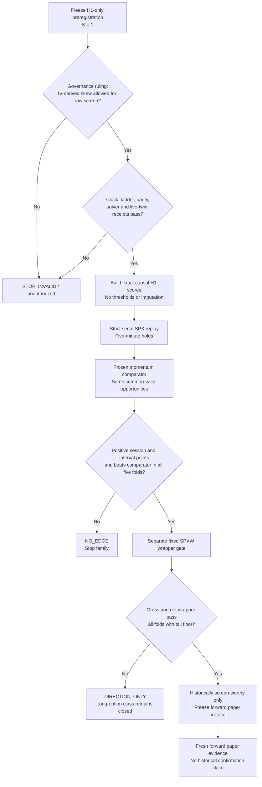
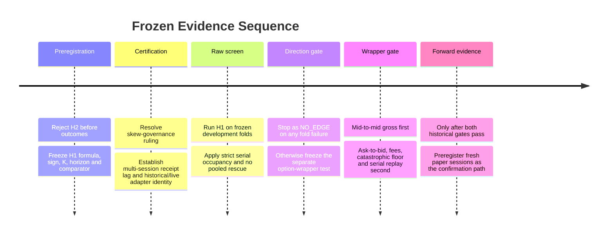

# Adversarial Scientific Review of the Proposed Options-Chain Directional Screen

## Executive Summary

**[EVIDENCE — `01_SCIENTIFIC_QUESTIONS.md`, lines 9–18, 22–36, 49–77]** This review evaluates the proposed raw options-chain directional screen only. It does not authorize implementation, fitting, threshold selection, historical promotion, paper-order changes, or any modification to the current Protocol101 default. The preserved product objective remains a one-account system that buys one SPXW 0DTE call or put; substituting futures, spreads, short premium, or longer-dated options would change the scientific question. fileciteturn0file0

**Bottom line: `REVISE`.** The economic question is worth one tightly bounded falsification test, but the proposed **K = 2 family is not valid as written**.

The principal findings are:

| Finding | Label | Adversarial conclusion |
|---|---|---|
| The broad long-premium class is closed on current evidence. | **EVIDENCE** | Gross expectancy was approximately **−$13 per trade with friction removed**, negative in all five folds. A chain-direction screen may reopen inquiry only by demonstrating incremental SPX direction at a holdable horizon; it does not overturn the closure itself. `06_PRIOR_CAMPAIGN_DISTILLATION.md`, lines 176–183; `08_PHASE1_CLOSEOUT.md`, lines 39–74. fileciteturn0file5 fileciteturn0file7 |
| H2 is inadmissible before outcomes. | **EVIDENCE** | H2 directly uses `bid_size` and `ask_size`, which the canonical alpha contract quarantines; the latest certification also bars the native CBBO, cross-sectional, implied-volatility, and self-computed-Greek families pending parity receipts. The handoff itself says quote-size imbalance is blocked. `07_OPTIONS_CHAIN_DIRECTION_HANDOFF.md`, lines 45–85; `10_FEATURE_CERTIFICATION_REPORT.md`, lines 11–31; `14_CANONICAL_STAGE1_CONTRACT.py`, lines 63–76. fileciteturn0file6 fileciteturn0file9 fileciteturn0file13 |
| H2 is also not an identifiable dealer-hedging measure. | **EVIDENCE / INFERENCE** | The owned substrate has displayed consolidated top-of-book sizes but no participant-labelled inventory, no order-level history, and no owned trade-by-trade TCBBO history. Gamma is positive for calls and puts and does not identify who owns the option or the sign of inventory. Therefore the formula can be called only a **gamma-weighted displayed-quote-pressure proxy**, and even that proxy’s directional sign is unestablished. `18_ENTRY_LIVE_FEATURE_CATALOG.py`, lines 118–174, 232–283, 378–394. fileciteturn0file17 Official Databento documentation independently distinguishes time-sampled CBBO from event-level CMBP-1, trade-space TCBBO, and order-level MBO. citeturn1search0turn1search1turn1search4 |
| H1 is scientifically testable only after a minimal specification repair. | **EVIDENCE / INFERENCE** | The current code chooses the closest solved put at least 20 points below implied spot and the closest call at least 20 points above, but it does not enforce symmetric distance; strike changes can therefore masquerade as skew changes. The rate and solver constants also conflict across files. H1 needs a fixed symmetric interpolation rule, one solver/constants hash, exact missingness rules, and a certified availability clock before it can be run. `13_PATHD_OPRA_PARITY_FEATURES.py`, lines 99–186, 253–327; `14_CANONICAL_STAGE1_CONTRACT.py`, lines 25–27, 118–158. fileciteturn0file12 fileciteturn0file13 |
| The family should be reduced **before any outcome is observed** from K = 2 to **K = 1**. | **INFERENCE** | This is not adaptive narrowing. H2 is rejected from source-contract and identifiability evidence alone. H1 remains the sole candidate. The research-loop rules permit a hypothesis to be blocked by prior art or invalid machinery before consuming a look, and require the declared family to remain bounded. `16_PATHD_RESEARCH_LOOP.py`, lines 1–22, 74–90, 117–199. fileciteturn0file15 |
| Five minutes is defensible only as a least-bad falsification horizon. | **EVIDENCE / INFERENCE** | The old wrapper’s five-minute outcome distribution was poor, with 23.1% big losses and negative mean net payoff, and longer horizons worsened the big-loss rate. A later gate amendment makes that distribution report-only rather than a raw-direction rejection gate. Thus it does not prove that five-minute SPX direction is unpredictable; it warns that even a directional pass may fail the option wrapper. `09_HORIZON_VS_CHARTER_SWEEP.md`, lines 20–57; `17_PATHD_MODEL_GATE.py`, lines 204–260. fileciteturn0file8 fileciteturn0file16 |
| The historical evidence cannot be called confirmation. | **EVIDENCE** | The 36-session holdout was spent in invalidating the prior 60-second-look-ahead result. Historical work can screen and falsify; only future, preregistered paper evidence can supply new confirmation. `07_OPTIONS_CHAIN_DIRECTION_HANDOFF.md`, lines 137–153; `08_PHASE1_CLOSEOUT.md`, lines 87–95, 97–127. fileciteturn0file6 fileciteturn0file7 |

**[INFERENCE]** The smallest defensible next experiment is therefore a **single H1 risk-reversal-change screen at a five-minute horizon**, tested as signed SPX points under strict serial occupancy against a frozen five-minute SPX-momentum comparator. It should not be run until the clock and live/historical adapter receipts are certified. A failure in any one fold is `NO_EDGE`; pooled performance cannot rescue it.

## Evidence Reconciliation and Corrected Premise

The package contains several explicit status conflicts. They cannot be silently resolved by selecting the most favorable document.

| Issue | Evidence and contradiction | Resolution for this review |
|---|---|---|
| **Holdout status** | **EVIDENCE:** `04_PROTOCOL101_TRAINING_README.md`, lines 54–69, says the protected holdout is unspent, while the later `07_OPTIONS_CHAIN_DIRECTION_HANDOFF.md`, lines 137–141, and `08_PHASE1_CLOSEOUT.md`, lines 87–95, say it was spent on August 2–3 while invalidating `signed18`. fileciteturn0file3 fileciteturn0file6 fileciteturn0file7 | **EVIDENCE:** Treat the holdout as spent. The later dated, experiment-specific closeout controls. “Open count remained zero” in the Phase-0 certification means that particular certification run did not reopen it; it does not restore an untouched firewall. |
| **Paper readiness** | **EVIDENCE:** The training front page says IBKR paper readiness was not earned, while the paper-default registry names Protocol101 as `approved_paper_default`, and the repository overview describes a guarded paper runtime. `04`, lines 54–69; `11_PAPER_TRADING_DEFAULT.json`, lines 1–24; `02_PROJECT_OVERVIEW_AGENTS.md`, lines 306–326. fileciteturn0file3 fileciteturn0file10 fileciteturn0file1 | **EVIDENCE:** Protocol101 remains the operational registry default, but this does not make the new Path-D screen paper-ready. No result in this review may change that registry. |
| **“Options information has never entered a model”** | **EVIDENCE:** The handoff makes that broad claim, but the canonical contract contains near-ATM straddle, put/call, smile-slope, delta, and gamma features. `07`, lines 27–43; `14`, lines 31–60, 215 onward. fileciteturn0file6 fileciteturn0file13 | **EVIDENCE:** The defensible correction is: **a causal full-chain directional screen has not been cleanly tested; chain-derived option information has previously entered models.** |
| **H2’s status** | **EVIDENCE:** The scientific brief proposes gamma-weighted displayed quote pressure, while the handoff says quote-size imbalance is blocked and the canonical contract quarantines `bid_size` and `ask_size`. `01`, lines 62–75; `07`, lines 45–77; `14`, lines 63–76. fileciteturn0file0 fileciteturn0file6 fileciteturn0file13 | **EVIDENCE:** H2 is rejected before outcomes. It is not part of the valid experiment family. |
| **Big-loss rule** | **EVIDENCE:** The horizon report treats a 2% big-loss ceiling as a hard charter gate; the model-gate code’s later amendment makes the four-bucket distribution report-only. `09`, lines 3–57; `17`, lines 204–260. fileciteturn0file8 fileciteturn0file16 | **EVIDENCE:** The 23.1% five-minute big-loss rate remains powerful adverse evidence about the wrapper, but it does not reject a raw SPX-direction hypothesis by itself. |
| **Current status authority** | **EVIDENCE:** `03_CURRENT_TRADING_BOT_SINGLE_SOURCE_OF_TRUTH.md`, lines 1–32, labels itself superseded for Path-D model status; it remains useful for runtime risks, including weak quote-age evidence. fileciteturn0file2 | **EVIDENCE:** Use Files 07–10 for the latest Path-D scientific status; use Files 02, 03, 11, 19, and 20 only for runtime and operational constraints. |
| **Corpus size** | **EVIDENCE:** `development_sessions()` asserts exactly 251 CBBO-1m sessions and returns the first 215 development sessions. `12_PATHD_PHASE1_ENTRY.py`, lines 67–81. fileciteturn0file11 | **EVIDENCE:** The 251-session count and 215-session development prefix are verified in executable code. |
| **Contracts per session** | **UNKNOWN:** The review brief reports 392–1,288 contracts, median 478 and mean 532; the handoff says “500 distinct contracts/session,” but none of the remaining included files contains the cited census output. `01`, line 40; `07`, lines 27–43. fileciteturn0file0 fileciteturn0file6 | **UNKNOWN:** The exact range, median, and mean should not be treated as proved by this package. The experiment must produce a pre-outcome inventory receipt. |
| **Signed flow and dealer data** | **EVIDENCE:** The live-feature catalog states that historical Trades/TCBBO and CMBP-1 event flow are not owned; the data contract warns that CBBO last-sale fields are not volume. `18`, lines 232–283; `05_DATA_CONTRACT.md`, lines 161–169. fileciteturn0file17 fileciteturn0file4 | **EVIDENCE:** No historical participant-labelled inventory, dealer position, queue position, or complete signed-flow substrate is established. |
| **Runtime freshness** | **EVIDENCE:** The historical fill law requires an exact-contract quote no more than 2,000 ms old, while the persistent live runner’s clean-window guard permits quote ages up to 90,000 ms. `12`, lines 33–56, 284–343; `20_PROTOCOL160_PERSISTENT_PAPER_TRADER.py`, lines 552–590. fileciteturn0file11 fileciteturn0file19 | **EVIDENCE:** The new screen must not inherit the runtime’s 90-second tolerance. Its own interval-availability law must be certified and identical historically and live. |

**[EVIDENCE — `05_DATA_CONTRACT.md`, lines 18–49, 112–149]** The data contract requires event time, receive time, decision time, timestamp precision, feature age, source, live reproducibility, and explicit no-forward-fill semantics. The rule `event_time <= decision_time` is necessary but not sufficient: a record that occurred before the decision but arrived after it is still unavailable. fileciteturn0file4

**[EVIDENCE — `15_SPX_DIRECTIONAL_SKILL_SCREEN.py`, lines 108–152]** The package already contains a concrete warning that the corpus stores one timestamp as `datetime64[us]`; an unqualified integer conversion produces microseconds, not nanoseconds, creating a 1,000-fold clock error. The same file defines official SPX bar availability as bar-open timestamp plus one minute and subjects joins to a 90-second SPX staleness cap. fileciteturn0file14

**[EVIDENCE]** The official vendor documentation corroborates the package distinction: CBBO is a **time-space-sampled consolidated top-of-book and last-sale schema**; CMBP-1 is event-space consolidated top-of-book; TCBBO is trade-space BBO around every trade; and Trades is the tick-by-tick trade schema. The displayed `bid_sz_00` and `ask_sz_00` fields are aggregate top-level displayed quantities, not participant inventory or dealer ownership. citeturn1search0turn1search1turn1search3turn1search4

## Scientific Audit of the Candidate Family

| Mechanism | Label | Formula and interpretation audit | Verdict before outcomes |
|---|---|---|---|
| **H1: five-minute risk-reversal change** | **EVIDENCE / ASSUMPTION** | The intended score is `−(RR_t − RR_t−5m)`, where increasing put-over-call skew maps toward PUT. That sign is economically plausible as a preregistered hypothesis, but it is not identified as a causal law: skew can react to the SPX move already observed, respond jointly to volatility demand, or predict downside variance rather than signed return. `01`, lines 51–60. fileciteturn0file0 | **REVISE, then eligible.** |
| **H1 strike construction** | **EVIDENCE** | The existing IV snapshot chooses the nearest solved put strike at least 20 points below implied spot and the nearest call at least 20 points above. It does not require equal distances, interpolation to fixed moneyness, or pair continuity across snapshots. `13`, lines 278–327. fileciteturn0file12 | Must be frozen before results. Otherwise strike-grid switches can create a false “change” signal. |
| **H1 IV and spot construction** | **EVIDENCE** | The parity estimator uses exact-strike call/put pairs, inverse combined-spread weights, at least five pairs, a 150-point radius, and a 25-point pair-spot residual. Missing snapshots are not carried forward. The IV solver imposes no-arbitrage bounds and a `[10⁻⁴, 5]` volatility domain. `13`, lines 99–186, 197–236, 253–275. fileciteturn0file12 | Reusable, subject to one frozen constants hash and parity receipts. |
| **H1 constants** | **EVIDENCE** | File 13 uses a 4% risk-free rate and File 14 uses 5%; both use zero dividend yield. `13`, lines 20–29; `14`, lines 25–27. fileciteturn0file12 fileciteturn0file13 | The conflict must be resolved before scores are generated. No result is interpretable if historical and live solvers can use different constants. |
| **H1 model-facing legality** | **UNKNOWN / EVIDENCE** | The canonical contract quarantines raw IV as a feature but permits IV as an intermediate for delta/gamma; the handoff explicitly says whether an IV-derived skew is model-facing alpha remains an open ruling. The certification report bars implied volatility because its implied-spot parent and parity receipts are incomplete. `07`, lines 67–85; `10`, lines 11–31; `14`, lines 63–76. fileciteturn0file6 fileciteturn0file9 fileciteturn0file13 | No experiment until the owner records whether a raw, non-model screen may use the derived skew and the required receipts pass. |
| **H2: gamma-weighted displayed quote pressure** | **EVIDENCE** | H2 consumes two explicitly quarantined alpha fields. The parent CBBO-native family, cross-sectional family, and self-computed-Greek family are not certified. `07`, lines 45–77; `10`, lines 11–31; `14`, lines 63–76. fileciteturn0file6 fileciteturn0file9 fileciteturn0file13 | **REJECT before outcomes.** |
| **H2 sign** | **THEORETICAL / INFERENCE** | `bid_size − ask_size` is displayed-book asymmetry, not trade aggressor flow. A larger displayed bid can mean genuine demand, passive inventory provision, temporary order placement, or simply a venue/contract-universe effect. Multiplying by unsigned gamma does not reveal whether dealers are long or short that gamma. | The sign from positive H2 score to CALL is unproved. |
| **H2 normalization** | **THEORETICAL** | Dividing by total eligible gamma does not normalize for the number of contracts, strike-density changes, missing strikes, quote age, premium, or displayed-size scale. Because 0DTE gamma concentrates near spot, small changes in the eligible near-ATM universe can dominate the score. | The statistic can move when the contract set changes even if each continuing contract’s quote state does not. |
| **H2 zero/missing behavior** | **IMPLEMENTATION** | Per-contract imbalance is undefined when both displayed sizes are zero. The aggregate is undefined when no eligible positive finite gamma remains. Locked, crossed, stale, or missing quotes also destroy the intended interpretation. | Every such state would need `WAIT`, which may create highly non-random coverage and occupancy differences. |
| **K after review** | **INFERENCE** | H2 is removed based on source and contract evidence, not historical returns. | **Frozen family becomes K = 1.** |

**[INFERENCE]** The strongest defensible story for H1 is not “dealer hedging predicts SPX.” It is: **a causally observed change in the relative price of downside versus upside convexity may contain incremental information about the next five-minute signed SPX move beyond recent SPX momentum**. That claim is deliberately weaker because the data do not identify who changed inventory, whether the initiating demand came from customers or dealers, or whether any hedge transaction followed.

**[EVIDENCE — `18_ENTRY_LIVE_FEATURE_CATALOG.py`, lines 232–283, 486–510]** Claims that cannot be made include dealer inventory sign, aggregate dealer gamma exposure, participant-level positions, queue position, complete cancellation behavior, or signed customer flow. Those would require different historical substrates or participant identifiers that the package does not establish. fileciteturn0file17

**[INFERENCE]** The minimum lead/lag interpretation matrix is:

| Observed pattern | Label | Interpretation |
|---|---|---|
| H1 strongly explains SPX return from `t−5` to `t`, but not `t` to `t+5`. | **INFERENCE** | Reaction or nowcasting, not prediction. |
| H1 predicts `|SPX(t+5)−SPX(t)|` but not signed points. | **INFERENCE** | Volatility, jump-risk, or liquidity-state information rather than direction. |
| H1’s sign reverses after controlling by the frozen momentum comparator. | **INFERENCE** | The raw relationship was probably common response to recent SPX movement. |
| H1 retains positive signed points and beats momentum on the same eligible decisions in every fold. | **EVIDENCE if observed** | Incremental historical directional screening evidence, not confirmation and not option profitability. |
| H1 passes underlying direction but the fixed option wrapper loses before or after costs. | **EVIDENCE if observed** | Directional magnitude is insufficient to overcome theta, IV change, spread, or fees. |
| H1 produces unusually large performance relative to the project’s historical range. | **ASSUMPTION / SAFETY RULE** | Presume a clock, pairing, or join defect until mutation tests and decision-time reconstruction prove otherwise. `01`, lines 28–30; `08`, lines 87–95. fileciteturn0file0 fileciteturn0file7 |

## Frozen Scientific Specification

**[ASSUMPTION]** This is the smallest test that could be valid after the required receipts and governance ruling. It is a design freeze, not authorization to execute.

### Estimand hierarchy

**[INFERENCE]** The estimands must be hierarchical because underlying direction is necessary but not sufficient for a profitable long option:

\[
Y_{t,5} = SPX^{avail}_{t+5m} - SPX^{avail}_{t}
\]

\[
D_t =
\begin{cases}
+1 & \text{H1 score}>0\quad(\text{CALL})\\
-1 & \text{H1 score}<0\quad(\text{PUT})\\
0 & \text{score}=0\text{ or required input unavailable}\quad(\text{WAIT})
\end{cases}
\]

\[
P_t^{SPX}=D_tY_{t,5}
\]

The hierarchy is:

| Level | Frozen estimand | Label | Meaning |
|---|---|---|---|
| Raw directional primary | Mean **signed SPX points per session** under strict one-account serial occupancy. | **ASSUMPTION** | Measures harvestable directional output rather than an unlimited count of overlapping predictions. |
| Raw directional secondary | Mean signed SPX points per executed interval. | **ASSUMPTION** | Separates average signal quality from signal frequency and occupancy. |
| Incrementality | Difference in the same two metrics between H1 and frozen five-minute SPX momentum on a common valid opportunity set. | **ASSUMPTION** | Tests whether the chain adds information beyond a closed price-only mechanism. |
| Wrapper gross | Fixed-contract SPXW mid-to-mid P&L over five minutes under the identical serial decisions. | **ASSUMPTION** | Tests whether direction and move magnitude are sufficient before friction. |
| Wrapper net | Fixed-contract ask-to-bid P&L, fees, catastrophic floor, and serial replay. | **ASSUMPTION** | Tests whether the proposed long-call/put expression is economically viable. |
| Ultimate target | \(E[\text{long-option net payoff}\mid\text{causal chain state}]>0\), with acceptable tail, concentration, and operational behavior. | **INFERENCE** | Underlying direction alone does not establish this because option value also depends on magnitude, implied-volatility change, theta, spread, fills, and fees. |

**[EVIDENCE — `04_PROTOCOL101_TRAINING_README.md`, lines 22–52]** Even a successful fixed-ATM wrapper is only a feasibility component. The final Protocol101 product must eventually learn WAIT versus a specific eligible call/put/strike and, while open, HOLD versus EXIT; a hard-coded ATM-only entry is not the finished trader. fileciteturn0file3

### Frozen H1 construction

| Component | Frozen rule | Label and basis |
|---|---|---|
| Family | **K = 1: H1 only.** H2 is blocked before outcomes and does not consume a hypothesis look. | **INFERENCE**, based on Files 07, 10, 14, 16. |
| Source | Owned development-prefix SPXW CBBO-1m, definitions, and official SPX bars only. No holdout access. | **EVIDENCE:** `12`, lines 67–81, and `07`, lines 137–153. fileciteturn0file11 fileciteturn0file6 |
| Implied spot | Exact-strike call/put parity estimator from File 13: at least five self-consistent pairs; no carried prior spot. | **EVIDENCE:** `13`, lines 99–186, 197–211. fileciteturn0file12 |
| Wing definition | Interpolate OTM put IV at exactly `S−20` points and OTM call IV at exactly `S+20` points from immediately bracketing five-point strikes. No extrapolation; both brackets must exist and have valid quotes. | **ASSUMPTION:** indispensable correction to the asymmetric nearest-wing rule in `13`, lines 312–318. It changes H1’s measurement, not K. |
| Risk reversal | `RR_t = IV_put(S−20,t) − IV_call(S+20,t)`. The ATM IV cancels and therefore need not enter the final RR value. | **INFERENCE:** algebraically equivalent to `put_skew−call_skew` when both skews share the same ATM IV. |
| Score | `score_t = −(RR_t−RR_t−5m)`. | **ASSUMPTION:** rising downside-relative skew maps to PUT; falling downside-relative skew maps to CALL. |
| Prior snapshot | Exact snapshot at `t−5m`; no nearest-time substitution and no forward fill. | **EVIDENCE:** exact-prior semantics already exist in `13`, lines 338–365. fileciteturn0file12 |
| Solver | One shared historical/live implementation; one frozen rate, dividend, expiry clock, solver range, iteration count, and hash. | **EVIDENCE:** the shared-adapter concept is present, but the 4% versus 5% rate conflict must first be resolved. `13`, lines 20–29, 253–275; `14`, lines 25–27. fileciteturn0file12 fileciteturn0file13 |
| Mapping | Positive `CALL`, negative `PUT`, exact zero `WAIT`. No deadband and no return-optimized threshold. | **ASSUMPTION:** a deadband would create an additional unfrozen parameter. |
| Missingness | Any missing snapshot, pair, bracket, quote, IV solution, zero/invalid time to expiry, failed parity guard, or late receipt produces `WAIT`. Missing values are never imputed from an earlier boundary. | **EVIDENCE / ASSUMPTION:** consistent with Files 05, 13, and 18. fileciteturn0file4 fileciteturn0file12 fileciteturn0file17 |
| Primary horizon | Five minutes only. | **ASSUMPTION:** least-bad falsification horizon, not an optimum. No horizon sweep is allowed. |
| Sensitivity | None in the confirmatory screen. | **ASSUMPTION:** minimizes family size and prevents rescue by 15-, 30-, or 60-minute outcomes. |

### Exact clock law

| Clock element | Frozen requirement | Status |
|---|---|---|
| Option event interval | Use only the completed CBBO interval ending at boundary `b` and the exact interval ending at `b−5m`. | **ASSUMPTION**, consistent with `18`, lines 118–174. fileciteturn0file17 |
| Vendor timestamp | Preserve `ts_event` and `ts_recv` at their declared precision. Explicitly cast to nanoseconds before integer operations. | **EVIDENCE:** Files 05 and 15. fileciteturn0file4 fileciteturn0file14 |
| Local availability | A chain snapshot is usable only after all selected ladder records have been locally received by `b+L*`, where `L*` is a frozen conservative lag established from a **multi-session receipt-latency distribution**. | **ASSUMPTION / CURRENTLY BLOCKED:** that distribution is a missing certification receipt. `10`, lines 23–27; `18`, lines 134–174. fileciteturn0file9 fileciteturn0file17 |
| Decision time | `decision_time = b + L*`, after feature computation. | **ASSUMPTION** |
| Feature cutoff | No quote, definition update, trade summary, IV input, SPX value, session aggregate, or candidate-universe update with local availability after decision time may affect the score. | **EVIDENCE:** required by `05`, lines 40–49, 112–149. fileciteturn0file4 |
| SPX label start | Latest completed official SPX close available at decision time under the same bar-open-plus-one-minute law used by the prior directional screen. | **EVIDENCE:** `15`, lines 108–152. fileciteturn0file14 |
| SPX label end | Latest completed official SPX close available at `decision_time+5m`; no bar whose availability exceeds label end. | **ASSUMPTION**, applying the same availability function. |
| As-of join | Backward-only by availability time, never by bare event date or nearest timestamp. | **ASSUMPTION / DATA-CONTRACT REQUIREMENT** |
| Proof | Mutating every source row whose availability is after a decision must leave all earlier scores byte-identical. A deliberately shifted future snapshot must change the planted-leak probe. | **EVIDENCE / ASSUMPTION:** based on `05`, lines 193–203, and the prior leak history. fileciteturn0file4 |
| Failure behavior | Any clock mismatch, duplicate availability key, 1,000-fold unit mismatch, late source, or non-identical historical/live adapter is `INVALID_EXPERIMENT`, not `NO_EDGE`. | **ASSUMPTION**, reflecting the project’s fail-closed governance. |

### Serial occupancy and selection law

**[ASSUMPTION]** Candidate boundaries are every minute from **10:00 through 15:50 New York time**. The 10:00 start preserves a substantial session warm-up and matches the existing directional-screen boundary discipline. A trade opened at `t` occupies the account on `[t,t+5m)`; signals at `t+1` through `t+4` are logged as skipped. At `t+5`, the prior interval closes first, then the new score may be considered. The session is forced flat by 15:55, matching the current paper runtime’s forced-flat default. `15`, lines 46–63, 97–105; `20`, lines 109–145. fileciteturn0file14 fileciteturn0file19

**[EVIDENCE — `02_PROJECT_OVERVIEW_AGENTS.md`, lines 268–286]** Strict one-account serial replay, no overlapping headline trades, skipped-opportunity reporting, and flat-by-close behavior are already repository-level comparison requirements. fileciteturn0file1

### Required data fields

| Field group | Required fields | Why required | Current status |
|---|---|---|---|
| Time and availability | `timestamp_source`, `timestamp_precision`, `event_time`, vendor `ts_recv`, local `receive_time`, interval end, `decision_time`, availability lag, feature age | Proves causal availability and catches the prior 60-second leak. | **PARTIAL / BLOCKED:** schema requirements exist; multi-session local receipt proof is missing. `05`, lines 40–49; `10`, lines 23–27. fileciteturn0file4 fileciteturn0file9 |
| Contract identity | Session, raw OSI symbol, expiry, right, strike, root, settlement style, instrument ID, multiplier, tick size | Prevents cross-session instrument-ID reuse and wrong-expiry contamination. | **AVAILABLE:** parsing and same-session validation exist in `12`, lines 57–88. fileciteturn0file11 |
| Quote state | Bid, ask, quote record time, bid/ask venue publishers where available, locked/crossed flag, source flags | Needed for valid mids, parity, IV, and missingness. | **AVAILABLE BUT NOT CERTIFIED FOR THIS FAMILY.** |
| Quote size | Not required for H1. | Removing H2 removes the scientific and governance dependence on displayed sizes. | **EXCLUDED.** |
| Definitions | Listing identity, strike, expiry, right, tick increment, definition-replay completion time | Establishes the causal eligible universe. | **CONTRACT CLOCK ADMITTED; wider ladder receipts pending.** `10`, lines 11–27. fileciteturn0file9 |
| Parity state | Selected exact-strike pair IDs, call/put mids, combined spread, pair implied spots, weights, implied spot, dispersion | Makes every spot and wing choice reconstructable. | **IMPLEMENTED, PARENT NOT CERTIFIED.** `13`, lines 99–186. fileciteturn0file12 |
| IV state | Price, spot, strike, right, time to expiry, rate, dividend, solver version/hash, IV result/failure reason | Prevents hidden solver drift. | **IMPLEMENTED, CONSTANTS CONFLICT, CERTIFICATION PENDING.** |
| Wing interpolation | Bracketing put/call symbols and strikes, interpolation weights, target offsets, gap widths | Distinguishes true skew movement from strike selection changes. | **NOT YET FROZEN.** |
| SPX labels | Official source flag, SPX bar event time, availability time, start close, end close, five-minute signed move | Produces the raw directional outcome without option economics. | **AVAILABLE:** official-source assertions exist in `12`, lines 204 onward, and clock parity in File 15. fileciteturn0file11 fileciteturn0file14 |
| Fold and occupancy | Fold ID, boundary ID, action, entry time, exit time, skipped reason, account state, session points | Enforces serial replay and fold-level gates. | **SERIAL ADAPTER PENDING:** `18`, lines 435–458. fileciteturn0file17 |
| Provenance | Vendor source, input hashes, schema version, build ID, adapter hash, solver hash, source row IDs | Makes the experiment immutable and reconstructable. | **REQUIRED:** `05`, lines 126–139. fileciteturn0file4 |
| Corpus inventory | Session count, contracts per session, missing partitions, duplicate identities | Verifies the factual premise before outcomes. | **SESSION COUNT VERIFIED; CONTRACT-DISTRIBUTION STATISTICS UNKNOWN.** |

## Raw Ledger and Gates

### Sample and folds

**[EVIDENCE]** The owned corpus is asserted to contain 251 sessions, of which the first 215 form the development prefix. The holdout suffix must never be decoded or reopened. `12`, lines 67–81; `07`, lines 137–153. fileciteturn0file11 fileciteturn0file6

**[INFERENCE — derived from `12_PATHD_PHASE1_ENTRY.py`, lines 596–615]** Reusing the existing expanding-fold routine yields an initial 44-session history, one embargo session per fold, and **166 non-overlapping evaluation sessions**, split approximately `34/33/33/33/33`. Because H1 has no fitted parameters, the earlier training prefixes are not used to tune the signal; reuse of the fold function is solely for immutable chronological reporting. fileciteturn0file11

**[ASSUMPTION]** A fold is valid only if it retains at least 30 sessions, no more than ten development sessions are dropped in total, and each included session has at least 30 valid pre-occupancy feature boundaries. These thresholds reuse the prior raw directional-screen coverage discipline rather than being optimized from H1 outcomes. `15`, lines 46–63. fileciteturn0file14

### Frozen comparator

**[ASSUMPTION]** The comparator direction is:

\[
D_t^{mom}=\operatorname{sign}
\left(SPX^{avail}_t-SPX^{avail}_{t-5m}\right)
\]

Zero or unavailable momentum maps to `WAIT`. It uses the same decision boundaries, five-minute occupancy, forced-flat rule, and common H1-valid opportunity set. No learner, score threshold, random null, or post-outcome calibration is permitted.

**[EVIDENCE]** This comparator is intentionally simpler than the current Protocol101 entry machinery, which contains a learned margin threshold, candidate truncation, and time-bucket restrictions. Those existing thresholds must not leak into the raw screen. `19_PROTOCOL101_ENTRY.py`, lines 122–173, 271–342. fileciteturn0file18

### Exact fold ledger

Every fold must report the following without aggregation-only substitution:

| Output | Definition | Gate status |
|---|---|---|
| Evaluation sessions | Sessions entering the fold after frozen quality rules | Coverage gate |
| Dropped sessions and reasons | Missing partition, duplicate identity, late receipt, insufficient ladder, SPX availability failure | Any unexplained or outcome-dependent drop invalidates |
| Eligible boundaries | H1 construction succeeded before occupancy | Report |
| Executed intervals | Eligible boundary while account flat and score nonzero | Report |
| Skipped overlap signals | Valid nonzero score while occupied | Report |
| CALL / PUT / WAIT counts | By fold, session, and time of day | Report; no balancing |
| Session signed points | Sum of `D_t × ΔSPX_5m` within each session | **Primary directional gate** |
| Interval signed points | Mean of `D_t × ΔSPX_5m` over executed intervals | **Secondary directional gate** |
| Momentum session points | Same metric under the comparator | Comparator gate |
| Momentum interval points | Same metric under the comparator | Comparator gate |
| Incremental session points | H1 minus momentum, paired on session | Comparator gate |
| Incremental interval points | H1 minus momentum on common executions | Comparator gate |
| Contemporaneous signed points | `D_t × (SPX_t−SPX_t−5m)` | Reaction diagnostic |
| Absolute future move | `|SPX_t+5−SPX_t|`, summarized by score-magnitude bins | Volatility diagnostic only |
| Sign-reversed identity | Performance after replacing `D_t` by `−D_t` | Must equal the exact negative apart from zero/WAIT rows |
| Pair turnover | Fraction of boundaries whose interpolation brackets differ from `t−5` | Implementation diagnostic |
| Solver and parity failure rates | By session and time of day | Data-quality diagnostic |
| Result provenance | Source hashes, build hash, formula hash, clock hash, solver hash | Validity gate |

### Pass and stop rules

**[ASSUMPTION]** The raw H1 screen passes only if **all** of the following are true:

1. Mean signed SPX points per session are strictly positive in each of the five folds.
2. Mean signed SPX points per executed interval are strictly positive in each fold.
3. H1 exceeds the frozen momentum comparator in session points in each fold.
4. H1 exceeds the comparator in interval points in each fold.
5. No fold is rescued by the pooled result.
6. Coverage requirements pass without return-dependent exclusions.
7. Every clock, mutation, sign-identity, source-hash, and adapter-parity test passes.
8. The lead/lag ledger does not show that the apparent result exists only contemporaneously.

**[INFERENCE]** Requiring five of five folds is stricter than the generic Path-D acceptance function, which permits four sign-stable folds for some tiers. That additional strictness is appropriate here because `NO_EDGE` is explicitly acceptable and there is no untouched holdout to correct an optimistic historical screen. `17_PATHD_MODEL_GATE.py`, lines 330–401; `01`, lines 11–18, 28–36. fileciteturn0file16 fileciteturn0file0

**[ASSUMPTION]** The following outcomes terminate the experiment immediately:

| Stop condition | Result |
|---|---|
| H1 fails any one of the four economic comparisons in any fold | `NO_EDGE` |
| H1 is pooled-positive but fold-inconsistent | `NO_EDGE` |
| H1 predicts absolute moves but not signed points | `NO_DIRECTIONAL_EDGE` |
| H1 reacts to the prior five-minute SPX move but adds no next-five-minute value beyond momentum | `NO_INCREMENTAL_EDGE` |
| Clock, unit, join, receipt, universe, mutation, or solver parity fails | `INVALID_EXPERIMENT` |
| Required governance ruling or certification remains unresolved | `NOT_AUTHORIZED` |
| Any threshold, wing distance, horizon, missingness rule, universe radius, or sign convention is changed after outcomes are inspected | `FAMILY_INVALIDATED` |
| H1 passes the raw gate | `DIRECTION_SCREEN_PASS`, not confirmation and not permission to fit a model |

**[EVIDENCE — `16_PATHD_RESEARCH_LOOP.py`, lines 1–22, 74–90, 234 onward]** The family budget includes every hypothesis that consumes a look, semantic duplicates cannot be retried under new names, and a successful historical tier means at most “worth a forward paper test,” not deployable. fileciteturn0file15

## Conditional Wrapper and Compatible Model

**[ASSUMPTION]** This section applies only if H1 clears the raw gate exactly as frozen. Direction alone does not reopen production research.

### Fixed option-wrapper gate

| Component | Frozen conditional design |
|---|---|
| Underlying decisions | Exact H1 CALL/PUT/WAIT decisions and serial times from the raw screen; no reselection. |
| Contract | One same-session SPXW call for CALL or put for PUT at the strike nearest the latest causally available SPX level. An exact half-grid tie selects the lower numeric strike. |
| Quantity | One contract. |
| Entry time | First exact-contract quote available after the raw decision plus the frozen order-arrival latency. |
| Hold | Five minutes, unless the deterministic catastrophic floor triggers earlier. |
| Gross pass | Entry and exit at causal mids, zero fees, strict serial replay. |
| Net pass | Entry at causal ask, exit at causal bid, actual documented fees, identical serial replay. |
| Catastrophic floor | Exit when the executable bid marks a loss of 50% of entry premium, using exact-contract CBBO-1s; forced flat remains 15:55. The 50% stop is inherited from the existing reference-policy identifier rather than selected from wrapper outcomes. `12`, lines 33–56. fileciteturn0file11 |
| Missing exit quote | Fail closed; do not substitute a future favorable quote. Report the path and use the first causal executable quote allowed by the frozen law. |
| Gate | Positive mean P&L per session and per executed trade in all five folds at mid-to-mid **and** ask-to-bid-after-fees; no pooled rescue. |
| Tail | p99 and top-decile tail value must each retain at least 80% of the fixed-hold baseline, consistent with the existing tail-preservation test. `17`, lines 57–122. fileciteturn0file16 |
| Concentration | Report side, time, session, and top-decile concentration; no single window may be used as a rescue. |
| Status if passed | Historical wrapper screen worthy of a new forward-paper preregistration, not confirmation. |

**[EVIDENCE]** The old long-premium result was negative before friction, and passive execution improvements did not make it profitable in all folds. Therefore a directional pass that fails mid-to-mid gross cannot be repaired by an execution narrative. `08_PHASE1_CLOSEOUT.md`, lines 1–37, 39–74. fileciteturn0file7

**[EVIDENCE]** Five-minute wrapper risk is already adverse: the old policy produced mean net P&L of approximately −$44.84 and a 23.1% big-loss share at five minutes. That evidence concerns a different entry policy and therefore does not falsify H1, but it raises the prior probability that a weak underlying directional edge will not survive the wrapper. `09`, lines 20–32, 61–69. fileciteturn0file8

### Compatible entry-plus-exit objective

**[INFERENCE]** If both raw direction and the fixed wrapper survive, entry and lifecycle models must be trained jointly on the entry policy’s own out-of-fold trajectory distribution. A suitable objective is:

\[
\begin{aligned}
J(\pi_E,\pi_X)
=&\ E[P_{\pi_E,\pi_X}] \\
&-\lambda_L E\left[(L_{\text{floor}}-P_{\pi_E,\pi_X})_+\right] \\
&-\lambda_T E\left[
(P_H-P_{\pi_E,\pi_X})_+
\mathbf{1}\{P_H\ge q_{0.90}(P_H)\}
\right]
\end{aligned}
\]

subject to:

\[
\pi_X=\text{EXIT}
\quad\text{whenever the deterministic catastrophic floor is breached,}
\]

and session-close forced-flat behavior.

Here \(P_{\pi_E,\pi_X}\) is realized ask-to-bid net P&L under the composed policy, while \(P_H\) is the fixed-hold payoff on the same entry trajectory. The coefficients \(\lambda_L\) and \(\lambda_T\) must be frozen before model outcomes and cannot be tuned to maximize historical P&L.

**[INFERENCE]** This objective resists the two previously observed degeneracies. An always-exit policy is penalized when it forfeits trajectories in the positive hold-tail, while an always-hold policy is penalized for downside below the loss floor and is still subject to a mandatory catastrophic exit. It must also pass the existing first-step-exit and tail-preservation tests rather than relying on mean P&L alone. `17`, lines 1–17, 30–122. fileciteturn0file16

**[EVIDENCE]** The need is not hypothetical: the prior learned exit selected the first step in roughly 95.1% of trajectories and reduced p99 from roughly $3,422 under hold-to-close to about $86. `01`, lines 31–33; `08`, lines 1–37, 87–95. fileciteturn0file0 fileciteturn0file7

**[EVIDENCE]** Entry and exit running sequentially does not make them compatible. The full-trader product requires one-account combined behavior and a final composed-system gate; an entry-only or fixed-ATM model remains incomplete. `04`, lines 22–52, 176–192. fileciteturn0file3

## Failure Priorities and Final Decision

### Ranked adversarial failure analysis

| Rank | Failure mode | Label | Probability | Damage | Why it can create a convincing false result | Required falsifier or mitigation |
|---:|---|---|---|---|---|---|
| 1 | **Uncertified availability clock** | **EVIDENCE / INFERENCE** | Very high | Fatal | A previous 60-second look-ahead generated an apparently extraordinary result and consumed the holdout. CBBO receipt-lag certification is still incomplete. | Multi-session receipt-latency distribution; exact historical/live adapter identity; mutate-future invariance; nanosecond-unit assertions. `07`, lines 103–120, 137–153; `10`, lines 23–31. fileciteturn0file6 fileciteturn0file9 |
| 2 | **H2 source-contract violation** | **EVIDENCE** | Certain as written | Fatal | The proposed formula directly uses quarantined fields and barred parent families. | Reject H2 before outcomes; K becomes 1. |
| 3 | **Simultaneous response to SPX** | **THEORETICAL / INFERENCE** | High | Fatal to incrementality | Option mids, parity-implied spot, IV, and skew all respond rapidly to SPX. A five-minute skew change may describe the move that just occurred. | Compare prior-five-minute and next-five-minute signed points; beat frozen SPX momentum on identical opportunities in every fold. |
| 4 | **H2 non-identifiability as dealer flow** | **EVIDENCE / THEORETICAL** | High | Fatal to mechanism claim | Displayed sizes do not reveal position ownership or inventory sign; gamma does not provide participant sign. | Requires participant-labelled positions or a defensible trade/event substrate; neither is owned. |
| 5 | **Strike-pair discontinuity in H1** | **EVIDENCE / IMPLEMENTATION** | High | High | Nearest-wing selection can jump between strikes as implied spot moves, manufacturing apparent RR changes. | Fixed ±20-point IV interpolation, saved bracket IDs and weights, pair-turnover diagnostics. |
| 6 | **Variance prediction mistaken for direction** | **THEORETICAL** | High | High | Skew changes may forecast absolute movement, downside variance, or liquidity stress without predicting return sign. | Signed-point gate, absolute-move diagnostic, sign reversal, and no directional claim from magnitude-only results. |
| 7 | **Insufficient data resolution** | **EVIDENCE / INFERENCE** | Medium-high | High | One-minute CBBO is sampled in time space and is not event-level quote flow. It can suppress cancellation and intra-minute path information relevant to H2-like stories. | Keep H1 as a minute-snapshot price-geometry hypothesis; do not interpret it as event flow. Moving to one-second data would constitute a new family and requires a separate preregistration. |
| 8 | **Changing contract universe** | **IMPLEMENTATION / INFERENCE** | High | High | Missing strikes, shifted ladders, and variable quote coverage can change a cross-sectional statistic independently of market belief. | Atomic ladder receipt, fixed wing interpolation, no backfill, coverage ledger, identical historical/live universe. |
| 9 | **Economic magnitude below wrapper drag** | **EVIDENCE / INFERENCE** | High | Fatal to product | The prior wrapper lost before friction; even a statistically consistent SPX edge can be too small for theta, IV decay, spread, and fees. | Separate gross mid-to-mid wrapper gate before any modeling; then ask-to-bid and fees. |
| 10 | **Occupancy dilution and opportunity mismatch** | **EVIDENCE / INFERENCE** | Medium-high | High | A per-boundary mean can look positive while one account misses most signals or occupies losing intervals. Different WAIT patterns can also make comparator results incomparable. | Primary per-session serial metric; common-valid comparator ledger; skipped-signal opportunity cost. |
| 11 | **Fold or time-window concentration** | **EVIDENCE** | Medium | High | A prior exploratory 10:30–10:59 gross-positive window was one of 11 inspected windows and remained net negative. | Five-of-five fold gate; time-of-day report only; no window rescue. `08`, lines 1–22. fileciteturn0file7 |
| 12 | **Threshold and horizon fishing** | **EVIDENCE / GOVERNANCE** | Medium | High | The current Protocol101 stack uses learned thresholds, but importing or tuning one would enlarge the raw family; a horizon sweep would do the same. | Sign-only H1, one five-minute horizon, no deadband, no sensitivity rescue. `19`, lines 122–173, 271–342. fileciteturn0file18 |
| 13 | **Nonstationarity** | **THEORETICAL** | Medium | High | 0DTE participation, volatility regimes, and quote behavior may vary over the one-year corpus. Fold consistency can still hide a future regime break. | Chronological fold ledger and mandatory fresh forward paper; never call historical stability confirmation. |
| 14 | **Wrapper success with incompatible lifecycle** | **EVIDENCE / INFERENCE** | Medium | High | A fixed-hold wrapper may pass while a learned exit later amputates convex winners. | Joint objective, deterministic floor, own-entry OOF trajectories, first-step-exit and tail tests, fresh composed gate. |
| 15 | **Operational parity failure** | **EVIDENCE** | Medium | High | Historical and live candidate filters, feature calculations, stale rules, action space, and account state can diverge. The current repository already records historical/live mismatch risk. | Same adapters and hashes, decision-shadow reconstruction, latency/freshness logging, blocked reasons, no paper authorization until parity. `02`, lines 306–326; `03`, lines 75–86, 810–890. fileciteturn0file1 fileciteturn0file2 |
| 16 | **False comfort from current paper infrastructure** | **EVIDENCE** | Medium | Medium | A registry-approved paper runtime and guarded order path do not validate a new feature family; observed sessions have often produced no orders. | Keep the current default unchanged and treat the H1 work as offline scientific screening only. `11`, lines 1–24; `20`, lines 109–164. fileciteturn0file10 fileciteturn0file19 |

### Prioritized required revisions

| Priority | Required revision | Label | Blocking status |
|---:|---|---|---|
| 1 | Remove H2 from the declared family before inspecting any return outcome. Record the reason as quarantined fields, barred feature parents, missing event-flow substrate, and non-identifiable participant sign. | **EVIDENCE** | **Fatal blocker** |
| 2 | Record an explicit owner/governance ruling that an IV-derived skew may be used in a raw, non-model falsification screen despite `E.bs.iv` being quarantined as model-facing alpha. | **UNKNOWN** | **Fatal blocker** |
| 3 | Certify CBBO-native, cross-sectional ladder, implied-spot, and implied-volatility historical/live receipts, including a multi-session local receipt-latency distribution. | **EVIDENCE** | **Fatal blocker** |
| 4 | Freeze one parity/IV implementation and constants hash, resolving the 4% versus 5% risk-free-rate conflict. | **EVIDENCE** | **Fatal blocker** |
| 5 | Replace nearest asymmetric 20-point wings with fixed ±20-point interpolated IVs; save all bracket identities and interpolation weights. | **INFERENCE** | **Fatal scientific blocker** |
| 6 | Freeze the exact clock, including interval end, local availability, decision emission, SPX label start/end, nanosecond conversion, and backward-only joins. | **EVIDENCE / ASSUMPTION** | **Fatal blocker** |
| 7 | Run executable prior-art searches for “risk reversal,” “skew change,” “option-surface direction,” and semantically equivalent mechanisms across both the distillation and protocol decoder. A blocking hit stops the hypothesis. | **EVIDENCE** | **Precondition:** `16`, lines 117–199. fileciteturn0file15 |
| 8 | Freeze the five-minute, sign-only, strict-serial screen and momentum comparator exactly as specified; prohibit deadbands, threshold sweeps, horizon sweeps, or pooled rescue. | **ASSUMPTION** | **Precondition** |
| 9 | Produce a corpus inventory receipt proving the actual contracts-per-session distribution and all missing/duplicate partitions. | **UNKNOWN** | **Data precondition** |
| 10 | If and only if raw H1 passes, run the separate fixed-wrapper gross and net gates; do not fit a model first. | **EVIDENCE / ASSUMPTION** | **Conditional** |
| 11 | If the wrapper passes, preregister a forward paper protocol with no claim of untouched historical confirmation and no change to `PAPER_TRADING_DEFAULT.json`. | **EVIDENCE** | **Conditional** |
| 12 | Treat any rejecting result as terminal `NO_EDGE` for this frozen H1 family; do not repair the sign, wing distance, threshold, or horizon after outcomes. | **EVIDENCE / GOVERNANCE** | **Mandatory** |

### Final decision

**[EVIDENCE]** The proposed K = 2 screen cannot proceed as written because one of its two members is explicitly blocked by the current alpha firewall and latest feature certification, and because the surviving H1 lacks a frozen symmetric strike construction and a certified availability clock. fileciteturn0file6 fileciteturn0file9 fileciteturn0file13

**[INFERENCE]** The underlying research question is nevertheless falsifiable at low conceptual scope. After rejecting H2 before outcomes, resolving the skew-governance ruling, certifying the data clock and adapters, and freezing the H1-only design above, a one-hypothesis five-minute raw SPX-direction test would be scientifically defensible.

**[ASSUMPTION]** The exact `NO_EDGE` stop condition is: **H1 fails to produce strictly positive signed SPX points per session and per executed interval, and to exceed the frozen five-minute SPX-momentum comparator on both metrics, in every one of the five chronological folds under strict serial occupancy.** Any one-fold failure ends the family. A pooled positive result, a favorable intraday window, an absolute-move result, a different horizon, or a later threshold cannot rescue it.

**[INFERENCE]** Even a raw-direction pass is only permission to run the separate fixed SPXW option-wrapper gate. It is not confirmation, model readiness, paper readiness, or evidence that the long-call/put objective is profitable.

REVISE