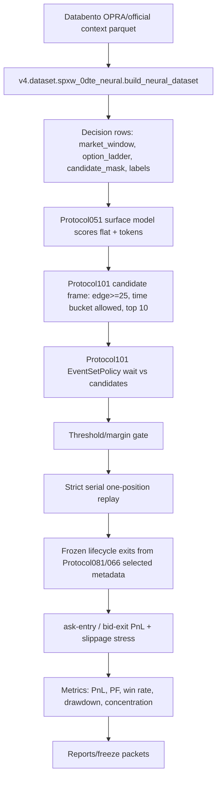
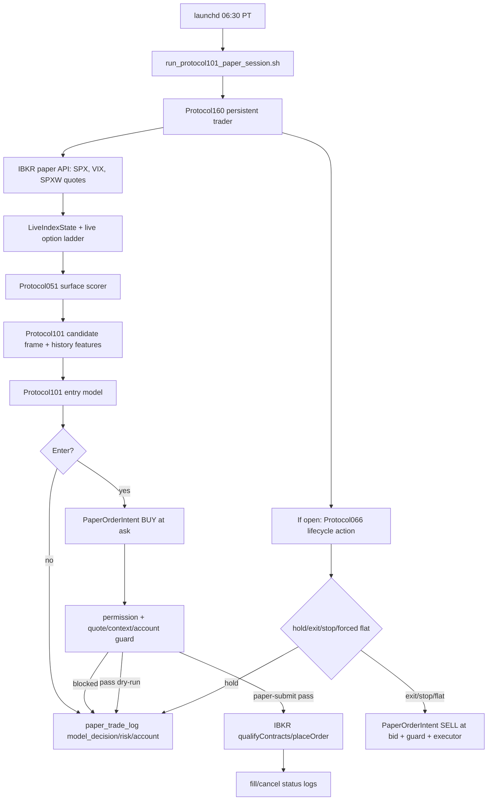
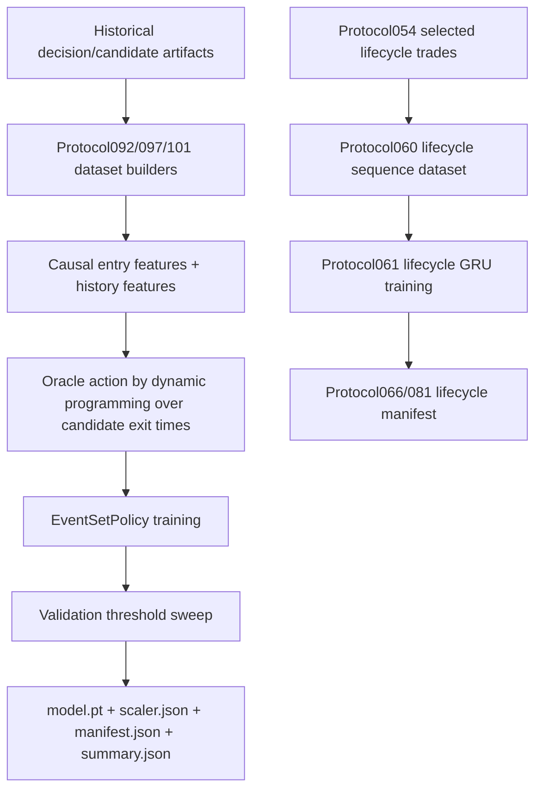
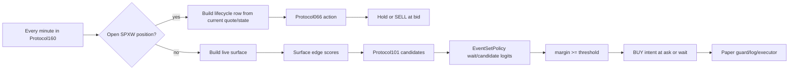
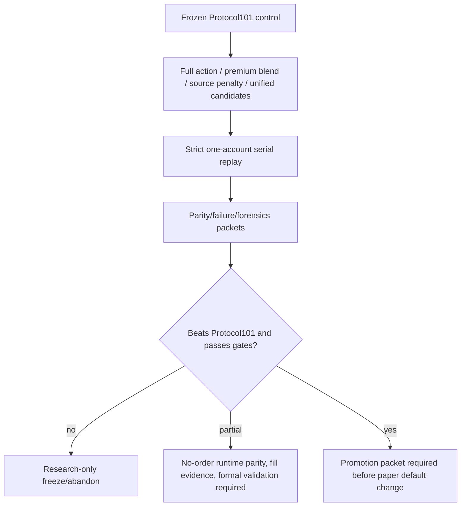
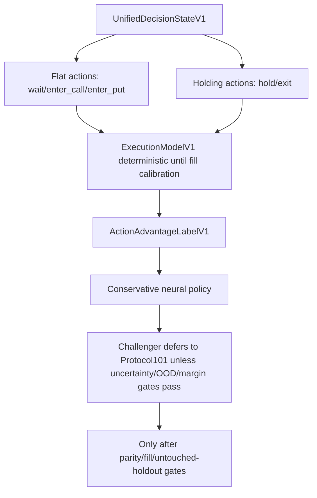

# Current Trading Bot Single Source Of Truth

Audit date: 2026-05-24  
Repository: `autoresearch-trading`  
Scope: current code, configs, artifacts, tests, local logs, reports, and launch assets.  
Safety posture during this audit: read-only inspection plus this markdown file only. No training, threshold tuning, paid-data download, broker connection, or order path was run.

## 2026-07-08 Current Phase Notice

This document is older than the Protocol101 historical/live synchronization
work completed in July 2026.  Before acting on training, paper, promotion, or
sync questions, read the current phase handoff:

```text
v4/docs/PROTOCOL101_CURRENT_PHASE_AND_TRAINING_HANDOFF_2026_07_08.md
```

Current transition summary:

```text
sync phase: closed unless new evidence contradicts it
active training/live contract: protocol101-live-v2-microstructure-masked
required scoring transform: mask_vendor_sensitive_option_quote_greek_microstructure
training runner dry-run: ready, blockers=[]
model training: not yet executed; explicit owner approval still required
paper-submit/promotion/real-money: still blocked
```

Do not treat older `protocol101-live-v1` artifacts as the active training
contract.  They are historical context only.

## 1. Executive Summary: What Is The Bot?

The current operational trading bot is the v4 `Protocol101` SPXW 0DTE stack. In current repo terms, the paper default is `PAPER_DEFAULT_PROTOCOL101`; challengers such as Protocol194, Protocol240, Protocol265, Protocol276, and unified-conservative systems are research-only unless a later decision packet explicitly changes that default.

Evidence for the current default:

| Evidence | Path | What it proves | Confidence |
|---|---|---|---|
| Naming guide | `v4/docs/NAMING_GUIDE.md` | Labels `PAPER_DEFAULT_PROTOCOL101` as current paper-trading default and challengers as research-only. | High |
| Daily runbook | `v4/docs/PROTOCOL101_DAILY_PAPER_TRADING.md` | Describes scheduled Protocol101 paper session and monitor as normal daily workflow. | High |
| Launchd session | `v4/ops/launchd/com.autoresearch.protocol101.paper-session.plist` | Schedules Protocol101 `paper-submit` at 06:30 PT with paper-order env set. | High |
| Runtime shell | `v4/ops/ibkr/run_protocol101_paper_session.sh` | Starts `v4.scripts.run_protocol160_protocol101_persistent_paper_trader` by default. | High |
| Runtime flag | `v4/runtime/protocol101_paper_order_enablement.json` | Enables Protocol101 one-contract IBKR paper scope only; real money false. | High |
| Paper logs | `v4/logs/paper_trading/2026-05-21/protocol101_persistent-paper_2026-05-21.jsonl` | Current persistent `paper-submit` session wrote 2,737 paper log rows; no broker order endpoint rows in that session. | Medium |
| IBKR entitlement summary | `v4/audit/ibkr_live_data_entitlements/summary.json` | 2026-05-21 live SPX/VIX and SPXW option NBBO probe passed without order intent. | Medium |

Current state of readiness: **guarded IBKR paper runtime exists and is scheduled, but most observed current sessions are effectively no-entry/no-order because the model emitted no candidates or IBKR connectivity failed. This is not live trading.** The system can connect to IBKR paper data and, if guards pass, submit one-contract paper limit orders. The latest inspected Protocol101 paper log had `broker_order_endpoint_called = 0` and `paper_orders_submitted = 0`.

What the bot trades today:

| Item | Current truth |
|---|---|
| Underlying | SPX index context with SPXW option contracts. |
| Instrument | Same-day SPXW options, PM-settled, calls and puts. |
| Contract style | Long option only, one contract in current paper guard. |
| Entry price | Buy limit at current ask in live paper executor; ask-entry in replay. |
| Exit price | Sell limit at current bid in live paper executor; bid-exit in replay. |
| Account assumption | `$10,000` paper cash baseline; `$500` IBKR access reserve is documented but not subtracted by `validate_order_intent`. |
| Max concurrency | One open position. |
| What it explicitly does not trade | Non-SPX underlyings, non-SPXW roots, AM-settled SPX, multi-leg spreads, futures, equities, crypto, short options, multi-contract live/paper default. |
| Actions it can take | Wait/no-entry, emit candidate/model/risk/account logs, create paper BUY/SELL intents, dry-run orders, submit/cancel IBKR paper limit orders after guard pass. |
| Research goals only | Unified wait/enter/hold/exit model, learned defer, runner/giveback policy, full action surface challenger, stochastic fill model, multi-contract sizing, live replacement of Protocol101. |

Main contradictions to keep visible:

| Topic | Current code/artifact truth | Conflicting/stale doc truth | Resolution |
|---|---|---|---|
| Paper readiness | Protocol160/158 plus launchd and runtime flag implement guarded IBKR paper submission. | `v4/promotion/PROTOCOL_101_PROMOTION_READINESS_PACKET.md` says Protocol101 is not broker-connected paper approved. | Treat readiness packet as older blocker evidence; current operational docs and launch assets supersede it for paper-default status. |
| Project status | v4 Protocol101 paper stack is operational in paper-submit mode. | Root `README.md` says this is not a live product and live execution is deferred. | Root README is partly stale; still true for real-money live trading. |
| v4 purity | v4 README says no v2/v3 imports. | `v4/model/hypothesis_protocol.py` imports `v2.core.market_structure`. | Hidden/stale architecture claim; code has a v2 dependency. |

Top unresolved risks:

| Risk | Evidence | Why it matters |
|---|---|---|
| Execution/fill realism not calibrated | `v4/sim/simulator.py` still has `NullSimulator`; `v4/audit/autoresearch/truth_grounded_replacement_program_v1/report.md` says zero/insufficient fill observations. | Ask/bid replay profitability may not survive actual fills and cancels. |
| Quote freshness weak in current bridge | `live_option_quotes()` in `v4/scripts/run_protocol158_protocol101_live_entry_paper_bridge.py` sets `quote_age_ms=0`; executor receives `quote_age_ms: 0`. | Guard can pass without real quote timestamp age evidence. |
| Entry edge is a two-model stack | Protocol101 entry features depend on Protocol051 surface scores. | Live parity can break if surface scorer input differs from historical training rows. |
| Lifecycle live/replay mismatch | `protocol066_action()` expects causal sequence state, but current live bridge builds a single row from current position state. | Exits may not be code-identical to replay/training. |
| Latest paper logs show no submitted paper orders | 2026-05-21 log: 2,737 rows, 0 broker calls, 0 order events; 320 model decisions were all wait/no-candidate. | Paper runtime exists, but actual fill evidence is absent. |
| Protocol101 score calibration weak | Strategy forensics show Spearman score-margin vs PnL `-0.0571`. | Score margin may not be utility calibrated. |
| Slot opportunity cost | Counterfactual-flat audit found 3,723 blocked Protocol101 entries and `$399,510` best-blocked-minus-open. | One-position rule may block better later trades. |

## 2. Repository Map

| Path | Role | Key code objects | Inputs | Outputs | Runtime/research status | Mutates state? | Broker/data risk? | Notes |
|---|---|---|---|---|---|---|---|---|
| `README.md` | Root overview | N/A | N/A | N/A | Documentation | No | No | Partly stale; says live execution deferred. |
| `pyproject.toml` | Python deps | `torch`, `pandas`, `ib_insync`, `databento` | N/A | N/A | Config | No | No | No console scripts found. |
| `data/processed/` | Derived historical datasets | Pickled v4 decision rows | Normalized historical quotes/context | `.pkl` decision rows | Research/training/replay artifact | No when read | No when read | Includes 2025-2026 SPXW 0DTE derived rows. |
| `data/models/` | Older pilot models | Torch `.pt` files | Training outputs | Model files | Superseded/research | No when read | No | Not current Protocol101 runtime. |
| `v4/dataset/spxw_0dte_neural.py` | Historical market reconstruction | `NeuralDatasetConfig`, `build_neural_dataset`, `_label_for_policy` | Normalized Databento-like parquet + index context | Decision rows with ladders/labels | Training/replay data builder | Yes if run | No broker; data-file only | Rebuilds derived data; do not run casually. |
| `v4/ingest/databento_opra.py` | Databento OPRA adapter | `filter_0dte_definitions`, `normalize_spxw_0dte_day` | Databento client output | Normalized SPXW rows | Paid data ingestion | Yes if run | Paid data risk | Do not run download paths without approval. |
| `v4/checks/paid_data_guard.py` | Paid data guard | `require_paid_data_approval` | Approval manifest/env | SystemExit/pass | Safety config | No | Guards paid data | Tested to fail before client download. |
| `v4/model/hypothesis_protocol.py` | Surface model/data contract | `SurfaceDecision`, `SurfaceStandardizer`, `MarketStructureCache` | Decision rows, v2 cache/index bars | Surface decisions | Training/replay/runtime support | No if imported | No | Contains hidden v2 dependency. |
| `v4/live/protocol051_surface_edge.py` | Frozen upstream surface-edge runtime | `load_surface_edge_artifact`, `score_surface_decisions` | Surface artifact, `SurfaceDecision` | Flat+token action scores | Live/paper + replay support | No | No | Feeds Protocol101 `edge`. |
| `v4/model/serial_opportunity.py` | Protocol092/101 entry feature schema and serial sim | `ENTRY_FEATURE_COLUMNS`, `serial_simulate_candidates`, `strict_serial_baseline` | Selected exit artifacts | Entry model datasets/trades | Replay/training infrastructure | Yes if run via scripts | No | Defines leakage tokens and core entry feature formulas. |
| `v4/scripts/run_protocol097_sequential_event_policy.py` | Sequential event policy trainer/replay | `EventSetPolicy`, `add_oracle_actions`, `simulate_event_policy` | Candidate events | Model artifacts/trades | Training/replay | Yes | No | Base class used by Protocol101. Do not train during audit. |
| `v4/scripts/run_protocol101_event_history_policy.py` | Protocol101 training runner | `HISTORY_FEATURE_COLUMNS`, `FEATURE_COLUMNS`, `add_history_features` | Protocol092 dataset | Protocol101 artifacts/summary | Training/replay | Yes | No | Current entry artifact was produced here. |
| `v4/live/protocol101_entry.py` | Frozen Protocol101 entry inference | `Protocol101EntryArtifact`, `Protocol101HistoryState`, `protocol101_candidate_frame_from_surface`, `predict_protocol101_entry` | Protocol051 scores + live/historical surface decision | Candidate frame, enter/no-entry decision | Operational entry model | No | No | Current entry decision core. |
| `v4/live/protocol101_live_entry.py` | Live row/candidate adapter | `LiveIndexState`, `build_live_surface_row`, `order_intent_from_prediction` | IBKR SPX/VIX/options quotes | Surface row, contract lookup, order intent | Operational runtime support | No | No by itself | Labels set to zero placeholders live. |
| `v4/live/protocol066_inference.py` | Frozen lifecycle inference | `Protocol066Artifact`, `predict_protocol066_sequence`, `protocol066_action` | Lifecycle artifact + current state features | hold/exit/stop/forced_flat action | Operational exit model/rules | No | No | Hybrid learned residual plus mandatory hard-coded exits. |
| `v4/scripts/build_lifecycle_sequence_dataset.py` | Lifecycle dataset builder | `CAUSAL_STEP_FEATURE_COLUMNS`, `_first_exit_index`, `_build_step_rows` | Protocol054 selected trades + normalized paths | Parquet trade/step tables | Research/training data build | Yes | No | Contains future label columns; not runtime. |
| `v4/scripts/run_protocol061_sequence_lifecycle_model.py` | Lifecycle model trainer | `LifecycleSequenceModel`, `_simulate_sequence_exits` | Lifecycle sequence dataset | Model/scaler/manifest | Training/replay | Yes | No | Produces Protocol066/081 lineage artifacts. |
| `v4/live/ibkr_paper_guard.py` | Paper order guard | `PaperOrderGuardConfig`, `paper_order_permission`, `validate_order_intent` | Intent, account, quote/context | pass/block reason | Operational paper safety | No | No | Guard before broker endpoint. |
| `v4/live/ibkr_paper_executor.py` | Broker paper adapter | `execute_guarded_paper_order` | IB object, intent, quote/account | dry-run/submitted/blocked result | Operational paper only | Yes if real IB object + not dry-run | Broker order risk | Only code path calling `placeOrder`. |
| `v4/live/paper_trade_log.py` | Paper JSONL schema/logging | `make_trade_log_event`, `append_trade_event`, `validate_trade_log` | Runtime events | JSONL/CSV logs | Operational observability | Yes if run | No | Rejects real-money fields and raw account ids. |
| `v4/scripts/run_protocol158_protocol101_live_entry_paper_bridge.py` | One-shot/capture live entry bridge | `main`, `live_option_quotes`, `handle_open_position` | IBKR market data + artifacts | Paper logs/orders | Live/paper runtime | Yes | Broker/data/order risk in paper-submit | Superseded by persistent Protocol160 for daily default. |
| `v4/scripts/run_protocol160_protocol101_persistent_paper_trader.py` | Current persistent runtime | `main`, `evaluate_once`, `handle_open_position`, `decide` | IBKR market data + artifacts + runtime flag | Paper JSONL/CSV/reports/orders | Current paper runtime | Yes | Broker/data/order risk | Launchd default. |
| `v4/scripts/run_protocol147_protocol101_morning_session.py` | Older/cycled morning harness | `main`, `run_preflight`, `run_live_capture`, `run_entry_bridge` | Local scripts + IBKR | Cycle summaries/logs | Legacy ops/runtime | Yes | Broker/data/order risk if bridge enabled | Replaced by Protocol160 persistent flow in shell defaults. |
| `v4/scripts/run_protocol150_protocol101_paper_order_enablement_gate.py` | Paper-enable gate | `DEFAULT_RUNTIME_FLAG`, gate builder | Prior logs/summaries | Runtime flag | Ops gate | Yes if `--write-runtime-flag` | No | Produces `v4/runtime/protocol101_paper_order_enablement.json`. |
| `v4/scripts/run_protocol157_protocol101_daily_ops_monitor.py` | Monitor | `build_monitor_payload`, `summarize_paper_activity`, `decide_monitor` | Paper logs, launchd, runtime flag | JSON/MD/HTML monitor | Operational diagnostics | Yes writes reports | Reads launchd; no broker order | Safe-ish read/report only. |
| `v4/ops/ibkr/run_protocol101_paper_session.sh` | Daily paper shell | Bash env + `python -m ...Protocol160` | Env, artifacts, IBKR | Paper session | Operational launch | Yes | Broker/data/order risk | Default env sets `paper-submit`. |
| `v4/ops/launchd/*.plist` | macOS scheduling | LaunchAgents | Calendar/OS | Runs shell scripts | Operational ops config | No when read | Risk by launched target | Do not install/change in audit. |
| `v4/sim/paper_replay.py` | Paper replay accounting | `build_replay_frame`, `apply_slippage`, `live_data_parity_checks` | Frozen selected trades + lifecycle steps | Replay metrics/checks | Replay/diagnostic | No if imported; scripts write | No | Not a live simulator; blocks on live shadow feed in older gate. |
| `v4/sim/shadow_paper.py` | No-order shadow accounting | `replay_shadow_paper` | Shadow JSON/JSONL rows | Ledger summary | Diagnostic | No if imported | No | Ensures no order fields. |
| `v4/sim/protocol101_position_sizing.py` | Offline sizing simulator | `PositionSizingPolicy`, `simulate_position_sizing` | Frozen trade rows | Cash/drawdown summaries | Research | No if imported; scripts write | No | Not current paper default. |
| `v4/sim/simulator.py` | Simulator interface skeleton | `NullSimulator`, `OrderIntent` | Order intents | Expired records | Stale/future foundation | No | No | Fill model not implemented. |
| `v4/audit/autoresearch/v4_aplus_hypothesis_101_event_history_policy/` | Protocol101 official artifact/report | `summary.json`, model artifacts | Training/replay outputs | Frozen entry model | Operational artifact source | No when read | No | Current runtime entry manifest from fold3 seed1. |
| `v4/audit/autoresearch/v4_aplus_hypothesis_075_protocol054_frozen_stack_artifacts/` | Frozen surface stack artifact | Surface manifest/model/scaler | Training outputs | Surface model | Operational upstream artifact | No when read | No | Current Protocol051 surface artifact. |
| `v4/audit/autoresearch/v4_aplus_hypothesis_081_q4start_residual_sequence_deterministic_artifacts/` | Lifecycle artifact | Model/scaler/manifest | Training outputs | Lifecycle model | Operational exit artifact | No when read | No | Current Protocol066/081 manifest. |
| `v4/logs/paper_trading/` | Paper runtime logs | JSONL/CSV | Runtime events | Session logs | Operational observability | Appended by runtime | No | Source of truth for paper sessions. |
| `v4/runtime/` | Runtime mutable state | `protocol101_paper_order_enablement.json`, live context JSONL | Ops gates/live context | Runtime flags/state | Operational config/state | Yes | No | Do not mutate in audit. |
| `v4/tests/` | Tests/gates | `test_protocol101_entry.py`, `test_protocol160...`, etc. | Fixtures/artifacts | Pass/fail | Tests | Some tmp writes | Mostly no | Do not assume all safe; IBKR/ops tests use fakes or local files when inspected. |
| `v2/` | Older system | Many v2 ops/scripts | v2 data/state | v2 outputs | Deprecated/stale except hidden import | Yes if run | Possible ops risk | Do not treat as current bot. |

Dead/stale/duplicate signals:

| Component | Evidence | Current interpretation |
|---|---|---|
| Root README operational claims | Says live execution deferred and v2 active. | Stale relative to Protocol101 guarded paper runtime. |
| v4 README clean-slate claims | Says no v2/v3 imports. | Conflicts with `v4/model/hypothesis_protocol.py`. |
| `v4/sim/simulator.py` | Phase-0 `NullSimulator`, no fill model. | Interface/future concept, not current replay engine. |
| `v4/scripts/run_protocol147...` | Shell defaults now choose persistent Protocol160. | Legacy/cycled harness, still relevant for older logs and docs. |
| `data/models/*pilot*.pt` | Older pilot models. | Research/superseded, not current Protocol101 paper runtime. |

## 3. Entrypoints And Launch Commands

| Entrypoint | Command | Purpose | Reads | Writes | Safe to run? | Why / why not |
|---|---|---|---|---|---|---|
| Current scheduled paper session | `bash v4/ops/ibkr/run_protocol101_paper_session.sh` | Starts Protocol101 persistent paper trader. | Artifacts, runtime flag, IBKR API/data. | Paper logs, runtime state, possible paper orders. | **No without human confirmation** | Can connect to broker/data and submit paper orders under default env. |
| Persistent trader module | `python -m v4.scripts.run_protocol160_protocol101_persistent_paper_trader --mode paper-submit ...` | Current daily paper runtime. | IBKR, Protocol051/101/081 artifacts. | Logs, reports, paper orders if guards pass. | **No** | Broker/data/order risk. |
| Live entry bridge | `python -m v4.scripts.run_protocol158_protocol101_live_entry_paper_bridge --mode intent-shadow|paper-dry-run|paper-submit` | One-shot live bridge/capture. | IBKR + artifacts. | Logs, optional orders. | **No** | Broker/data/order risk; `paper-submit` can call `placeOrder`. |
| Morning session legacy | `python -m v4.scripts.run_protocol147_protocol101_morning_session` | Older preflight/capture/entry-bridge orchestrator. | Local summaries, IBKR, artifacts. | Audit dirs/logs, optional bridge outputs. | **No** | Can run IBKR probes/captures and entry bridge. |
| Daily monitor shell | `bash v4/ops/ibkr/run_protocol101_daily_monitor.sh` | Watches/summarizes paper session. | Paper logs, launchd, runtime flag. | Monitor HTML/JSON/MD. | **Mostly safe with confirmation** | No order endpoint, but mutates reports and inspects local launchd. |
| Monitor module | `python -m v4.scripts.run_protocol157_protocol101_daily_ops_monitor --session YYYY-MM-DD --run-id ...` | Single monitor report. | Logs/artifacts. | Monitor reports. | Safe if output writes accepted | No broker order endpoint. |
| Paper enablement gate | `python -m v4.scripts.run_protocol150_protocol101_paper_order_enablement_gate --write-runtime-flag` | Writes paper-order enablement flag. | Previous logs/summaries/env. | Runtime flag. | **No** | Mutates operational runtime gating. |
| Paper preflight | `bash v4/ops/ibkr/run_protocol101_paper_preflight.sh` | Waits for IBKR API/entitlements. | IBKR API/data. | Logs/summaries. | **No** | Broker/data endpoint contact. |
| IBKR probe | `python v4/ops/ibkr/probe_ibkr_api.py` | Checks IBKR connectivity/data. | IBKR API/data. | Summary/report. | **No** | Broker/data endpoint contact. |
| Historical replay May 2026 | `python -m v4.scripts.run_protocol161_may2026_historical_replay` | Frozen Protocol101 historical replay. | Local processed data/artifacts. | Audit reports. | Safe only after checking args/data | Script says no broker/training/download; still writes. |
| Serial lifecycle replay | `python -m v4.scripts.run_protocol162_may2026_serial_lifecycle_replay` | One-position serial replay. | Local replay outputs. | Audit reports. | Safe only after checking args/data | Writes outputs; no broker/download by docstring. |
| Protocol101 training | `python -m v4.scripts.run_protocol101_event_history_policy` | Train Protocol101 event-history policy. | Datasets/artifacts. | Model artifacts/summary. | **No** | Training/tuning explicitly out of scope. |
| Protocol097 training | `python -m v4.scripts.run_protocol097_sequential_event_policy` | Train base event policy. | Candidate data. | Models/summaries. | **No** | Training/tuning. |
| Lifecycle training | `python -m v4.scripts.run_protocol061_sequence_lifecycle_model --save-model-artifacts` | Train lifecycle GRU. | Lifecycle sequence dataset. | Model artifacts/selected trades. | **No** | Training/tuning. |
| Dataset build | `python -m v4.scripts.build_lifecycle_sequence_dataset` | Build lifecycle parquet. | Selected trades + normalized paths. | Parquet/report. | **No for audit** | Mutates artifacts. |
| Databento downloads | `python -m v4.scripts.download_databento_*` | Paid high-res/selected data downloads. | Databento API. | Raw/audit data. | **No** | Paid data endpoint, guarded by approval. |
| ThetaData downloads | `python -m v4.scripts.download_thetadata_index_bars` | Index context downloads. | ThetaData API. | Data/audit logs. | **No** | Paid/externally sourced data. |
| Test subset | `python -m pytest v4/tests/test_protocol101_entry.py ...` | Local validation. | Code/fixtures. | Pytest cache/tmp files. | Not run in this audit | Likely safe for selected fake/local tests, but audit remained read-only except doc. |
| LaunchAgents | `launchctl bootstrap ... v4/ops/launchd/*.plist` | Install/start scheduled IBKR/session/monitor. | Plist/shell. | OS launchd state. | **No** | Mutates machine operations and can schedule broker-paper runtime. |

Likely `main()`/CLI families found by `rg`:

| Family | Examples | Status |
|---|---|---|
| Operational Protocol101 | `run_protocol147`, `run_protocol150`, `run_protocol157`, `run_protocol158`, `run_protocol160`, `ibkr_preflight`, `probe_ibkr_api` | Treat as broker/ops risk unless clearly monitor-only. |
| Training/model research | `run_protocol061`, `run_protocol097`, `run_protocol101`, `run_protocol165`, `run_unified_conservative_neural_policy*` | Do not run for audit. |
| Replay/diagnostics | `run_protocol090`, `run_protocol118`, `run_protocol161`, `run_protocol162`, `run_protocol194`, `run_protocol265`, `run_protocol276`, forensics packets | Usually local writes; inspect before running. |
| Data acquisition | `download_databento_*`, `download_thetadata_*` | Do not run without exact approval. |
| Ops shell/plist | `v4/ops/ibkr/*.sh`, `v4/ops/launchd/*.plist` | Machine/broker operational risk. |

Required env/config for current paper path:

| Variable/flag | Current use |
|---|---|
| `PYTHONPATH` | Set to repo root by ops shell/plist. |
| `PYTHON_BIN` | Defaults to repo `.venv/bin/python`, fallback `python3`. |
| `PROTOCOL101_SESSION_KIND` | `persistent` in current launchd/shell default. |
| `PROTOCOL101_ENTRY_BRIDGE_MODE` | `paper-submit` in current launchd/shell default; safe modes exist but are not scheduled default. |
| `PROTOCOL101_ENABLE_PAPER_ORDERS` | Must be `YES` to pass flags in shell. |
| `PROTOCOL101_ACKNOWLEDGE_PAPER_LOSS` | Must be `YES` to pass flags in shell. |
| `V4_ALLOW_IBKR_PAPER_ORDERS` | Must be `YES` for `paper_order_permission`. |
| `IBKR_HOST`, `IBKR_PORTS` | IBKR API target; defaults localhost and paper/live ports. |
| `v4/runtime/protocol101_paper_order_enablement.json` | Runtime flag checked by Protocol158/160 before paper submit. |

## 4. Current Trading Game Definition

| Rule | Current code path | Function/class | Formula/pseudocode | Replay? | Live/paper? | Caveats |
|---|---|---|---|---|---|---|
| Instrument universe | `v4/dataset/spxw_0dte_neural.py`, `v4/live/protocol101_live_entry.py` | `_prepare_options`, `_valid_quote` | root/trading_class `SPXW`, right `C/P`, finite strike. | Yes | Yes | Historical requires settlement style PM; live checks trading_class SPXW but settlement is implicit via SPXW/expiry. |
| Underlying | Same files | `LiveIndexState`, `build_live_surface_row` | SPX and VIX context. | Yes | Yes | Historical context from official/proxy bars; live from IBKR. |
| Option type | Same | `_valid_quote`, `validate_order_intent` | Calls/puts only. | Yes | Yes | No spreads/shorts. |
| Expiration | `v4/ingest/databento_opra.py`, live discovery in Protocol158/160 | `filter_0dte_definitions`, contract discovery | expiry/session same day. | Yes | Yes | Live expiry comes from current date discovery. |
| Settlement | `v4/ingest/databento_opra.py`, `v4/live/protocol101_shadow_schema.py`, Protocol166 | `settlement_style PM`, `settlement_time_utc` | PM settlement only. | Yes | Mostly assumed | Live paper guard uses SPXW trading class, not explicit settlement field. |
| Strike filters | `v4/dataset/spxw_0dte_neural.py` | `NeuralDatasetConfig`, `build_neural_dataset` | 5-point strikes, ladder `$50` around ATM. | Yes | Live uses `live_strikes_around_atm` default 10 strikes around ATM | Protocol101 entry later filters to candidates produced by surface edge. |
| Moneyness | Forensics only | report buckets | ITM/OTM buckets in diagnostics. | Diagnostic | Not enforced | NOT FOUND IN CURRENT CODE — NEEDS HUMAN CONFIRMATION as a live gate. |
| Long/short | `v4/live/protocol101_live_entry.py`, paper executor | `order_intent_from_prediction`, `handle_open_position` | Entry BUY, exit SELL. | Yes ask/bid labels | Yes | No short option logic found. |
| Position sizing | `v4/live/ibkr_paper_guard.py` | `PaperOrderGuardConfig.max_order_quantity=1` | quantity <= 1. | Replay one-contract | Yes | Offline sizing research not operational. |
| Account size | Docs/guard/runtime args | `starting_paper_cash=10000`, `--paper-cash 10000` | paper cash `$10,000`. | Replay often one-contract, position-sizing sim starts `$10,000` | Yes | `ibkr_access_reserve=500` in guard config but not subtracted in affordability formula. |
| Max open positions | `v4/live/ibkr_paper_guard.py`, serial sims | `max_concurrent_positions=1` | block BUY if open_positions >= 1. | Yes | Yes | Live also queries `spxw_open_positions`. |
| Affordability | `v4/live/ibkr_paper_guard.py` | `validate_order_intent` | BUY blocked if `quantity*limit_price*100 > account_cash`. | Yes in position sizing/Protocol276 skips | Yes | No reserve subtraction. |
| Entry price | `v4/live/protocol101_live_entry.py`, executor | `order_intent_from_prediction` | `limit_price = selected quote ask`. | Yes ask entry | Yes | Limit at ask may not fill instantly. |
| Exit price | `v4/scripts/run_protocol158...`, executor | `handle_open_position` | SELL limit at current bid. | Yes bid exit | Yes | Cancel/timeout handling thin; fill observations sparse. |
| Spread/slippage | `v4/sim/paper_replay.py`, Protocol101 summary | `apply_slippage`, `simulate_event_policy` | replay stress subtracts `2*slippage_per_side*100`; paper replay `entry+=extra`, `exit-=extra`. | Yes | No fixed slippage in live | Live actual fill/cancel would determine slippage; little evidence. |
| Forced flat | `v4/scripts/build_lifecycle_sequence_dataset.py`, Protocol158/160 args | `_deadline`, `_minutes_to_forced_flat`, `--forced-flat-time 15:55` | Deadline min(max hold, 15:55 ET) for historical paths; live forced flat deadline default 15:55. | Yes | Yes | Live depends on loop and open-position handler being connected. |
| Time-of-day | `v4/model/environment_diagnostics.py`, `v4/live/protocol101_entry.py` | `time_bucket`, `allowed_buckets` | Protocol101 candidates only `post_open_morning` and `late_afternoon`. | Yes | Yes | Historical labels also no new entries after 15:30. |
| No overlap | `v4/model/serial_opportunity.py`, `run_protocol101_event_history_policy.py` | `open_until`, `simulate_event_policy` | skip if decision_time < current position exit time. | Yes | Yes through guard/open positions | Live runtime only one active position. |
| Trade definition | Replay and logs | `Trade`, paper log events | Entry+exit of one long option; PnL `(exit_bid-entry_ask)*100`. | Yes | Log only if fills occur | Current logs have no fills in inspected latest session. |
| Skipped | Replay | `skipped_overlap_candidates`, threshold/candidate failures | Below threshold/no candidate/overlap/invalid/unaffordable. | Yes | Logged as no_entry/risk block | Live blocked reasons less rich than replay candidate table. |
| Failed candidate | `protocol101_candidate_gate_diagnostics` | diagnostics | outside bucket, below min edge, no finite scores, no candidates. | Yes | Yes diagnostic logging | Not a trade. |
| Open position | Runtime state/IBKR positions | `spxw_open_positions`, `RuntimePositionState` | IBKR SPXW qty > 0 and/or runtime state. | No | Yes | Runtime state file mentioned; not inspected as present. |
| PnL | `paper_replay.py`, lifecycle dataset | `paper_pnl=(exit-entry)*100`; `current_pnl=(bid-entry_ask)*100` | Yes | Paper fill PnL reconstructable if fills logged | Current account state logs show zero realized daily PnL. |
| Cash/equity | `protocol101_position_sizing.py`, paper runtime account dict | `cash += pnl*quantity`; account cash from runtime config/logs. | Offline sizing | Runtime simplified | No full broker statement reconciliation found. |
| Drawdown | `metrics_for_trades`, sizing sim | `equity=cumsum(pnl); drawdown=equity-peak` | Yes | Monitor does not compute model DD live | Current paper log no fills. |

Missing in current code or not proven live:

| Rule | Status |
|---|---|
| Explicit live settlement validation beyond SPXW trading class | NOT FOUND IN CURRENT CODE — NEEDS HUMAN CONFIRMATION |
| Broker commission/fee treatment | Fees excluded in current labels/replay; live broker fees not modeled. |
| Queue position/fill probability model | NOT FOUND IN CURRENT CODE — NEEDS HUMAN CONFIRMATION |
| Robust broker account equity reconciliation | NOT FOUND IN CURRENT CODE — NEEDS HUMAN CONFIRMATION |
| Daily loss cap in current Protocol101 paper runtime | Daily stop exists in research sizers/gates; current daily runbook says no fixed daily loss cap. |

## 5. End-To-End Architecture Graph

Historical/replay flow:



Live/paper/no-order runtime flow:



Model training flow present in repo:



Current operational decision loop:



Research challenger loop:



Future intended unified loop in repo:



## 6. Data Sources And Market Reconstruction

| Data source | Path/provider | Frequency | Fields used | Replay available? | Live available? | Used by | Known limitations |
|---|---|---|---|---|---|---|---|
| Databento OPRA normalized | `v4/normalized_official_context/*.parquet`, `v4/normalized/*.parquet` | 1-minute CBBO/derived context in current artifacts; some 1s audits | bid, ask, sizes, quote_time, option OHLCV volume, OI, raw_symbol, strike, right, underlying, Greeks | Yes | No | Dataset builder, lifecycle paths, replay | Paid source; raw directory mostly empty; must not redownload without approval. |
| Official context | `*_official_context.parquet`, `v4/audit/official_context/*` | 1-minute bars/context | SPX, VIX, SPX VWAP, OMAR, session range, momentum | Yes | Live equivalent from IBKR SPX/VIX | Surface and Protocol101 features | Historical context may include fields not directly live-identical. |
| Derived processed rows | `data/processed/spxw_0dte_neural_*/*.pkl` | Decision-event rows | market_window, option_ladder, candidate_mask, labels | Yes | No | Training/replay | Contains labels/future path; not runtime input. |
| IBKR live/paper market data | `ib_insync` through Protocol158/160/probes | Live tick/snapshot during session | SPX/VIX last, option bid/ask/size/modelGreeks | No | Yes | Paper runtime | Quote timestamp age not fully retained in current entry bridge; current logs show no fills. |
| Runtime live index context | `v4/runtime/protocol101_live_index_context.jsonl` | Appended during sessions | timestamp, session, source, spx, vix | N/A | Yes | `LiveIndexState` warm start | Mutable runtime state; not full option history. |
| Paper trade logs | `v4/logs/paper_trading/*/*.jsonl` | Event-driven | market snapshot, candidates, decisions, risk, orders/fills | N/A | Yes | Monitor/forensics | Missing enough fields to fully reconstruct all feature vectors and model tensors. |
| IBKR entitlement summary | `v4/audit/ibkr_live_data_entitlements/summary.json` | Probe snapshot | live/delayed status, qualified contracts, SPX/VIX prices | N/A | Yes | Readiness/monitor | Point-in-time, no order/fill evidence. |
| High-res audit logs | `v4/audit/databento_*_downloads.jsonl`, `cbbo_1m_vs_1s_audit_summary.json` | Download/audit metadata | coverage/cost/audit stats | Partial | No | Promotion gates | Do not update/download without approval. |

Market reconstruction facts:

| Topic | Current code truth |
|---|---|
| Contract ID | Historical `SPXW-YYYYMMDD-STRIKE-RIGHT`; live lookup normalizes to same shape in `build_live_surface_row`. |
| Expiration | Historical definitions filter expiry=session; live discovers current 0DTE expiry. |
| Strike spacing | Historical 5-point strikes; Protocol166 contract validates 5-point offsets within `$50`; live defaults configurable strikes around ATM. |
| Quote executable fields | Entry ask and exit bid are executable assumptions. Mid is feature/info only. |
| Missing quotes | Historical `_latest_quotes_at` requires quote at/before decision within `max_quote_age_seconds`; lifecycle path fails `missing_future_path` etc.; live `_valid_quote` rejects missing/invalid bid/ask. |
| Stale quotes | Historical max quote age default 90 seconds in dataset builder; live guard requires `quote_age_ms <= 1500`, but current bridge often supplies `0`. |
| Greeks | Historical requires finite iv/delta/gamma/theta or computes repaired Greeks from Black-Scholes; live reads modelGreeks where available. |
| Future path labels | Historical only: stop/target/time-flat labels, future MFE/MAE, continuation labels. |
| Live-only fields | IBKR account id redaction, order statuses/fills, live market data type, qualified contract metadata. |
| Unproven assumptions | Live fill probability, queue position, actual quote age distribution, identical live/historical edge feature generation under load. |

## 7. Candidate Generation

Current Protocol101 considers a **curated candidate stream**, not the full option surface directly. The full live/historical surface is first scored by the Protocol051 surface model. Protocol101 then sees only candidates whose surface action score beats the flat score by at least `min_edge` and whose time bucket is allowed.

| Filter | Code path | Conditional/formula | Input columns | Output columns | Reason | Runtime/replay parity |
|---|---|---|---|---|---|---|
| Valid option quote | `v4/live/protocol101_live_entry.py::_valid_quote` | `trading_class=="SPXW"`, right C/P, finite strike, `bid>0`, `ask>0`, `ask>=bid` | live quote dict | live option ladder/candidate mask | Data hygiene/execution realism | Live only; historical equivalent in dataset builder. |
| Historical tradability | `v4/dataset/spxw_0dte_neural.py::_candidate_is_tradable` | bid/ask/mid finite, mid 0.50-35, spread <=0.50 and spread_frac <=0.25, sizes >=1 | normalized quote fields | candidate_mask | Execution realism/data hygiene | Historical only; live does not enforce exact mid/spread caps at this stage. |
| Greeks available | `v4/dataset/spxw_0dte_neural.py::_candidate_has_required_greeks` | finite iv/delta/gamma/theta | Greek fields | candidate_mask | Feature validity | Historical; live uses Greeks if present in option_ladder, no identical hard gate found. |
| Surface score validity | `v4/live/protocol101_entry.py::protocol101_candidate_frame_from_surface` | `len(surface_scores)==1+tokens`; mask flat and valid token scores; invalid set `-inf` | Protocol051 scores + token_mask | surface_action_score, surface_flat_score | Data integrity | Same adapter used for live and tests; replay path via artifacts. |
| Time bucket | Same | `time_bucket(decision_time) in ("post_open_morning","late_afternoon")` | decision_time | empty frame or rows | Trader belief/timing | Same code in live adapter. Historical event data generated similarly. |
| Edge | Same | `edge = action_score - flat_score`; require `edge >= min_edge` (default 25) | surface scores | `edge`, `score` | Trader belief/model abstention | Same code in live adapter; min_edge default set in Protocol158/160 args. |
| Max candidates | Same | sort `score desc, contract_id asc`; `head(MAX_CANDIDATES=10)` | candidate rows | <=10 candidates | Model architecture limit | Same. |
| Entry threshold | `predict_protocol101_entry` | `margin = best_candidate_logit - wait_logit`; enter only if `margin >= artifact.threshold` | candidate logits, wait logit | decision | Learned policy/validation threshold | Same inference code for live/replay artifact use. |
| Affordability | `v4/live/ibkr_paper_guard.py::validate_order_intent` | `quantity*limit_price*100 <= account_cash` | selected ask/account cash | pass/block | Account realism | Live/paper only; replay variants have separate affordability accounting. |
| Overlap | Protocol101 serial sim and live guard | replay skip if in position; live block if open position | open_until/open_positions | skipped/block | One-slot constraint | Conceptual parity; not same implementation. |

Typical candidate counts:

| Evidence | Count |
|---|---:|
| Protocol101 artifact event summary | Mean candidates per event `2.2231`, max `10`, events `23,530`. |
| 2026-05-21 paper log | 320 `candidate_set` rows, top reason `no_candidates` 290; no order events. |

Candidates excluded before Protocol101 model: invalid quotes, outside time bucket, edge below 25, masked/nonfinite surface tokens, rows beyond top 10. Candidates excluded after Protocol101 model: below threshold, no entry intent, unaffordable/account/quote/context guard failures, current open position.

## 8. Feature Construction

| Feature / feature group | Source | Formula | Code path | Runtime available? | Replay available? | Leakage risk? | Notes |
|---|---|---|---|---|---|---|---|
| Entry time features | decision timestamp | minutes since open; minutes to 15:55; progress, sin/cos, bucket flags | `v4/live/protocol101_entry.py::_entry_feature_row`; `v4/model/serial_opportunity.py::_add_entry_features` | Yes | Yes | Low | Causal. |
| Side/offset | contract metadata | call/put one-hot, offset, abs_offset | Same | Yes | Yes | Low | Offset points from ATM/strike. |
| Surface edge | Protocol051 scores | `edge=action_score-flat_score` | `protocol101_candidate_frame_from_surface` | Yes if Protocol051 wired | Yes | Medium | Depends on upstream model parity. |
| Quote features | option NBBO | bid, ask, mid, spread, spread_frac, bid/ask size | Entry feature row | Yes | Yes | Low if quote timestamp causal | Live quote age caveat. |
| Underlying/Greeks | market and option | underlying, iv, delta, gamma, theta, abs values | Entry feature row | Yes | Yes | Low/medium | Live Greeks source differs from historical repaired Greeks. |
| Derived option ratios | quote/Greek transforms | gamma/theta, theta/mid, theta burden, gamma/premium, premium/underlying, spread/mid, size imbalance | Entry feature row | Yes | Yes | Low | Causal if inputs fresh. |
| History features | previous Protocol101 candidate events | previous count/max/mean edge/gamma/theta/spread, call/put counts, rolling-3 stats | `Protocol101HistoryState`, `add_history_features` | Yes | Yes | Low if only previous events | Runtime updates only when candidates nonempty. |
| Market window | SPX/VIX context | 30x7 one-minute window | `LiveIndexState.market_window`, dataset builder | Yes | Yes | Medium | Live resampling ffill/bfill may differ from historical official context. |
| Surface token features | option ladder | 15 option features for each strike/right token | `build_live_surface_row`, dataset builder | Yes | Yes | Medium | Live labels placeholders; token availability differs. |
| Lifecycle current state | open position quote/state | current_pnl, MFE, MAE, giveback, velocities, bid/mid over entry ask, time to forced flat | `build_lifecycle_sequence_dataset`, live `_live_feature_row`/`lifecycle_row_for_position` | Partial | Yes | Medium | Live single-row sequence caveat. |
| Future lifecycle labels | future path | future max/min/final, recovery/decay, regret/saves | `FUTURE_LABEL_COLUMNS` | No | Yes | High if used as feature | Explicitly labels only; forbidden at runtime. |
| Account state features | paper cash/open positions | cash/open count used in guards, not Protocol101 feature vector | paper guard/runtime | Yes | Some research sizers | Low | Current entry model does not consume account state. |
| Scaling | training median/mean/std | impute median, `(x-mean)/std`, nan_to_num inf caps | `FeatureScaler` | Yes | Yes | Low if scaler frozen | Loaded from `scaler.json`. |

Feature manifests:

| Artifact | Feature columns |
|---|---|
| Protocol101 entry manifest | 55 columns: 37 entry + 18 history features. |
| Protocol066/081 lifecycle manifest | 39 causal lifecycle step columns. |
| Surface model manifest | Scalar/token feature definitions in frozen stack manifest and `SurfaceVariant`; inspected as current upstream, not fully expanded here. |

Forbidden/leaky feature guard:

| Guard | Code path | Effect |
|---|---|---|
| Entry feature leakage tokens | `v4/model/serial_opportunity.py::LEAKY_FEATURE_TOKENS` | Asserts Protocol101 entry features do not contain path/exit/future/MFE/MAE/PnL/label/current_pnl terms. |
| Lifecycle future labels | `build_lifecycle_sequence_dataset.py::FUTURE_LABEL_COLUMNS` | Separated from `CAUSAL_STEP_FEATURE_COLUMNS`; must not be runtime features. |

## 9. Model And Policy Mechanics

Current operational model stack:

| Layer | Model class | Artifact | Output | Operational role |
|---|---|---|---|---|
| Surface edge | `SurfaceActionModel` | `v4/audit/autoresearch/v4_aplus_hypothesis_075_protocol054_frozen_stack_artifacts/model_artifacts/train_through_q4_2025_test_q1_2026/seed_11/manifest.json` | Flat + token action scores in dollars | Upstream candidate edge. |
| Entry decision | `EventSetPolicy` | `v4/audit/autoresearch/v4_aplus_hypothesis_101_event_history_policy/model_artifacts/fold3_train_q1_q2_q3_validate_q4_test_q1_2026/seed_1/manifest.json` | Wait logit and candidate logits | Chooses enter vs no-entry. |
| Lifecycle | `LifecycleSequenceModel` | `v4/audit/autoresearch/v4_aplus_hypothesis_081_q4start_residual_sequence_deterministic_artifacts/model_artifacts/train_q1_2025_q2_2025_q3_2025_q4_2025_test_q1_2026/seed_1/manifest.json` | Continuation value + recovery/decay probabilities | Hybrid exit/hold policy. |

Entry model mechanics:

```text
surface_scores = Protocol051(surface_decision) * target_scale
flat_score = surface_scores[0]
for token i:
    if token_mask[i] and finite(surface_scores[i+1]):
        edge_i = surface_scores[i+1] - flat_score
        if edge_i >= min_edge and time_bucket allowed:
            build candidate feature row
sort candidates by edge desc, contract_id asc
take top 10

x = scaler.transform(candidate_features)
logits = EventSetPolicy(x[1, <=10, 55], mask)
wait_logit = logits[0]
candidate_logits = logits[1:n+1]
best_idx = argmax(candidate_logits)
margin = candidate_logits[best_idx] - wait_logit
if margin < threshold:
    no_entry
else:
    enter selected candidate
```

Wait/no-trade representation: action index `0` is wait in the event-policy training and inference. Candidate actions are local indices `1..n`.

Threshold:

| Item | Value/evidence |
|---|---|
| Current threshold | `-1.3651819953918456` for fold3 seed1. |
| Source | `v4/audit/autoresearch/v4_aplus_hypothesis_101_event_history_policy/summary.json`. |
| Selection objective | Validation split `q4_2025`, stress `$0.10` delta vs strict serial baseline. |
| Threshold sweep | Selected threshold had validation model PnL `$99,440`, stress10 `$93,540`, strict baseline `$96,560`, baseline stress10 `$90,680`, 295 trades. |

Failure behaviors:

| Situation | Behavior | Code path |
|---|---|---|
| No candidates | `{"action":"no_entry","reason":"no_candidates"}` | `predict_protocol101_entry` |
| Missing feature column | Raises `ValueError` | `predict_protocol101_entry` |
| Below threshold | no-entry reason `below_protocol101_threshold` | `predict_protocol101_entry` |
| Best candidate unaffordable | Intent built then guard blocks `insufficient_paper_cash` | `validate_order_intent` |
| Quote/context freshness fails | Guard blocks `stale_option_quote`, `missing_quote_age`, `stale_context`, etc. | `validate_order_intent` |
| Artifact load fails | Runtime exception path logs `paper_error`/blocked decision | Protocol158/160 exception handling |

## 10. Lifecycle, Hold, And Exit Logic

Lifecycle is a hybrid: mandatory hard stop/target/time-flat behavior inherited from frozen baseline labels, plus a learned Protocol066/081 residual sequence model that can override before the baseline exit if predicted continuation value exceeds a calibrated threshold.

| Exit reason / lifecycle state | Trigger | Formula/pseudocode | Code path | Replay? | Live/paper? | Learned or rule-based? | Known weakness |
|---|---|---|---|---|---|---|---|
| hard_stop | Baseline exit step reason hard_stop | if baseline exit step and reason hard_stop: `stop` | `protocol066_action` | Yes | Yes | Rule-based mandatory | Stop threshold inherited from label policy, not live-learned. |
| target | Baseline exit step reason target | if baseline reason target: `exit` | `protocol066_action` | Yes | Yes | Rule-based mandatory | May clip runners. |
| time_flat/forced_flat | Baseline time flat or minutes_to_forced_flat <=0 | forced flat at or before 15:55 | `protocol066_action`, `_deadline` | Yes | Yes | Rule-based | Live depends on loop and connection. |
| protocol054_fallback | No learned override before Protocol054 exit | exit at frozen Protocol054 step/reason | `_simulate_sequence_exits`, `protocol066_action` | Yes | Yes | Inherited baseline | Protocol101 does not own lifecycle fully. |
| sequence_residual_override | Predicted continuation/residual value above threshold before fallback | `if value_pred > override_threshold + 1e-4: exit` | `run_protocol061...`, `protocol066_action` | Yes | Yes | Learned thresholded override | Live feature sequence may be incomplete. |
| hold | No mandatory or override exit | return hold | `protocol066_action` | Yes | Yes | Hybrid | Live MFE/MAE state update caveat. |

Lifecycle formulas from code:

| Formula | Code path | Definition |
|---|---|---|
| Current PnL | `build_lifecycle_sequence_dataset`, Protocol158 live row | `(bid - entry_ask) * 100` |
| MFE | `_build_step_rows` | `max(path_pnl[:idx+1])` |
| MAE | `_build_step_rows` | `min(path_pnl[:idx+1])` |
| Giveback | `_build_step_rows` | `max(0, mfe_to_now - current_pnl)` |
| Giveback fraction | `_build_step_rows` | `giveback / mfe_to_now` if `mfe_to_now > 0` else 0 |
| Duration | `_build_step_rows`, live lifecycle row | minutes since entry, min 1.0 historically |
| Hard stop PnL | `_first_exit_index` with `LabelPolicy(0.50,1.00,25)` | `-0.50 * entry_ask * 100` |
| Target PnL | `_first_exit_index` | `1.00 * entry_ask * 100` |
| Deadline | `_deadline` | `min(decision_time+25m, forced_flat_15:55)` |

Holding blocks future candidates: replay uses `open_until` and skips decision events while position is open; live checks IBKR/runtime open positions and evaluates lifecycle instead of entry while holding.

Known replay/live lifecycle differences:

| Difference | Evidence | Risk |
|---|---|---|
| Historical lifecycle model trained on full sequences | `LifecycleSequenceModel` is GRU over padded sequence. | Replay has full path state sequence. |
| Live bridge builds current single-row frame | `handle_open_position`/`lifecycle_row_for_position` create `pd.DataFrame([row])`. | Hidden state/sequential context mismatch. |
| Live MFE/MAE state may be stale | Runtime state uses previous MFE/MAE and current quote; update persistence not obviously continuous. | Giveback features may understate intratrade excursions. |
| Exit fill realism | Live exits are limit at bid and wait/cancel; replay assumes deterministic bid exit. | Actual paper exits may not match. |

## 11. Account, Risk, And Order Guards

| Guard | Purpose | Code path | Condition/formula | Failure behavior | Log field | Replay/live parity |
|---|---|---|---|---|---|---|
| Paper permission flags | Prevent accidental broker paper order | `paper_order_permission` | enable flag true, acknowledge flag true, `V4_ALLOW_IBKR_PAPER_ORDERS=YES`, account starts `DU` | Block before broker endpoint | `risk_gate.reason`, executor result | Live only |
| Runtime flag | Require explicit runtime enablement | Protocol158/160 `runtime_flag_summary` | `protocol101_paper_order_enablement.json` exists/enabled | Logs `paper_order_blocked` | runtime_flag/risk reason | Live only |
| Real-money log guard | Prevent real-money logs | `validate_trade_event` | `real_money_trading is False`, `paper_trading is True` | Raise validation error | schema validation | Live logs only |
| Symbol restriction | SPX only | `validate_order_intent` | `intent.symbol == "SPX"` | Block | risk reason `invalid_underlying_symbol` | Live only |
| Trading class | SPXW only | `validate_order_intent`, `paper_trade_log` | `trading_class == "SPXW"` | Block/log validation fail | risk/log validation | Live/replay concept |
| Right restriction | Calls/puts only | `validate_order_intent` | right in `{C,P}` | Block | risk reason `invalid_right` | Both concept |
| Quantity cap | One contract | `PaperOrderGuardConfig.max_order_quantity=1` | `quantity <= 1` | Block | `paper_quantity_exceeds_one_contract_limit` | Replay one-contract |
| Concurrency | One open position | `validate_order_intent` | BUY blocked if open_positions >= 1 | Block | `max_concurrent_position_reached` | Replay skip/open_until |
| NBBO sanity | Avoid invalid quotes | `validate_order_intent` | bid/ask present, >0, ask>=bid | Block | `missing_bid_ask`, `crossed_quote` | Replay parity checks |
| Quote freshness | Avoid stale option quote | `validate_order_intent` | quote_age_ms present and <=1500 | Block | `stale_option_quote` | Replay has quote gap warnings/checks |
| Context freshness | Avoid stale SPX/VIX | `validate_order_intent` | context_age_ms present and <=5000 | Block | `stale_context` | Replay has live parity checks |
| Limit price valid | Avoid nonsensical order | `validate_order_intent` | finite positive limit price | Block | `invalid_limit_price` | Both concept |
| Ask moved budget | Avoid chasing | `validate_order_intent` | ask-reference_ask <= 0.25 | Block | `ask_moved_beyond_budget` | Live only |
| Affordability | Avoid cash overrun | `validate_order_intent` | premium_required <= account_cash | Block | `insufficient_paper_cash` | Replay/sizing analogous |
| No-order shadow | Ensure shadow cannot submit | `protocol101_shadow_schema`, `shadow_parity` | live_orders false, broker endpoint false, no order fields | Validation fail | schema errors | No-order only |
| Paid data approval | Prevent paid downloads | `paid_data_guard` | exact approval text required before endpoint call | SystemExit | exception text | Data acquisition only |

What prevents real-money trading: code only implements a paper executor; permission requires `DU` paper account; logs reject `real_money_trading=true`; no live-money mode found. Human confirmation still required because IBKR API account routing is external.

## 12. Replay/Backtest Engine

There are multiple replay styles. The official Protocol101 metrics come from sequential event-policy replay in `run_protocol101_event_history_policy.py` / `run_protocol097_sequential_event_policy.py`, while paper-readiness accounting is in `v4/sim/paper_replay.py`.

Core event-policy replay:

```text
for each split, seed, session:
    open_until = None
    for event in chronological_events:
        if open_until is not None and event.decision_time < open_until:
            skip overlap
            continue
        candidates = event top <= 10
        logits = model(scaled_features, mask)
        wait = logits[0]
        best = argmax(logits[1:n+1])
        margin = logits[best+1] - wait
        if best action <= 0 or margin < threshold:
            skip threshold/no-entry
            continue
        trade = candidates[best]
        pnl = trade.candidate_pnl - 2 * slippage_per_side * 100
        record trade
        open_until = trade.candidate_exit_dt
```

Paper replay accounting:

| Step | Code path | Details |
|---|---|---|
| Load selected trades | `load_selected_trades` | Requires trade_uid, split, seed, session, decision_time, candidate_exit_time, contract_id, right, candidate_pnl, candidate_exit_step. |
| Load lifecycle path | `load_lifecycle_steps` | Reads `protocol054_lifecycle_steps.parquet` columns bid/ask/mid/spread/current_pnl. |
| Entry fill | `build_replay_frame` | Entry uses `entry_ask_from_path` or entry ask NBBO. |
| Exit fill | `build_replay_frame` | Exit uses `exit_bid` at candidate exit step. |
| NBBO PnL | `build_replay_frame` | `(exit_fill_nbbo - entry_fill_nbbo) * 100`. |
| Extra slippage | `apply_slippage` | `entry_fill_price = entry_nbbo + extra_entry`; `exit_fill_price = max(exit_nbbo - extra_exit, 0)`. |
| Slippage PnL | `apply_slippage` | `(exit_fill_price - entry_fill_price) * 100`. |
| Metrics | `_trade_metrics`, `metrics_with_concentration` | Total PnL, PF, win rate, median/mean PnL, concentration. |
| Order state | `order_state_summary` | Simulates decision->submitted->ack->working->filled->exit_submitted->exit_filled. |
| Live parity checks | `live_data_parity_checks` | Required quote fields, bid/ask sanity, no mid fills, one contract, flat before close, SPXW PM, 1s audit if supplied, live shadow feed blocker. |

Metrics formulas:

| Metric | Formula/code |
|---|---|
| Profit factor | `sum(wins) / abs(sum(losses))`, inf/999 handling if no losses. |
| Win rate | `mean(pnl > 0)`. |
| Drawdown | `equity=cumsum(pnl); peak=max.accumulate([0]+equity); drawdown=equity-peak; min(drawdown)`. |
| Daily positive fraction | Aggregate PnL by `session`, mean of daily PnL > 0. |
| Top-day concentration | Max positive day PnL / total positive day PnL. |

Replay missing-data/edge cases:

| Case | Behavior |
|---|---|
| Missing selected-trade required columns | Raise `ValueError`. |
| Missing lifecycle path file | Raise `FileNotFoundError`. |
| Missing entry/exit fields | Live parity checks fail/warn. |
| Unaffordable trades | In Protocol276/full-action replays skipped as `unaffordable_current_equity`; Protocol101 official replay is one-contract strict serial and not account-cash constrained in the same guard code. |
| Multiple candidates same event | Model chooses argmax candidate logit after pre-sort/top-10; tie behavior is `np.argmax` first local index after candidate sort. |

## 13. Live/Paper/No-Order Runtime

| Runtime step | Code path | Input | Output | Guard | Failure mode | Log field |
|---|---|---|---|---|---|---|
| Start | `run_protocol101_paper_session.sh` -> Protocol160 | Env, artifacts, IBKR | Persistent loop | Market clock unless skip | blocked outside hours | heartbeat/paper_order_blocked |
| Connect | Protocol160 `_connect_ibkr` | host/ports | IBKR connection | reconnect/max reconnects | `persistent_ibkr_connection_failed` | paper_error |
| Subscribe index | Protocol160/158 | SPX/VIX contracts | live context rows | entitlement/live data | missing live SPX/VIX | market_snapshot/risk |
| Discover SPXW | Protocol158/160 contract discovery | current SPX/expiry/ATM | option subscriptions | qualified contracts | no valid NBBO | heartbeat/risk |
| Build live context | `LiveIndexState` | SPX/VIX ticks | 30x7 market window | min context minutes default 30 | insufficient context | risk_gate |
| Build option ladder | `build_live_surface_row` | option quotes | surface row + lookup | `_valid_quote` | no valid quotes/candidates | candidate_set |
| Score surface | `score_surface_decisions` | surface decision | flat/token scores | artifact load/finite | exception/no score | paper_error/model_decision |
| Build Protocol101 candidates | `protocol101_candidate_frame_from_surface` | surface scores/history | candidate DataFrame | time bucket/edge/top 10 | `no_candidates` | candidate_set |
| Predict entry | `predict_protocol101_entry` | candidate frame/artifact | enter/no_entry | feature manifest | below threshold/error | model_decision |
| Build order intent | `order_intent_from_prediction` | selected candidate/lookup | BUY at ask | selected contract exists | no intent | risk_gate |
| Validate/execute | `execute_guarded_paper_order` | intent/account/quote/context | blocked/dry-run/submitted | permission+intent guard | block/cancel | paper_order_* |
| Open-position lifecycle | `handle_open_position` | held contract quote/runtime state | hold/SELL intent | lifecycle artifact + guard | quote/model/IB errors | paper_exit_* / paper_error |
| Monitor | Protocol157 | logs/launchd/flag | HTML/JSON/MD | trade log validation | monitor blocked/observe | monitor summary |

Paper-enabled:

| Mode | Meaning |
|---|---|
| `intent-shadow` | Build/log intent but no executor call. |
| `paper-dry-run` | Validate intent and build contract/order preview; no `placeOrder`. |
| `paper-submit` | May call `ib.placeOrder` after runtime flag, env/flags, paper account, quote/context/account guards. |

Live-disabled: no real-money trading mode or live account prefix was found. Logs explicitly require `real_money_trading=false`.

What must change before real live trading:

| Needed change | Current blocker |
|---|---|
| Real-money account routing and risk policy | No live-money code path, only paper account DU guard. |
| Calibrated fill/latency model | Simulator is a skeleton; little/no fill observation evidence. |
| Strong quote timestamp/freshness logging | Current bridge quote age often set `0`. |
| Full replay/live feature parity proof | Protocol101 entry stack depends on Protocol051 and lifecycle sequence state. |
| Broker statement reconciliation | Paper logs are not full account source of truth. |
| Independent promotion packet | Existing challenger packets explicitly keep Protocol101 unchanged. |

## 14. Train/Replay/Live Parity

| Component | Training | Replay | Live/paper | Parity status | Evidence | Gap | Risk level |
|---|---|---|---|---|---|---|---|
| Underlying universe | SPXW 0DTE historical rows | SPXW selected trades | IBKR SPXW contracts | Partial | Dataset/live adapters | Live settlement implicit | Medium |
| Surface candidates | Full ladder through Protocol051 | Frozen surface scorer | Frozen surface scorer wired | Good but complex | Protocol121 smoke, Protocol051 runtime | Need live surface row hash parity | Medium |
| Protocol101 candidate filters | Time/edge/top10 | Same inference adapter | Same adapter | Good | `test_protocol101_entry.py` | Live quote quality differs | Medium |
| Entry features | 55 manifest columns | 55 columns | Same manifest loaded | Good | manifest + tests | Live upstream edge/history under no-candidate days sparse | Medium |
| Feature scaling | `FeatureScaler.fit` on train | frozen scaler | frozen scaler | Good | `load_protocol101_entry_artifact` | Artifact drift if regenerated | Low |
| Wait/candidate action | Oracle DP training | Event replay | Same `EventSetPolicy` inference | Good | code reuse | Model outputs logits not calibrated utility | Medium |
| Threshold | Validation q4_2025 | Frozen threshold | Frozen threshold | Good | summary.json | Threshold selected on exposed validation, not live | Medium |
| Lifecycle features | Full sequences | Full path sequence | Single current row/state | Weak | `protocol066_action` vs live row build | GRU sequence-state mismatch | High |
| Accounting | Ask/bid deterministic | Ask/bid + stress | Actual paper limit orders if submitted | Weak/unproven | paper replay + logs | No fill evidence in latest logs | High |
| Quote freshness | quote_gap_seconds/age | parity checks warn/block | guard requires age but bridge passes 0 | Weak | code inspection | Real quote age not logged | High |
| Position overlap | strict serial `open_until` | strict serial | open_positions/runtime state | Conceptual parity | tests + guard | Race/cancel/fill edge cases | Medium |
| Account affordability | Mostly not entry model | Some replay/sizing variants | Guard uses cash | Partial | guard/Protocol276 skips | Replay official metrics not cash path | Medium |
| No-order schema | N/A | shadow validators | no-order modes | Good for schemas | `protocol101_shadow_schema.py` | Not current paper-submit path | Low |
| Promotion gates | Validation summaries | Readiness packets | Runtime/monitor | Conflicting | Protocol101 readiness vs ops docs | Stale docs | High |

## 15. Artifacts, Configs, And Manifests

| Artifact/config | Producer | Consumer | Purpose | Frozen? | Operational? | Regeneration allowed? | Notes |
|---|---|---|---|---|---|---|---|
| `v4/audit/...101_event_history_policy/summary.json` | `run_protocol101_event_history_policy.py` | `load_protocol101_entry_artifact` | Protocol101 metrics and threshold | Yes by convention | Yes | No in audit | Contains official fold/seed threshold. |
| `.../model_artifacts/fold3.../seed_1/manifest.json` | Protocol101 trainer | Protocol158/160 | Entry manifest 55 cols | Yes | Yes | No | Current runtime default manifest. |
| `.../seed_1/model.pt` | Protocol101 trainer | Entry loader | `EventSetPolicy` weights | Yes | Yes | No | Loaded with hidden_dim 96. |
| `.../seed_1/scaler.json` | Protocol101 trainer | Entry loader | median/mean/std scaler | Yes | Yes | No | FeatureScaler JSON. |
| `v4/audit/...075_protocol054_frozen_stack_artifacts/.../seed_11/manifest.json` | Protocol075 stack export | Surface edge runtime | Protocol051 surface scorer | Yes | Yes | No | Upstream edge source. |
| `v4/audit/...081_q4start.../seed_1/manifest.json` | Protocol081 deterministic artifacts | `load_protocol066_artifact` | Lifecycle GRU/scaler/threshold | Yes | Yes | No | `selected_override_threshold` about 69.527. |
| `v4/runtime/protocol101_paper_order_enablement.json` | Protocol150/user/manual gate | Protocol158/160 | Runtime paper-enable flag | Mutable operational | Yes | **Do not mutate** | Current file enabled, paper only. |
| `v4/ops/launchd/com.autoresearch.protocol101.paper-session.plist` | Ops prep | macOS launchd | Scheduled paper session | Mutable ops config | Yes | **Do not mutate** | Sets `paper-submit` env. |
| `v4/ops/ibkr/run_protocol101_paper_session.sh` | Ops prep | launchd/manual | Runtime shell defaults | Mutable ops script | Yes | **Do not mutate** | Exports paper-order env. |
| `v4/logs/paper_trading/*/*.jsonl` | Runtime | Monitor/forensics | Session source-of-truth logs | Append-only | Yes | Append by runtime only | Latest inspected no broker rows. |
| `v4/audit/ibkr_live_data_entitlements/summary.json` | IBKR probe | Readiness/monitor | Live data entitlement snapshot | Point-in-time | Ops diagnostic | Regenerate only with broker confirmation | Requires IBKR API/data. |
| `v4/promotion/PROTOCOL_101_FREEZE.json` | Protocol102 readiness | Docs/audit | Freeze manifest | Yes | Historical/promotion | No | Status says not paper approved, conflicting with later ops. |
| `v4/promotion/PROTOCOL_265_RESEARCH_FREEZE.json` | Protocol266 | Docs/audit | Research-only freeze | Yes | No | No | Keeps Protocol101 default unchanged. |
| `v4/audit/autoresearch/protocol101_*` packets | Forensics scripts | Humans | Failure diagnostics | Frozen reports | Research | No | Do not train from these without gates. |
| `data/processed/spxw_0dte_neural_*` | Dataset builder/download pipelines | Training/replay | Historical decision rows | Mutable artifact | Research/replay | No in audit | Rebuild changes behavior. |

Hashes: Protocol265 freeze includes artifact hashes for 18 files; Protocol101 freeze lists 52 files but this audit did not compute hashes to avoid unnecessary artifact traversal. Regenerating any model/scaler/threshold artifact would alter current behavior and is not allowed without a formal promotion workflow.

## 16. Logs, Monitoring, And Observability

| Log/report | Producer | Consumer | Fields | Source-of-truth status | Missing fields |
|---|---|---|---|---|---|
| `v4/logs/paper_trading/YYYY-MM-DD/*.jsonl` | Protocol158/160/executor | Protocol157/148/manual audit | event_type, timestamp, session, mode, selected_contract, order, account, market_snapshot, model_decision, risk_gate | Current paper session source of truth | Full feature vectors, raw logits for all candidates, true quote timestamps, latency breakdown often sparse. |
| Paper CSV exports | `export_trade_log_csv`, runtime finish | Humans/monitor | Flattened JSONL fields | Derived | Nested candidate/model details lost. |
| `v4/audit/autoresearch/...157.../summary.json` | Protocol157 monitor | Operator | startup, entitlement, paper activity, failures, next_action | Derived monitor truth | Depends on logs; jq sample showed nested paper fields require full path. |
| `latest_daily_monitor.html` | Protocol157 | Operator | HTML dashboard | Derived | Not machine canonical. |
| `v4/runtime/protocol101_live_index_context.jsonl` | Protocol158/160 | Runtime warm-start | timestamp, session, source, spx, vix | Runtime context log | No options/candidates/orders. |
| `~/Library/Logs/autoresearch-trading/*.log` | launchd/shell | Operator | stdout/stderr | OS ops truth | Not structured. |
| `v4/audit/ibkr_live_data_entitlements/summary.json` | IBKR probe | Readiness monitor | connection, live/delayed status, contract counts | Point-in-time data readiness | No trade/fill decisions. |
| Research reports | `v4/audit/autoresearch/**/report.md` | Humans | Metrics/failures/gates | Artifact truth for frozen experiments | May not reflect current runtime default. |

Can an external engineer reconstruct every decision from logs alone? **No.** They can reconstruct event timing, model action/reason, selected contract/order intent, account snapshot, and some candidate counts. They cannot reliably reconstruct the exact Protocol101 feature tensor and logits for every rejected candidate because full feature rows/logits and source quote timestamps are not consistently logged.

Observed current logs:

| Session log | Rows | Events | Decisions | Broker endpoint rows | Notes |
|---|---:|---|---|---:|---|
| `2026-05-21/protocol101_persistent-paper_2026-05-21.jsonl` | 2,737 | 926 heartbeat, 325 market_snapshot, 320 candidate_set/model/risk/account, 201 paper_error | 2,707 wait, 30 blocked | 0 | IBKR connected early, later repeated connection failures; no order events. |
| `2026-05-20/protocol101_persistent_smoke_2026-05-20.jsonl` | 11 | smoke events | all wait | 0 | no valid SPXW NBBO quotes. |
| `2026-05-19/protocol101_no-order-shadow_2026-05-19.jsonl` | 1,473 | no-order shadow bridge rows | mostly wait | 0 | no-order mode evidence. |

## 17. Tests, Invariants, And Safety Gates

Tests were inspected but not run in this audit.

| Test/gate | Path | What it proves | Safe to run? | Last known status | Gap |
|---|---|---|---|---|---|
| Protocol101 entry candidate/inference | `v4/tests/test_protocol101_entry.py` | Candidate edge/time filters, artifact load/predict shape. | Likely safe | Not rerun | Uses synthetic artifact. |
| Live entry adapter | `v4/tests/test_protocol101_live_entry.py` | Builds live ladder, uses SPXW quotes, order intent at ask. | Likely safe | Not rerun | Does not prove IBKR live parity. |
| Persistent trader logic | `v4/tests/test_protocol160_persistent_paper_trader.py` | Contract refresh, fail-closed decisions, minute cadence. | Likely safe | Not rerun | No real IBKR. |
| Entry bridge logic | `v4/tests/test_protocol158_live_entry_paper_bridge.py` | Fail-closed modes, runtime flag shape, live context readiness. | Likely safe | Not rerun | No real broker/fills. |
| Paper executor | `v4/tests/test_protocol142_paper_executor.py` | Fake IB dry-run blocks/submits only after guards pass. | Safe with fake IB | Not rerun | Does not validate real IBKR behavior. |
| Paper trade log | `v4/tests/test_paper_trade_log.py` | Schema rejects real money/raw account; exports CSV. | Safe | Not rerun | Does not ensure all runtime rows complete. |
| Paper replay | `v4/tests/test_paper_replay.py` | Ask entry, bid exit, adverse slippage, live shadow blocker. | Safe | Not rerun | Synthetic small case. |
| Live readiness | `v4/tests/test_protocol119_live_readiness.py` | Edge generator blockers and ready decision composition. | Safe | Not rerun | Older readiness gate differs from current paper ops. |
| Paid data guard | `v4/tests/test_paid_data_guard.py` | Approval required before paid clients/download calls. | Safe/unit | Not rerun | Does not guard all possible manual code paths unless used. |
| Shadow schema/parity | `v4/tests/test_shadow_paper.py`, `test_shadow_parity.py` | No-order rows carry no broker fields and fresh quotes/context. | Safe | Not rerun | Separate from paper-submit runtime. |
| Challenger parity | `test_protocol194_runtime.py`, `test_protocol166_parity_contract.py` | Research challenger runtime no-order contracts. | Safe | Not rerun | Research only. |

Untested or weakly tested invariants:

| Invariant | Gap |
|---|---|
| Real IBKR paper `placeOrder` under live conditions | Only fake executor tests and no current fill rows. |
| Quote age accuracy | Guard tested, but current runtime supplies 0 in key path. |
| Lifecycle GRU sequence parity live vs replay | No direct test found. |
| Full feature tensor logging/reconstruction | No test proving every decision can be reconstructed. |
| Broker statement/account reconciliation | No robust test found. |
| Real market close forced-flat under disconnection | Logic exists; no evidence of actual filled exit. |

## 18. Research Challengers And Experimental Systems

| Research system | Main files | Idea tested | Evidence | Why not operational | Reusable lesson |
|---|---|---|---|---|---|
| Protocol194 full-action surface-edge | `v4/audit/autoresearch/v4_aplus_hypothesis_194_full_action_surface_edge_5seed_confirmation/*`, `v4/live/protocol194_runtime.py` | Full-action policy surviving Protocol081 serial replay. | Median PnL above Protocol101 across q3/q4/q1/recent, 0 overlap/affordability violations. | Caveat says no replacement of live-paper timing validation; research candidate. | Full surface candidates may add edge but need parity/fill evidence. |
| Protocol240 premium-leaning blend | `v4/audit/autoresearch/v4_aplus_hypothesis_240_premium_leaning_blend_five_seed_decision/*` | Premium-leaning blended utility challenger. | Beats Protocol101 in five-seed split table; median premium $1,790. | Decision explicitly does not change paper default; next gate no-order runtime parity/attribution. | Premium regime matters; no default change without runtime gates. |
| Protocol265 baseline-anchored continuation | `v4/audit/...265...`, `v4/promotion/PROTOCOL_265_RESEARCH_FREEZE.*` | Baseline-anchored lifecycle continuation. | Beats paper default but not Protocol261 base; reproduction exact. | Frozen research-only; Protocol101 unchanged. | Extending baseline can help recent but model extensions harmed q1/march in extension rows. |
| Protocol276 integrated entry+lifecycle | `v4/audit/...276_integrated_entry_lifecycle_serial_replay/*` | Integrated full-action entry plus lifecycle. | Underperformed Protocol101 in q3/q4/q1/march; recent only positive. | Decision: research-only, does not surpass Protocol101. | Integration can destroy value; attribution required before tweaks. |
| Unified conservative offline policy | `v4/docs/UNIFIED_CONSERVATIVE_OFFLINE_POLICY.md`, `v4/audit/autoresearch/unified_conservative_*` | Future wait/enter/hold/exit action framework. | Foundation frozen; training blocked. | Explicitly not paper default; neural training blocked until gates. | Future model should be conservative and defer to Protocol101 unless evidence clears penalties. |
| Learned defer challenger | `v4/docs/LEARNED_DEFER_CHALLENGER_RESEARCH_PACKET_V1.md` | Override/defer Protocol101 based on slot cost. | Positive delta but concentration warnings and calibration undercoverage. | Holdout blocked by calibration, fill evidence, live no-order full-action parity, formal validation. | Slot-cost idea is promising but fragile/concentrated. |
| Truth-grounded replacement program | `v4/docs/TRUTH_GROUNDED_REPLACEMENT_PROGRAM_V1.md` | Replace generic model churn with named playbooks/gates. | Strategy hypothesis registry and weakness matrix. | Training/replacement explicitly blocked. | Ask trader-specific questions before new model work. |

## 19. Failure Modes And Weak Points

| Failure mode | Evidence | Code/artifact path | Severity | What question it raises | What diagnostic would answer it |
|---|---|---|---|---|---|
| Timing/latency sensitivity | Execution fragility rows show large PnL loss under entry delay; e.g. q4 call post-open 3000-3500 sequence override entry delay delta `-57,780`. | `protocol101_strategy_forensics_packet_v1/execution_fragility_by_archetype.csv` | High | Is edge executable after real latency/fills? | Stratified no-order/paper fill and delay replay by archetype. |
| Fill realism absent | Simulator is `NullSimulator`; latest paper logs have 0 broker endpoint rows/fills. | `v4/sim/simulator.py`, `v4/logs/paper_trading/2026-05-21/...` | High | Does deterministic ask/bid replay overstate fills? | Collect paper order/fill/cancel observations. |
| Quote age weak live | `quote_age_ms` can be passed as `0`; shadow schema demands timestamps but paper path less strict. | Protocol158/160 live option quote handling | High | Are decisions using stale/mis-timestamped quotes? | Log raw quote timestamp and age for every candidate. |
| Missing contract quotes | Latest logs include `no_valid_spxw_nbbo_quotes`; Protocol276 skips `missing_contract_quotes` 2,887 rows. | Protocol157 summaries; Protocol276 report | Medium | How often does live ladder coverage fail around decisions? | Candidate coverage dashboard by time/side/ATM. |
| Affordability skips | Protocol276 had 13,912 unaffordable skips; paper guard blocks over cash. | Protocol276 report, guard | Medium | Are research winners unaffordable in $10k account? | Account-aware replay using current guard exactly. |
| Score calibration | Spearman score-margin vs PnL `-0.0571`. | `score_calibration.csv` | Medium | Is margin a reliable utility/rank signal? | Same-event rejected candidate calibration. |
| Hard-stop losses | 11 hard-stop rows lost `$-14,470`; several had early MFE. | hard_stop autopsy | Medium/High | Are these avoidable pre-entry or lifecycle failures? | Manual hard-stop autopsy + matched controls. |
| Premature exits/runners | Exact selected paths: 314 runner-extension candidates with large post-exit best delta; forced-flat extension can also destroy value. | Track A runner summary | High | Should exits become runner/giveback states? | Causal post-exit/hold-action advantage with costs. |
| Overholding/slot cost | 3,723 blocked Protocol101 entries; best-blocked-minus-open `$399,510`. | internal slot cost report | High | Does entering early block better later opportunities? | Mutually exclusive exit/switch replay with fill costs. |
| Side-specific behavior | Forensics show calls/puts different profiles; hard stops often puts in examples. | side_strategy_audit/hard_stop rows | Medium | Are calls and puts separate strategies? | Side-specific playbook audit. |
| Time-of-day bias | Protocol101 candidates only post-open morning/late afternoon; top archetypes post-open ITM. | Protocol101 code/reports | Medium | Is timing edge narrow or missing midday opportunities? | Matched rejected-candidate audit. |
| Premium/moneyness bias | Median Protocol101 premium `$2,750`; top archetypes ITM 2500-3500. | forensics packet | Medium | Is high-premium ITM a real edge or affordability/fill risk? | Premium/moneyness fill and PnL stress by bucket. |
| Train/replay/live mismatch | Lifecycle sequence mismatch and live quote source differences. | lifecycle code/live bridge | High | Are live decisions code-identical enough? | Feature hash parity and replay/live side-by-side shadow. |
| Artifact drift/stale docs | Freeze says not paper approved while launchd runs paper-submit. | promotion packet vs ops docs | High | Which packet is binding? | Update source-of-truth governance and deprecate stale docs. |
| Hidden dependencies | v4 imports v2 market structure. | `v4/model/hypothesis_protocol.py` | Medium | Can v4 be reproduced cleanly? | Dependency audit/reproduction in clean env. |

## 20. Strategy Forensics Questions

| Question | Why it matters | Current evidence | Missing evidence | Diagnostic to run | Decision it enables |
|---|---|---|---|---|---|
| What kind of trade is Protocol101 monetizing? | Avoid generic architecture tweaks. | High-premium ITM, post-open quick captures, median duration 10m, PF 4.421 in seed-1 forensics. | Live fill by archetype. | Execution realism by archetype. | Keep/retire playbook buckets. |
| Are exits rational, inherited, or accidental? | Lifecycle is not purely Protocol101-owned. | Exits inherited from Protocol054/066/081; runner/giveback evidence mixed. | Causal post-exit paths with costs. | Confirmed MFE runner/giveback audit. | Train or reject lifecycle overlay. |
| Are losses avoidable regimes or unavoidable cost? | Determines guard vs acceptance. | Hard-stop autopsy: 8 unclassified, 2 path-management, 1 fast adverse. | Manual chart/path classification. | Hard-stop autopsy v1. | Add rejection/lifecycle rule or accept losses. |
| Does the bot block better later opportunities by entering too early? | One-slot constraint may be core bottleneck. | `$399,510` best-blocked-minus-open counterfactual. | Mutually exclusive exit/switch replay and fill costs. | Internal slot cost replay. | Defer/exit overlay. |
| Are calls and puts separate strategies? | Shared model may blur playbooks. | Side audit shows different side/time/exit profiles. | Split-wise side robustness/fill evidence. | Side-specific strategy audit. | Separate side heads/gates. |
| Is timing edge executable after quote age and fill probability? | Historical edge may vanish live. | Delay stress severe; no fill observations. | Real order/fill/cancel dataset. | Paper fill observation collection. | Paper/live promotion viability. |
| Is the model too narrow or correctly abstaining? | Expanding universe can add or destroy edge. | Challenger narrowness proxy shows some challenger buckets profitable. | Matched controls for rejected candidates. | Missed-winner abstention audit. | Widen candidate set or stay narrow. |
| What should the next model be forbidden to trade? | Avoid repeating Protocol276 failure. | Protocol276 negative A_enter rows and overholds. | Regime-specific failure labels. | Challenger failure surface attribution. | Exclusion gates. |
| What evidence would prove current edge is real? | Need falsifiable standard. | Historical walk-forward and paper runtime plumbing. | Live no-order parity plus fills plus untouched holdout. | Formal validation + fill study. | Real paper/live scaling decision. |
| What evidence would falsify it? | Avoid sunk-cost research. | Latest paper logs no entries/fills; live quote gaps. | Enough live sessions with eligible candidates and no fills/edge decay. | Live shadow/fill campaign. | Retire Protocol101 or restrict hours. |

## 21. Formula And Pseudocode Appendix

| Formula name | Formula/pseudocode | Code path | Inputs | Units | Causal? | Replay? | Live/paper? | Caveats |
|---|---|---|---|---|---|---|---|---|
| Time bucket | `<10:00 first_30; <11:30 post_open_morning; <13:30 midday; else late_afternoon` | `environment_diagnostics.time_bucket` | decision time | category | Yes | Yes | Yes | NY timezone. |
| Protocol101 time eligibility | `bucket in {post_open_morning, late_afternoon}` | `protocol101_candidate_frame_from_surface` | bucket | bool | Yes | Yes | Yes | Hard-coded default allowed buckets. |
| Surface edge | `edge = action_score - flat_score` | `protocol101_candidate_frame_from_surface` | Protocol051 scores | dollars/model units | Yes if scores causal | Yes | Yes | Depends on upstream artifact. |
| Candidate sort/tie | sort by `score desc, contract_id asc`, take top 10 | same | candidate rows | order | Yes | Yes | Yes | After edge/time filters. |
| Feature scaling | `fill=nanmedian(train); x=(finite_or_fill-mean)/std; nan_to_num(posinf=8, neginf=-8)` | `FeatureScaler` | feature matrix | z-score | Yes | Yes | Yes | std floor 1.0 for tiny std. |
| EventSetPolicy logits | MLP candidate encoder -> candidate_head per token; wait_head from masked pooled candidates | `run_protocol097...EventSetPolicy` | scaled features/mask | logits | Yes | Yes | Yes | Logits, not calibrated probabilities. |
| Wait vs enter | `margin = max(candidate_logits)-wait_logit`; enter iff `margin >= threshold` | `predict_protocol101_entry` | logits/threshold | logit delta | Yes | Yes | Yes | Threshold may be negative. |
| Argmax tie | `np.argmax(candidate_logits)` | `predict_protocol101_entry` | logits | index | Yes | Yes | Yes | First local max after sorted candidates. |
| Oracle action training | `take_value = candidate_pnl + values[next_idx]; wait_value=values[i+1]; choose argmax if take>wait` | `add_oracle_actions` | candidate_pnl/exit time | dollars utility | Uses future labels | Training | No | Training label only. |
| Replay slippage | `pnl = candidate_pnl - 2*slippage_per_side*100` | `simulate_event_policy` | candidate_pnl/slip | dollars | N/A | Yes | No | Deterministic stress. |
| Ask-entry cost | `premium_required = quantity * limit_price * 100` | `PaperOrderIntent.premium_required` | ask/qty | dollars | Yes | Yes concept | Yes | Uses ask as limit. |
| Bid-exit PnL | `(exit_bid - entry_ask) * 100` | `paper_replay`, lifecycle dataset | bid/ask | dollars | Historical yes | Yes | Yes concept | Assumes fills. |
| Adverse paper slippage | `entry=entry_nbbo+extra_entry`; `exit=max(exit_nbbo-extra_exit,0)` | `apply_slippage` | prices | option points | N/A | Yes | No | Stress only. |
| Affordability | block if `qty*limit_price*100 > account_cash` | `validate_order_intent` | qty/price/cash | dollars | Yes | Partial | Yes | Reserve not subtracted. |
| Cash update | `cash += trade.pnl * quantity` | `simulate_position_sizing` | pnl/qty | dollars | N/A | Research | No | Offline sizing only. |
| Drawdown | `max_drawdown = min(equity - cummax(equity))` | `metrics_for_trades` | trade pnl | dollars | N/A | Yes | Not live monitor | Starts at zero equity baseline. |
| Profit factor | `sum(pnl>0)/abs(sum(pnl<0))` | `metrics_for_trades`, `_profit_factor` | trade pnl | ratio | N/A | Yes | Monitor derived if fills | Inf/999 handling differs. |
| Win rate | `mean(pnl > 0)` | metrics functions | trade pnl | fraction | N/A | Yes | Yes if fills | None. |
| Hard stop | if `path_pnl <= -0.50*entry_ask*100` | `_first_exit_index` | path bid/entry ask | dollars | Future path | Yes | Via inherited baseline | Label policy stop50. |
| Target | if `path_pnl >= 1.00*entry_ask*100` | `_first_exit_index` | path bid/entry ask | dollars | Future path | Yes | Via inherited baseline | Label policy target100. |
| Fallback/max hold | deadline `min(entry+25m, 15:55)` | `_deadline` | decision time | timestamp | Yes | Yes | Yes concept | Protocol054/081 metadata. |
| MFE | `max(path_pnl up to now)` | `_build_step_rows` | pnl path | dollars | Yes up to now | Yes | Partial | Live state persistence caveat. |
| MAE | `min(path_pnl up to now)` | `_build_step_rows` | pnl path | dollars | Yes up to now | Yes | Partial | Same. |
| Giveback | `max(0, MFE-current_pnl)` | `_build_step_rows` | MFE/current | dollars | Yes | Yes | Partial | Live state caveat. |
| Duration | `(timestamp-entry_time)/60` | lifecycle builders | timestamps | minutes | Yes | Yes | Yes | Historical min 1.0. |
| Skip while open | if `decision_time < open_until: continue` | `simulate_event_policy`, `serial_simulate_candidates` | open_until | bool | Yes | Yes | Yes concept | Live uses open positions. |
| Quote freshness | `quote_age_ms <= 1500` | `validate_order_intent` | quote age | ms | Yes if measured | No official replay | Yes | Current bridge may pass 0. |
| Context freshness | `context_age_ms <= 5000` | `validate_order_intent` | context age | ms | Yes if measured | No official replay | Yes | Current context age often set 0. |
| Fill probability | NOT FOUND IN CURRENT CODE — NEEDS HUMAN CONFIRMATION | `v4/sim/simulator.py` has protocol only | N/A | N/A | N/A | No | No | `NullSimulator` refuses fills. |
| Opportunity cost label | Best-blocked-minus-open and slot-cost diagnostics | protocol101 internal slot reports | blocked/open trade PnL | dollars | Partially hindsight | Diagnostic | No | Not a training label yet. |

## 22. Current Truth Versus Stale Documentation

| Topic | Code says | Docs say | Evidence | Resolution | Confidence |
|---|---|---|---|---|---|
| Current default | Protocol101 persistent paper runtime scheduled. | Naming guide agrees; root README underplays runtime. | ops shell/plist/runtime flag/logs | Protocol101 paper default. | High |
| Paper approval | Runtime flag enabled and launchd paper-submit configured. | Protocol101 promotion readiness says not paper approved. | `v4/runtime`, launchd vs `PROTOCOL_101_PROMOTION_READINESS_PACKET.md` | Promotion packet stale/superseded for ops; still blocker history. | Medium |
| Live trading | No real-money live mode. | README says not live product. | paper guard requires DU, logs real_money false | True: not live trading. | High |
| v4 clean slate | v4 code imports v2. | v4 README says no v2/v3 imports. | `v4/model/hypothesis_protocol.py` | README stale. | High |
| Simulator | Current replay uses deterministic selected-trade/event loops. | `v4/sim/simulator.py` describes future fill simulator. | paper_replay/event_policy code | Simulator doc is future interface. | High |
| Challenger status | Protocol194/240/265 research-only or no default change. | Docs mostly agree. | reports/freeze docs | Do not promote challengers. | High |
| Unified policy | Foundation/future direction only. | Docs agree training blocked. | unified docs/reports | Future concept only. | High |
| Account reserve | Guard config has `$500` reserve. | Protocol122 says reserve not trading capital. | guard config but affordability ignores reserve | Behavior: reserve documented but not enforced in `validate_order_intent`. | Medium |
| Quote freshness | Guard requires age. | Shadow schemas emphasize quote timestamp. | paper runtime quote_age caveat | Critical behavior documented/guarded but weakly enforced by current live quote construction. | High |

## 23. Actions Not Supported By Current Evidence

- Do not promote Protocol194, Protocol240, Protocol265, Protocol276, learned-defer, or unified-conservative challengers as paper defaults without fresh parity, fill, and validation packets.
- Do not tune Protocol101 thresholds on current diagnostics; the default threshold is frozen in artifact summary and selected on q4_2025 validation.
- Do not train another model before resolving Protocol101 failure questions around execution realism, lifecycle/runner behavior, hard stops, and slot cost.
- Do not assume replay profitability proves live edge; current latest paper logs have no fills and no broker endpoint calls.
- Do not assume deterministic ask-entry/bid-exit replay proves fillability.
- Do not treat `README.md` or older Protocol101 readiness packets as the current source of truth when they conflict with launchd/runtime/logs.
- Do not score untouched/protected holdout data for exploratory model selection.
- Do not expand data acquisition until simulator labels, fill evidence, and live/replay parity questions are clear.
- Do not paper/live trade any challenger whose runtime path is not code-identical enough to replay.
- Do not mutate `v4/runtime/protocol101_paper_order_enablement.json` as part of research.
- Do not use the `$500` IBKR reserve as trading capital; also do not assume current guard enforces that reserve until code is changed and tested.
- Do not trust live quote freshness until raw quote timestamps and real ages are logged.
- Do not build a lifecycle model from final-loss slot-cost rows until causal state at blocked-signal time is attached.
- Do not treat Protocol276 integration failures as needing “more architecture” before root-cause diagnostics.

## 24. Final Deliverables

### A. One-Page How The Bot Works

The current bot is a one-contract, long-only SPXW 0DTE paper-trading system. During a scheduled morning session, launchd starts IB Gateway paper mode, runs a preflight, and launches the Protocol101 persistent trader. The trader connects to IBKR paper data, subscribes to SPX/VIX context and a same-day SPXW option ladder, and builds a live surface row that mirrors the historical surface model input.

The first model in the stack is the frozen Protocol051 surface model. It scores the flat action and each option token. Protocol101 does not inspect the full surface directly; it receives only candidates whose token score beats the flat score by at least 25 and whose decision time is in the allowed buckets, `post_open_morning` or `late_afternoon`. It builds 55 causal features: entry quote/Greek/time/edge features plus short event-history summaries.

The Protocol101 entry model is an `EventSetPolicy`. It emits one wait logit and one logit per candidate. The system picks the best candidate logit, subtracts the wait logit, and enters only if that margin exceeds the frozen fold3 seed1 threshold. If it enters, the runtime creates a BUY paper-order intent at the current ask for one SPXW contract. The paper guard blocks anything outside SPX/SPXW, non-paper account, stale/missing quotes/context, quantity above one, open-position overlap, or insufficient paper cash.

After entry, lifecycle is managed by the frozen Protocol066/081 sequence lifecycle stack. Mandatory hard stop, target, and time-flat behavior are inherited from frozen lifecycle labels; the learned residual model can trigger an earlier exit. Live exits are SELL limit intents at the current bid. All runtime decisions, risk gates, account snapshots, blocked orders, submitted paper orders, fills, cancels, and errors are appended to JSONL logs under `v4/logs/paper_trading`.

Today the system is operational as guarded paper infrastructure, not live trading. The latest inspected persistent paper session logged many market/candidate/model/risk rows but no broker order endpoint calls and no fills.

### B. One-Page What Code Owns Each Decision

| Decision | Code owner | Artifact/config | Runtime/replay/both | Confidence |
|---|---|---|---|---|
| Is this Protocol101 or a challenger? | `v4/docs/NAMING_GUIDE.md`, ops shell/plist | launchd + runtime flag | Runtime governance | High |
| Is a quote valid live? | `v4/live/protocol101_live_entry.py::_valid_quote` | None | Runtime | Medium |
| What is the surface edge? | `v4/live/protocol051_surface_edge.py` | Protocol075 surface manifest | Both | Medium |
| Which candidates reach Protocol101? | `v4/live/protocol101_entry.py::protocol101_candidate_frame_from_surface` | `min_edge`, allowed buckets | Both | High |
| Which entry features exist? | `v4/scripts/run_protocol101_event_history_policy.py::FEATURE_COLUMNS` | Protocol101 manifest | Both | High |
| How features are scaled | `v4/model/supervised_pilot.py::FeatureScaler` | `scaler.json` | Both | High |
| Enter vs wait | `v4/live/protocol101_entry.py::predict_protocol101_entry` | Protocol101 model/summary threshold | Both | High |
| Order intent price | `v4/live/protocol101_live_entry.py::order_intent_from_prediction` | selected quote ask | Runtime | High |
| Paper permission | `v4/live/ibkr_paper_guard.py::paper_order_permission` | env/flags/account | Runtime | High |
| Order guard | `v4/live/ibkr_paper_guard.py::validate_order_intent` | `PaperOrderGuardConfig` | Runtime | High |
| Broker submit | `v4/live/ibkr_paper_executor.py::execute_guarded_paper_order` | IBKR object | Runtime | High |
| Lifecycle action | `v4/live/protocol066_inference.py::protocol066_action` | Protocol081 manifest | Both conceptually | Medium |
| Replay open-slot skip | `run_protocol097/101` replay loops | selected candidate artifacts | Replay | High |
| PnL replay | `v4/sim/paper_replay.py`, lifecycle dataset | selected trades/steps | Replay | High |
| Monitoring decision | `v4/scripts/run_protocol157_protocol101_daily_ops_monitor.py` | paper logs/runtime flag | Runtime diagnostics | Medium |

### C. One-Page What Must Be True Before This Can Be Trusted

| Area | Must be true |
|---|---|
| Execution | Paper sessions must produce enough real submitted/cancelled/filled order observations by side, premium, spread, quote age, time bucket, and signal type. |
| Quote freshness | Every live candidate and selected contract must log raw quote timestamp, observation timestamp, and true age; `quote_age_ms=0` placeholders must disappear. |
| Feature parity | Live Protocol051 and Protocol101 feature tensors must hash-match replay construction for the same timestamp/contract whenever historical/live overlap exists. |
| Lifecycle parity | Live lifecycle must feed the same kind of causal sequence state used in Protocol066/081 replay, or the model must be replaced with a single-step runtime-valid policy. |
| Accounting | Paper account cash/equity/open positions must reconcile to broker statements, not just local assumptions. |
| Fill model | Deterministic ask/bid replay must be replaced or bounded by observed fill probability, cancel behavior, latency, and slippage. |
| Validation | Promotion claims need a frozen candidate, formal overfit controls, no exploratory use of protected holdout, and side/time/regime concentration analysis. |
| Risk | Guards must enforce paper/live scope, account reserve/cash, max quantity, max concurrency, stale data, and forced flat with tests and logs. |
| Monitoring | Logs must be sufficient to reconstruct every decision, rejected candidate, feature vector, logits, guard reason, order, fill, and exit. |
| Governance | Stale docs and readiness packets must be marked superseded or reconciled so humans know which default is binding. |

### D. Top 20 Questions For The External ML/Trading Engineer

| Priority | Question |
|---:|---|
| 1 | Is Protocol101’s high-premium ITM quick-capture edge executable after real quote age, latency, and fill probability? |
| 2 | Are Protocol101 exits creating or destroying edge relative to a causal hold/exit decision with explicit giveback risk? |
| 3 | Which hard-stop losses are pre-entry avoidable versus unavoidable cost of the playbook? |
| 4 | Does the one-position constraint cause avoidable slot opportunity cost, or are blocked winners hindsight bait? |
| 5 | Should calls and puts be modeled as separate strategies with separate entry and lifecycle gates? |
| 6 | What exact live feature parity test would falsify the Protocol051->Protocol101 stack? |
| 7 | Is Protocol101’s margin threshold a useful confidence measure, given weak selected-trade score calibration? |
| 8 | How much of historical PnL survives a realistic fill/cancel/slippage model learned from paper observations? |
| 9 | Are the best Protocol194/240/265 improvements genuine new alpha or artifacts of broader candidate/action spaces? |
| 10 | Should a replacement policy learn to defer to Protocol101 rather than choose from scratch? |
| 11 | Which Protocol101 archetypes should the next model be forbidden to trade? |
| 12 | Is post-open morning dominance an edge or a data/selection artifact? |
| 13 | Does late-afternoon Protocol101 behave like the same strategy as post-open Protocol101? |
| 14 | What causal state at a blocked later signal proves the current open trade is stale? |
| 15 | Can live/paper logs be made sufficient for exact replay of every decision? |
| 16 | Is the lifecycle GRU valid in live runtime if the live path only supplies one current row? |
| 17 | Should affordability and reserve rules be part of the model state or only a post-model guard? |
| 18 | What untouched evaluation block should be reserved for the next frozen challenger? |
| 19 | What formal validation method is appropriate for the family of strategy tweaks already tried? |
| 20 | What evidence would justify turning off Protocol101 paper-submit and returning to no-order shadow only? |

## Required Audit Trail

Search/inspection commands used:

```bash
pwd
git status --short
find . -maxdepth 3 -type f | sort
find . -maxdepth 4 -type f | grep -E "(py|md|json|yaml|yml|toml|csv)$" | sort
rg -n "paper|live|broker|order|Protocol|strategy|model|entry|exit|replay|candidate|feature|hold|flat|fill|slippage|account|position|artifact|manifest|threshold|config|default" v4 README.md pyproject.toml
rg -n "if __name__ == .__main__.|argparse|click|typer|main\(" v4 --glob "*.py" --glob "!audit/**" --glob "!**/__pycache__/**" --glob "!logs/**"
rg -n "placeOrder|submit|paper-submit|live_orders|V4_ALLOW_IBKR_PAPER_ORDERS|IB\(|IBKR|Gateway|broker" v4 --glob "*.py" --glob "*.sh" --glob "*.plist" --glob "!audit/**" --glob "!**/__pycache__/**" --glob "!logs/**"
find v4 -maxdepth 2 -type d | sort
find v4 -maxdepth 3 -type f | grep -E "(py|md|json|yaml|yml|toml|sh|plist)$" | sort
find v4/audit/autoresearch -maxdepth 2 -type f | grep -E "(summary.json|report.md|manifest.json)$" | sort
find v4/logs -maxdepth 4 -type f | sort
find v4/runtime -maxdepth 3 -type f | sort
jq ... selected manifests/summaries
sed -n ... selected source/docs/tests
wc -l/head/tail selected paper logs
python3 one-off read-only JSONL summaries
```

Broad recursive `rg` commands over all generated audit files were initially too noisy and were intentionally narrowed; long-running broad `rg` processes were killed before relying on their output.

Files inspected materially:

```text
README.md
pyproject.toml
v4/README.md
v4/docs/NAMING_GUIDE.md
v4/docs/PROTOCOL101_DAILY_PAPER_TRADING.md
v4/docs/UNIFIED_CONSERVATIVE_OFFLINE_POLICY.md
v4/docs/TRUTH_GROUNDED_REPLACEMENT_PROGRAM_V1.md
v4/docs/LEARNED_DEFER_CHALLENGER_RESEARCH_PACKET_V1.md
v4/promotion/PROTOCOL_101_PROMOTION_READINESS_PACKET.md
v4/promotion/PROTOCOL_101_FREEZE.json
v4/promotion/PROTOCOL_265_RESEARCH_FREEZE.json
v4/promotion/PROTOCOL_265_RESEARCH_FREEZE.md
v4/live/protocol051_surface_edge.py
v4/live/protocol101_entry.py
v4/live/protocol101_live_entry.py
v4/live/protocol066_inference.py
v4/live/ibkr_paper_guard.py
v4/live/ibkr_paper_executor.py
v4/live/paper_trade_log.py
v4/live/protocol101_shadow_schema.py
v4/live/shadow_parity.py
v4/live/protocol166_parity_contract.py
v4/live/protocol194_runtime.py
v4/model/hypothesis_protocol.py
v4/model/serial_opportunity.py
v4/model/supervised_pilot.py
v4/model/environment_diagnostics.py
v4/dataset/spxw_0dte_neural.py
v4/ingest/databento_opra.py
v4/checks/paid_data_guard.py
v4/sim/paper_replay.py
v4/sim/shadow_paper.py
v4/sim/protocol101_position_sizing.py
v4/sim/order_state.py
v4/sim/simulator.py
v4/scripts/run_protocol097_sequential_event_policy.py
v4/scripts/run_protocol101_event_history_policy.py
v4/scripts/run_protocol092_serial_opportunity_policy.py
v4/scripts/run_protocol061_sequence_lifecycle_model.py
v4/scripts/build_lifecycle_sequence_dataset.py
v4/scripts/run_protocol119_protocol101_live_readiness.py
v4/scripts/run_protocol121_protocol101_entry_router_smoke.py
v4/scripts/run_protocol147_protocol101_morning_session.py
v4/scripts/run_protocol157_protocol101_daily_ops_monitor.py
v4/scripts/run_protocol158_protocol101_live_entry_paper_bridge.py
v4/scripts/run_protocol160_protocol101_persistent_paper_trader.py
v4/ops/ibkr/run_protocol101_paper_session.sh
v4/ops/ibkr/run_protocol101_paper_preflight.sh
v4/ops/ibkr/run_protocol101_daily_monitor.sh
v4/ops/launchd/com.autoresearch.protocol101.paper-session.plist
v4/ops/launchd/com.autoresearch.protocol101.daily-monitor.plist
v4/audit/autoresearch/v4_aplus_hypothesis_101_event_history_policy/summary.json
v4/audit/autoresearch/v4_aplus_hypothesis_101_event_history_policy/model_artifacts/fold3_train_q1_q2_q3_validate_q4_test_q1_2026/seed_1/manifest.json
v4/audit/autoresearch/v4_aplus_hypothesis_194_full_action_surface_edge_5seed_confirmation/report.md
v4/audit/autoresearch/v4_aplus_hypothesis_240_premium_leaning_blend_five_seed_decision/report.md
v4/audit/autoresearch/v4_aplus_hypothesis_265_source_penalty_baseline_anchored_continuation/report.md
v4/audit/autoresearch/v4_aplus_hypothesis_276_integrated_entry_lifecycle_serial_replay/report.md
v4/audit/autoresearch/protocol101_strategy_forensics_packet_v1/report.md
v4/audit/autoresearch/protocol101_strategy_selection_packet_v1/report.md
v4/audit/autoresearch/protocol101_track_a_forensics_v1/report.md
v4/audit/autoresearch/protocol101_loss_reversal_exit_gate_diagnostic_v1/report.md
v4/audit/autoresearch/protocol101_internal_slot_cost_counterfactual_v1/report.md
v4/runtime/protocol101_paper_order_enablement.json
v4/runtime/protocol101_live_index_context.jsonl
v4/logs/paper_trading/2026-05-19/*.jsonl
v4/logs/paper_trading/2026-05-20/*.jsonl
v4/logs/paper_trading/2026-05-21/protocol101_persistent-paper_2026-05-21.jsonl
v4/tests/test_protocol101_entry.py
v4/tests/test_protocol101_live_entry.py
v4/tests/test_protocol158_live_entry_paper_bridge.py
v4/tests/test_protocol160_persistent_paper_trader.py
v4/tests/test_protocol142_paper_executor.py
v4/tests/test_paper_trade_log.py
v4/tests/test_paper_replay.py
v4/tests/test_protocol119_live_readiness.py
v4/tests/test_paid_data_guard.py
```

Files not inspected but likely important:

```text
All generated audit CSVs in every v4/audit/autoresearch protocol directory.
Full contents of every v4/scripts/run_protocol*.py CLI.
Full launchd stdout/stderr logs under ~/Library/Logs/autoresearch-trading.
Full model checkpoint tensors.
Raw Databento/ThetaData download logs beyond filenames.
Any local IBKR account statements outside the repo.
```

Commands intentionally not run for safety:

```bash
bash v4/ops/ibkr/run_protocol101_paper_session.sh
python -m v4.scripts.run_protocol160_protocol101_persistent_paper_trader ...
python -m v4.scripts.run_protocol158_protocol101_live_entry_paper_bridge ...
bash v4/ops/ibkr/run_protocol101_paper_preflight.sh
python v4/ops/ibkr/probe_ibkr_api.py
python -m v4.scripts.run_protocol101_event_history_policy
python -m v4.scripts.run_protocol061_sequence_lifecycle_model
python -m v4.scripts.download_databento_*
python -m v4.scripts.download_thetadata_*
launchctl bootstrap/load/unload any v4/ops/launchd plist
pytest suites that might touch broker/data/ops without deeper review
```

Human-confirmation-only items:

| Item | Why |
|---|---|
| Whether `v4/runtime/protocol101_paper_order_enablement.json` remains intentionally enabled | Mutates/controls paper order capability. |
| Whether launchd `paper-submit` should remain scheduled | Operational broker-paper behavior. |
| Actual IBKR account type/permissions/current cash | External broker state, not repo truth. |
| Any paid data download/refresh | Cost/licensing risk. |
| Any protected holdout boundaries not encoded in current artifacts | Validation governance. |
| Which stale docs should be archived/superseded | Governance/human intent. |

Confidence by major section:

| Section | Confidence |
|---|---|
| Current operational default | High |
| Repository map | Medium |
| Entrypoints | Medium |
| Trading game definition | Medium |
| Architecture graphs | Medium |
| Data sources | Medium |
| Candidate generation | High |
| Feature construction | High for Protocol101, medium for surface/lifecycle parity |
| Model mechanics | High for entry, medium for lifecycle live parity |
| Lifecycle/exit | Medium |
| Account/risk/order guards | High |
| Replay/backtest engine | High for inspected Protocol101/paper replay, medium for all research replays |
| Live/paper runtime | Medium/high |
| Train/replay/live parity | Medium |
| Artifacts/configs | Medium |
| Logs/observability | Medium |
| Tests/gates | Medium |
| Research challengers | Medium |
| Failure modes/questions | Medium |
| Stale docs comparison | High for listed conflicts |
